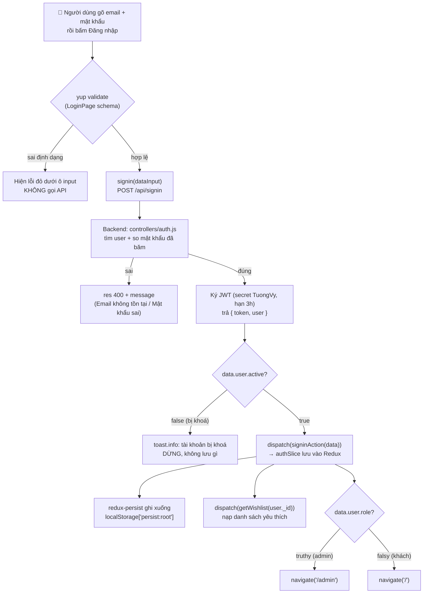

# Bài 23 — Chức năng Đăng ký / Đăng nhập / Đăng xuất

> **Phần 5 · Xây chức năng end-to-end** — Thời lượng ước tính: **~75 phút**
> ⬅️ Bài trước: [22 — RTK Query: `createApi`, cache và `invalidatesTags`](22-rtk-query.md) · Bài sau: [24 — `PrivateRouter` — chặn route theo quyền](24-private-router.md) ➡️
> 🏠 [Mục lục](README.md)

---

## 🎯 Sau bài này bạn sẽ

- Đọc vanh vách luồng **đăng nhập** từ lúc bấm nút tới lúc token nằm trong `localStorage`.
- Hiểu vì sao đăng nhập xong **admin bị đẩy vào `/admin`, còn khách vào `/`** — chỉ nhờ một dòng `if`.
- Mổ được schema **yup** của trang đăng ký, kể cả cách so khớp mật khẩu bằng `.test()`.
- Biết **đăng xuất** trong dự án thực chất chỉ làm đúng một việc, và việc đó *chưa đủ an toàn*.
- Chỉ ra được vì sao **trang "Quên mật khẩu" chỉ là hình vẽ** và tự phác được cách làm cho nó chạy thật.

## 📋 Cần chuẩn bị

- Đã hoàn thành [Bài 22](22-rtk-query.md) và nắm vững [Bài 11 — Mã hoá mật khẩu và JWT](11-mat-khau-va-jwt.md), [Bài 21 — redux-persist](21-redux-persist.md).
- Nhớ lại tầng API ở [Bài 18](18-tang-api-axios.md) và `authSlice` ở [Bài 19](19-redux-toolkit-co-ban.md).
- Backend + frontend đang chạy được (`npm start` ở cả `yotea-be/` và `yotea-fe/`).

> 💡 Đây là bài đầu tiên của **Phần 5** — nơi ta ngừng học lý thuyết rời rạc và bắt đầu
> ghép mọi thứ đã học thành một **chức năng hoàn chỉnh chạy được từ đầu tới cuối**. Đăng
> nhập là cánh cửa của mọi ứng dụng, nên ta mở màn bằng nó.

---

## 1. Toàn cảnh: đăng nhập là một chuỗi mắt xích

Trước khi soi từng dòng, hãy nhìn bức tranh lớn. Khi bạn gõ email + mật khẩu rồi bấm
"Đăng nhập", có **6 mắt xích** nối tiếp nhau chạy — mỗi mắt xích ta đều đã học rải rác ở
các bài trước, giờ chúng bắt tay nhau:



Toàn bộ 6 mắt xích này nằm gọn trong **một hàm `onSubmit` 20 dòng** ở `LoginPage.js`. Ta
sẽ đi ngược từ giao diện vào tận database, rồi quay ra.

> 📖 **Thuật ngữ:** *token* — tấm "vé đã đăng nhập" do server ký. Client cầm vé này đính
> vào mỗi request cần quyền (`Authorization: Bearer <token>`). Server chỉ cần **giải mã
> vé** là biết bạn là ai, không phải hỏi lại mật khẩu. Chi tiết ở [Bài 11](11-mat-khau-va-jwt.md).

---

## 2. Soi code thật: luồng ĐĂNG NHẬP

### 2.1. Điểm vào — schema yup của trang đăng nhập

`yotea-fe/src/pages/auth/LoginPage.js:16-22`

```js
const schema = yup.object().shape({
  email: yup
    .string()
    .required("Vui lòng nhập địa chỉ email")
    .matches(/^[\w-\.]+@([\w-]+\.)+[\w-]{2,4}$/, "Email không đúng định dạng"),
  password: yup.string().required("Vui lòng nhập mật khẩu"),
});
```

**Đọc từng dòng:**

| Dòng | Code | Ý nghĩa |
|---|---|---|
| 16 | `yup.object().shape({...})` | Khai báo "hình dạng" dữ liệu form phải có |
| 17-20 | `email: ... .required(...).matches(regex, ...)` | `email` bắt buộc, và phải khớp mẫu email |
| 21 | `password: ...required(...)` | `password` chỉ bắt buộc, **không** kiểm độ dài |

Schema này được đưa vào `useForm` qua `yupResolver`, `LoginPage.js:29-33`:

```js
const {
  register,
  handleSubmit,
  formState: { errors },
} = useForm({ resolver: yupResolver(schema) });
```

- `register("email")` gắn ô input vào form (bạn thấy nó ở JSX `LoginPage.js:85`).
- `handleSubmit(onSubmit)` chỉ gọi `onSubmit` **khi schema pass**. Sai định dạng thì
  `onSubmit` **không bao giờ chạy** — đây chính là nhánh "sai định dạng" trong sơ đồ.
- `errors.email?.message` (`LoginPage.js:91`) hiện dòng chữ đỏ khi có lỗi.

> ⚠️ **Chỗ này dự án làm chưa chuẩn:** đăng nhập **không** kiểm độ dài mật khẩu (`password`
> chỉ có `.required()`), trong khi đăng ký lại yêu cầu tối thiểu 4 ký tự. Không sai chức
> năng, nhưng bất nhất. Ngoài ra mẫu regex email `[\w-]{2,4}` chỉ cho phần đuôi tên miền
> dài 2–4 ký tự → các đuôi mới như `.museum`, `.travel` bị chặn oan. Lỗi regex này lặp lại
> ở **5 file** (Login, Register, Contact, Checkout, UpdateInfo).

### 2.2. Trái tim của luồng — hàm `onSubmit`

`yotea-fe/src/pages/auth/LoginPage.js:36-56`

```js
const onSubmit = async (dataInput) => {
  try {
    const { data } = await signin(dataInput);
    if (!data.user.active) {
      toast.info("Tài khoản của bạn đã bị khóa, vui lòng liên hệ QTV");
    } else {
      dispatch(signinAction(data));
      dispatch(getWishlist(data.user._id));

      toast.success("Đăng nhập thành công");

      if (data.user.role) {
        navigate("/admin");
      } else {
        navigate("/");
      }
    }
  } catch (error) {
    toast.error("Có lỗi xảy ra, vui lòng thử lại");
  }
};
```

**Đọc từng dòng — đây là đoạn quan trọng nhất bài:**

| Dòng | Code | Ý nghĩa |
|---|---|---|
| 36 | `async (dataInput) =>` | `dataInput` = `{ email, password }` do react-hook-form gom lại |
| 38 | `const { data } = await signin(dataInput)` | Gọi API đăng nhập; `data` = `{ token, user }` server trả về |
| 39 | `if (!data.user.active)` | Tài khoản bị **khoá** (`active` = false) thì chặn ngay |
| 42 | `dispatch(signinAction(data))` | Lưu **cả `token` lẫn `user`** vào Redux slice `auth` |
| 43 | `dispatch(getWishlist(data.user._id))` | Nạp luôn danh sách yêu thích của người vừa đăng nhập |
| 47-51 | `if (data.user.role) navigate("/admin")` else `navigate("/")` | **Phân luồng theo quyền** — mấu chốt |
| 53-55 | `catch` → toast chung chung | Bắt mọi lỗi (mạng, 400...) |

**Ba điểm cần khắc sâu:**

1. **`signinAction` là tên đặt lại của reducer `signin`.** Ở đầu file, dự án import
   khéo léo để tránh trùng tên với hàm API `signin`, `LoginPage.js:5` và `LoginPage.js:11-14`:

   ```js
   import { signin } from "../../api/auth";              // hàm gọi API
   import {
     selectStatusLoggin,
     signin as signinAction,                             // reducer, đổi tên
   } from "../../redux/authSlice";
   ```

   Cùng một chữ `signin` nhưng là **hai thứ hoàn toàn khác nhau**: một cái gửi request,
   một cái ghi vào store. Đây là ví dụ đẹp về `import ... as ...` để tránh đụng tên.

2. **Phân luồng theo quyền chỉ là một dòng `if (data.user.role)`.** Trong Yotea, `role`
   là số: `1` = admin (truthy → vào `/admin`), `0` = khách (falsy → vào `/`). Không có
   bảng phân quyền phức tạp nào, chỉ đúng một cờ.

3. **`getWishlist` được gọi ngay lúc đăng nhập** (không đợi người dùng vào trang khác) —
   nhờ vậy panel yêu thích ở header có dữ liệu ngay.

> ⚠️ **Chỗ này dự án làm chưa chuẩn:** khối `catch` (`LoginPage.js:53-55`) **nuốt sạch**
> thông báo lỗi cụ thể của backend. Server trả về `message` rõ ràng ("Email không tồn
> tại" / "Mật khẩu không chính xác" — xem mục 2.4), nhưng frontend luôn hiện một câu duy
> nhất *"Có lỗi xảy ra, vui lòng thử lại"*. Người dùng gõ sai mật khẩu mà tưởng server
> hỏng. Cách sửa: đọc `error.response?.data?.message` để hiện đúng lý do (và xem thêm cảnh
> báo bảo mật ở mục 6 về việc *có nên* phân biệt hay không).

### 2.3. Chặn vào trang đăng nhập khi đã đăng nhập

`yotea-fe/src/pages/auth/LoginPage.js:58-62`

```js
useEffect(() => {
  updateTitle("Đăng nhập");

  if (isLogged) navigate("/");
}, []);
```

Nếu người dùng **đã đăng nhập** rồi mà cố mở lại `/login`, effect này đá họ về trang chủ
ngay. `isLogged` lấy từ `useSelector(selectStatusLoggin)` (`LoginPage.js:27`).

> ⚠️ **Chỗ này dự án làm chưa chuẩn:** mảng phụ thuộc `[]` rỗng nhưng bên trong dùng
> `isLogged` và `navigate`. Effect chỉ chạy **lúc mount**, nên nếu trạng thái đăng nhập
> đổi trong lúc component vẫn đứng đó thì nó không phản ứng. Với trang này thì tạm chấp
> nhận được, nhưng ESLint sẽ cảnh báo "missing dependencies".

### 2.4. Nhắc lại phía backend — `POST /api/signin`

Ta đã mổ kỹ ở [Bài 11](11-mat-khau-va-jwt.md); ở đây chỉ nhắc điểm khớp với luồng frontend.
Hàm API rất mỏng, `yotea-fe/src/api/auth.js:3-6`:

```js
export const signin = (user) => {
  const url = `/signin`;
  return instance.post(url, user);
};
```

Nó bắn thẳng tới controller `yotea-be/src/controllers/auth.js:32-66`:

```js
export const signin = async (req, res) => {
  const { email, password } = req.body;

  try {
    const user = await User.findOne({ email }).exec();

    if (!user) {
      res.status(400).json({
        message: "Email không tồn tại",
      });
    } else if (!user.authenticate(password)) {
      res.status(400).json({
        message: "Mật khẩu không chính xác",
      });
    } else {
      const {
        _doc: { password: hashed_password, __v, ...rest },
      } = user;
      const token = jwt.sign(
        { _id: user._id, email: user.email },
        "TuongVy",
        { expiresIn: "3h" }
      );

      res.json({
        token,
        user: rest,
      });
    }
  } catch (error) {
    res.status(400).json({
      message: "Lỗi",
    });
  }
};
```

Ba việc backend làm, ghép đúng với sơ đồ đầu bài:

| Bước | Dòng | Ý nghĩa |
|---|---|---|
| Tìm user theo email | 36 | `User.findOne({ email })` |
| So mật khẩu | 42 | `user.authenticate(password)` — băm mật khẩu vừa gõ rồi so với chuỗi băm trong DB |
| Bóc `password` ra khỏi kết quả | 47-49 | Destructuring lồng nhau, loại `password` + `__v`, giữ `rest` |
| Ký token, trả về | 50-59 | JWT chứa `_id` + `email`, hạn 3 giờ; trả `{ token, user: rest }` |

Hàm `authenticate` nằm ở `yotea-be/src/models/user.js:66-80`:

```js
userSchema.methods = {
  authenticate(password) {
    return this.password === this.encryptPassword(password);
  },
  encryptPassword(password) {
    if (!password) return;
    try {
      return createHmac("SHA256", "TuongVy")
        .update(password)
        .digest("hex");
    } catch (error) {
      console.log(error);
    }
  },
};
```

Nghĩa là backend **không** giải mã mật khẩu (không thể — băm là một chiều), mà **băm lại**
mật khẩu người dùng vừa gõ rồi so hai chuỗi băm. Khớp thì đúng mật khẩu.

> 🔒 **Ghi chú bảo mật:** khoá `"TuongVy"` bị viết cứng và dùng chung cho **cả** băm mật
> khẩu **lẫn** ký JWT. Cách băm là **SHA256 không salt** — quá yếu cho mật khẩu. Đây là
> lỗ hổng lớn, phân tích đầy đủ ở [Bài 33](33-ra-soat-bao-mat.md), sửa ở [Bài 34](34-refactor-du-an.md).

### 2.5. Token được cất ở đâu?

Khi `dispatch(signinAction(data))` chạy, reducer trong `authSlice` ghi lại, `yotea-fe/src/redux/authSlice.js:37-44`:

```js
signin(state, { payload }) {
  state.isLogged = true;
  state.value = payload;
},
logout(state) {
  state.value = {};
  state.isLogged = false;
},
```

`state.value` giờ = `{ token, user }`. Nhờ **redux-persist** (đã học ở [Bài 21](21-redux-persist.md))
với `whitelist: ["auth", "cart"]`, cả object này được ghi xuống `localStorage["persist:root"]`.
Về sau mọi hàm API cần token đều đọc lại bằng `isAuthenticate()` (xem [Bài 18](18-tang-api-axios.md)).

> 🔒 **Ghi chú bảo mật:** token nằm trong `localStorage` → **mọi đoạn JavaScript chạy trên
> trang đều đọc được**. Nếu site dính lỗ XSS (chèn được script lạ, ví dụ qua bình luận
> không làm sạch), script đó đọc trộm token và mạo danh bạn. Chuẩn an toàn hơn là để token
> trong **cookie `httpOnly`** — loại JavaScript không đọc được. Chi tiết ở [Bài 33](33-ra-soat-bao-mat.md), lỗ hổng #6.

---

## 3. Soi code thật: luồng ĐĂNG KÝ

### 3.1. Schema yup đầy đủ — phần đáng học nhất

`yotea-fe/src/pages/auth/RegisterPage.js:10-35`

```js
const schema = yup.object().shape({
  username: yup.string().required("Vui lòng nhập Username"),
  fullName: yup.string().required("Vui lòng nhập họ tên"),
  phone: yup
    .string()
    .required("Vui lòng nhập sdt")
    .matches(
      /(84|0[3|5|7|8|9])+([0-9]{8})\b/,
      "Số điện thoại không đúng định dạng"
    ),
  password: yup
    .string()
    .required("Vui lòng nhập mật khẩu")
    .min(4, "Mật khẩu dài tối thiểu 4 ký tự"),
  confirm: yup
    .string()
    .required("Vui lòng xác nhận mật khẩu")
    .test("is_confirm", "Mật khẩu xác nhận không chính xác", function (value) {
      const { password } = this.parent;
      return password === value;
    }),
  email: yup
    .string()
    .required("Vui lòng nhập email")
    .matches(/^[\w-\.]+@([\w-]+\.)+[\w-]{2,4}$/, "Email không đúng định dạng"),
});
```

**Bảng tóm ràng buộc:**

| Field | Ràng buộc | Dòng |
|---|---|---|
| `username` | bắt buộc | 11 |
| `fullName` | bắt buộc | 12 |
| `phone` | bắt buộc + regex đầu số Việt Nam | 13-19 |
| `password` | bắt buộc + tối thiểu 4 ký tự | 20-23 |
| `confirm` | bắt buộc + `.test()` so khớp với `password` | 24-30 |
| `email` | bắt buộc + regex email | 31-34 |

**Điểm cần dừng lại — `.test()` để so khớp mật khẩu:**

```js
.test("is_confirm", "Mật khẩu xác nhận không chính xác", function (value) {
  const { password } = this.parent;
  return password === value;
})
```

- `"is_confirm"` — tên nội bộ của phép kiểm (để yup phân biệt).
- Chuỗi thứ hai — thông báo hiện ra khi kiểm **thất bại**.
- `function (value)` — **phải là `function` thường, KHÔNG dùng arrow function**, vì cần
  `this`. Trong yup, `this.parent` là object chứa **tất cả các field cùng cấp** — nhờ đó
  lấy được `password` để so với `value` (chính là ô `confirm`).
- Trả `true` = hợp lệ, `false` = báo lỗi.

> 💡 **Mẹo:** ở mục "Tự tay làm" ta sẽ viết lại đúng ràng buộc này bằng cách **gọn hơn** —
> dùng `yup.ref` + `oneOf`, thay cho `.test()` thủ công.

### 3.2. `onSubmit` của đăng ký

`yotea-fe/src/pages/auth/RegisterPage.js:45-53`

```js
const onSubmit = async (dataInput) => {
  try {
    await signup(dataInput);
    toast.success("Đăng ký tài khoản thành công");
    navigate("/login");
  } catch (error) {
    toast.error(error.response.data.message);
  }
};
```

- `signup(dataInput)` → `POST /api/signup` (`api/auth.js:8-11`).
- Thành công → toast + chuyển sang trang đăng nhập.
- **Đăng ký xong KHÔNG tự đăng nhập** — người dùng phải tự đăng nhập lại. Đây là chủ ý
  đơn giản hoá của dự án.

> ⚠️ **Chỗ này dự án làm chưa chuẩn:** `error.response.data.message` (dòng 51) **không
> phòng thủ**. Nếu lỗi là do **mất mạng** hay **server sập**, thì `error.response` là
> `undefined` → truy cập `.data` gây **TypeError**, làm sập chính hàm xử lý lỗi → người
> dùng **không thấy toast nào cả**. Cách đúng: `error.response?.data?.message || "Đăng ký
> thất bại, vui lòng thử lại"`.

> ⚠️ **Chỗ này dự án làm chưa chuẩn (backend):** trong `signup` (`controllers/auth.js:91-95`),
> khi email đã tồn tại, server `res.status(400).json(...)` nhưng **thiếu `return`**. Code
> chạy tiếp xuống dòng `new User(req.body).save()` và gọi `res` lần thứ hai → lỗi
> `ERR_HTTP_HEADERS_SENT`. Phải thêm `return` trước `res.status(400)`.

---

## 4. Soi code thật: luồng ĐĂNG XUẤT

Đây là chỗ nhiều người đoán sai. Nút Đăng xuất **không** nằm ở header trang chủ
(`WebsiteLayout`), mà nằm ở **hai layout riêng**: khu tài khoản khách và khu quản trị.

### 4.1. Đăng xuất ở khu "Tài khoản của tôi"

`yotea-fe/src/pages/layouts/MyAccountLayout.js:11-14`

```js
const handleLogout = () => {
  dispatch(logout());
  dispatch(clearWishlist());
};
```

### 4.2. Đăng xuất ở khu quản trị

`yotea-fe/src/pages/layouts/AdminLayout.js:22-24`

```js
const handleLogout = () => {
  dispatch(logout());
};
```

Cả hai đều gọi reducer `logout` (đã xem ở `authSlice.js:41-44`) — nó chỉ làm đúng hai việc:
đặt `value = {}` và `isLogged = false`. redux-persist tự đồng bộ, nên `localStorage` cũng
được dọn theo.

**Vì sao đăng xuất xong lại tự rời trang?** Không có `navigate` nào trong `handleLogout` cả.
Khi `isLogged` thành `false`, `PrivateRouter` bọc quanh khu `/my-account` và `/admin` (xem
[Bài 24](24-private-router.md)) re-render và trả về `<Navigate to="/login" />`. Tức là
**đổi state là đủ để bị đá ra**, không cần điều hướng thủ công.

> ⚠️ **Chỗ này dự án làm chưa chuẩn:** hai hàm đăng xuất **không giống nhau** —
> `MyAccountLayout` có `clearWishlist`, còn `AdminLayout` thì không. Hệ quả: admin đăng
> xuất xong, danh sách yêu thích của tài khoản cũ **vẫn còn** trong Redux store, có thể
> lộ sang phiên sau. Nên gom logic đăng xuất vào **một chỗ dùng chung**.

> 🔒 **Ghi chú bảo mật quan trọng:** `logout` chỉ xoá state phía client. **Token JWT vẫn
> còn hiệu lực trên server cho tới khi hết hạn 3 giờ.** Ai đã kịp sao chép token trước khi
> bạn đăng xuất thì vẫn dùng được nó. Đăng xuất "thật" cần server có cơ chế **thu hồi token**
> (blacklist, hoặc token phiên ngắn + refresh token). Dự án chưa có — đây là giới hạn cố hữu
> của việc lưu JWT ở client.

---

## 5. ⚠️ Trang "Quên mật khẩu" — chỉ là cái vỏ

Đây là phần **bắt buộc phải biết sự thật** để không hiểu nhầm dự án có tính năng này.

`yotea-fe/src/pages/auth/ForgotPage.js` — **toàn bộ** phần logic của file:

`yotea-fe/src/pages/auth/ForgotPage.js:4-7`

```js
const ForgotPage = () => {
  useEffect(() => {
    updateTitle("Quên mật khẩu");
  }, []);
```

Và cái "form" của nó, `yotea-fe/src/pages/auth/ForgotPage.js:16-35`:

```jsx
<form action="" className="mb-14" id="form__forgot">
  <div className="mt-3">
    <label htmlFor="form__forgot-email" /* ...class... */>
      Email *
    </label>
    <input
      type="text"
      id="form__forgot-email"
      /* ...class... KHÔNG có name, KHÔNG register, KHÔNG value/onChange... */
      placeholder="Nhập địa chỉ email"
    />
  </div>

  <button /* ...class... */>
    Đặt lại mật khẩu
  </button>
</form>
```

> ⚠️ **Chức năng này CHƯA HỀ TỒN TẠI — trang chỉ là HTML tĩnh.** Bằng chứng:
> - Không `useState`, không `useForm`, không `yup`, **không import bất kỳ hàm API nào**
>   (chỉ import `useEffect` và `updateTitle`).
> - `<form>` **không có `onSubmit`**; ô input **không có `name`, không `register`** → giá
>   trị người dùng gõ vào **không đi đâu cả**.
> - Nút "Đặt lại mật khẩu" mặc định là `type="submit"` trong một form không handler →
>   bấm vào chỉ **reload lại trang**.
> - **Backend cũng không có** endpoint quên mật khẩu: `yotea-be/src/routes/auth.js` chỉ có
>   `/signin`, `/signup`, `/checkPassword`. Thư viện `nodemailer` tuy khai trong
>   `package.json` nhưng **0 lần được import** trong toàn bộ `yotea-be/src`.

**Phác cách làm đúng (để bạn hình dung, sẽ không viết code đầy đủ ở đây):**

1. **Backend — API 1: yêu cầu đặt lại.** `POST /api/forgot-password` nhận `email`. Nếu email
   tồn tại: sinh một **token ngẫu nhiên có hạn** (ví dụ hết hạn sau 15 phút), lưu vào user
   (`resetToken` + `resetTokenExpire`), rồi **gửi email** chứa link
   `https://.../reset-password?token=abc123` bằng nodemailer.
2. **Backend — API 2: xác nhận đổi.** `POST /api/reset-password` nhận `token` + `newPassword`.
   Tìm user theo `resetToken`, kiểm **token còn hạn không**, đúng thì băm mật khẩu mới và
   **xoá token** (dùng một lần).
3. **Frontend.** `ForgotPage` thành form thật (yup + `useForm` + `onSubmit` gọi API 1). Thêm
   trang `ResetPasswordPage` đọc `token` từ query string, cho nhập mật khẩu mới, gọi API 2.

> 🔒 **Ghi chú bảo mật:** ở API 1, **luôn trả về cùng một thông báo** dù email có tồn tại
> hay không ("Nếu email tồn tại, chúng tôi đã gửi link"). Nếu báo "email không tồn tại",
> bạn vô tình cho kẻ xấu một công cụ **dò xem ai đã đăng ký**. Token reset phải **ngẫu
> nhiên đủ mạnh**, **có hạn ngắn**, và **dùng một lần**.

---

## 6. ⚠️ Cảnh báo bảo mật: thông báo lỗi phân biệt email / mật khẩu

Quay lại backend `signin` ở mục 2.4. Nó trả về **hai thông báo khác nhau**:

- `"Email không tồn tại"` khi không tìm thấy user (`controllers/auth.js:38-41`).
- `"Mật khẩu không chính xác"` khi sai mật khẩu (`controllers/auth.js:42-45`).

> ⚠️ **Đây là một điểm yếu bảo mật (dù nghe rất "thân thiện").** Hai thông báo tách biệt
> cho phép kẻ xấu **liệt kê email** (user enumeration): cứ thử một email bất kỳ với mật
> khẩu bừa — nếu nhận *"Mật khẩu không chính xác"* thì **email đó chắc chắn có đăng ký**;
> nếu nhận *"Email không tồn tại"* thì không. Ghép với việc `GET /api/users` đang công khai
> (xem [Bài 33](33-ra-soat-bao-mat.md)), rò rỉ này càng nguy hiểm.
>
> **Cách làm đúng:** dùng **một thông báo chung** cho cả hai trường hợp — *"Email hoặc mật
> khẩu không đúng"*. Người dùng thật vẫn hiểu; kẻ dò email thì mất manh mối.

Trớ trêu thay, cái bug "nuốt lỗi" ở `LoginPage.js:54` (mục 2.2) lại **vô tình che giấu** rò
rỉ này ở phía giao diện — nhưng đó là may rủi, không phải thiết kế có chủ đích, và kẻ tấn
công vẫn đọc được thông báo thật khi gọi API trực tiếp bằng Postman.

---

## 7. 🛠️ Tự tay làm

> Mục tiêu phần này: cuối phần bạn sẽ (1) viết ràng buộc "xác nhận mật khẩu" **gọn hơn** dự
> án bằng `yup.ref` + `oneOf`, và (2) hiện **tên người dùng + nút đăng xuất ngay trên header**
> trang chủ (thứ dự án đang thiếu). **Toàn bộ code trong phần này là bạn tự viết thêm, dự
> án gốc chưa có — KHÔNG sửa file dự án thật, hãy chép ra bản nháp để thử.**

### Bước 1 — Viết lại ràng buộc "xác nhận mật khẩu" bằng `yup.ref` + `oneOf`

Nhớ lại: dự án dùng `.test()` với `function` thường và `this.parent` (mục 3.1). yup có sẵn
`yup.ref("tênField")` để **tham chiếu tới field khác**, gọn hơn nhiều. Mở bản chép của
`RegisterPage.js`, thay khối `confirm` bằng:

```js
// ĐOẠN NÀY BẠN TỰ VIẾT THÊM — thay cho khối confirm cũ trong schema
confirm: yup
  .string()
  .required("Vui lòng xác nhận mật khẩu")
  .oneOf([yup.ref("password")], "Mật khẩu xác nhận không chính xác"),
```

**Giải thích:**

| Phần | Ý nghĩa |
|---|---|
| `yup.ref("password")` | "Lấy giá trị hiện tại của field `password` trong cùng schema" |
| `.oneOf([...], msg)` | Giá trị của `confirm` phải **nằm trong** danh sách; ở đây danh sách chỉ có đúng giá trị của `password` |

Ngắn hơn, không cần `function`, không cần `this.parent`, và ai đọc cũng hiểu ngay ý đồ.

> 💡 **Mẹo:** thứ tự khai báo field có thể ảnh hưởng. Đặt `confirm` **sau** `password` trong
> schema để `yup.ref` chắc chắn tham chiếu được. Trong dự án `confirm` đã nằm sau `password`
> nên yên tâm.

### Bước 2 — Thêm hiển thị tên user + nút đăng xuất ở header

Trong Yotea, header trang chủ (`WebsiteLayout`) hiện lời chào *"Hello, {fullName}"* nhưng
**không có nút đăng xuất** — người dùng phải vào tận khu tài khoản mới đăng xuất được. Ta
tự thêm. Trong bản chép của `WebsiteLayout.js`, ở đầu component đảm bảo đã có:

```js
// các dòng này dự án đã có sẵn — chỉ cần chắc chắn chúng tồn tại
import { useDispatch, useSelector } from "react-redux";
import { logout, selectAuth, selectStatusLoggin } from "../../redux/authSlice";
import { clearWishlist } from "../../redux/wishlistSlice";
import { useNavigate } from "react-router-dom";

const dispatch = useDispatch();
const navigate = useNavigate();
const isLogged = useSelector(selectStatusLoggin);
const { user } = useSelector(selectAuth);
```

Rồi tự viết thêm hàm đăng xuất **dùng chung, đầy đủ** (khắc phục điểm bất nhất ở mục 4.2):

```js
// ĐOẠN NÀY BẠN TỰ VIẾT THÊM
const handleLogout = () => {
  dispatch(logout());
  dispatch(clearWishlist());   // dọn luôn wishlist để không lộ sang phiên sau
  navigate("/");               // header không được PrivateRouter bảo vệ nên phải tự điều hướng
};
```

Và đoạn JSX hiển thị có điều kiện (đặt vào khu vực góc phải header):

```jsx
{/* ĐOẠN NÀY BẠN TỰ VIẾT THÊM */}
{isLogged ? (
  <div className="flex items-center gap-3">
    <span className="font-semibold">Xin chào, {user.fullName}</span>
    <button
      onClick={handleLogout}
      className="px-3 py-1 bg-orange-400 text-white text-sm rounded"
    >
      Đăng xuất
    </button>
  </div>
) : (
  <Link to="/login">Đăng nhập</Link>
)}
```

**Vì sao ở đây phải có `navigate("/")` mà `MyAccountLayout` thì không?** Vì header
(`WebsiteLayout`) **không** nằm trong `PrivateRouter`, nên không có ai tự đá bạn đi. Bạn
phải tự điều hướng — đúng như phân tích ở mục 4.

---

## 8. ✅ Kiểm chứng kết quả

### 8.1. Đăng nhập thành công

1. Bật cả hai server (`npm start` ở `yotea-be/` và `yotea-fe/`).
2. Mở `http://localhost:3000/login`, đăng nhập bằng tài khoản khách thường.
3. Kết quả **phải thấy**: toast xanh *"Đăng nhập thành công"*, và trình duyệt nhảy về trang
   chủ `/`. Nếu là tài khoản admin → nhảy vào `/admin`.
4. Mở DevTools → tab **Application** → **Local Storage** → khoá `persist:root`. Bên trong
   `auth` phải thấy `"isLogged":true` và một chuỗi `token` dài (JWT).

### 8.2. Kiểm chứng API bằng Postman

```
POST http://localhost:8080/api/signin
Body (JSON):
{
  "email": "admin@gmail.com",
  "password": "admin"
}
```

Nếu đúng → nhận về:

```json
{
  "token": "eyJhbGciOiJIUzI1NiIsInR5cCI6IkpXVCJ9...",
  "user": {
    "_id": "...",
    "email": "admin@gmail.com",
    "fullName": "...",
    "role": 1,
    "active": true
  }
}
```

Thử gõ **sai mật khẩu** → nhận `400` kèm `{ "message": "Mật khẩu không chính xác" }`. Thử
**email không tồn tại** → `{ "message": "Email không tồn tại" }`. Đây chính là hai thông báo
mà mục 6 cảnh báo là rò rỉ.

### 8.3. Kiểm chứng đăng xuất

Đăng nhập xong, vào `/my-account`, bấm **Đăng xuất** → bị đá về `/login`, và khoá `auth`
trong `localStorage` trở lại `"isLogged":false`, `"value":{}`.

---

## 9. 🐞 Lỗi thường gặp

| Thông báo / hiện tượng | Nguyên nhân | Cách sửa |
|---|---|---|
| Bấm Đăng nhập không có gì xảy ra | yup chặn vì email/mật khẩu sai định dạng → `onSubmit` không chạy | Nhìn dòng chữ đỏ dưới ô input |
| `TypeError: Cannot read properties of undefined (reading 'data')` khi đăng ký lỗi mạng | `error.response` là `undefined` (mục 3.2) | Dùng `error.response?.data?.message \|\| "..."` |
| Đăng nhập báo *"Có lỗi xảy ra"* dù mật khẩu đúng | Backend chưa chạy / MongoDB chưa bật | `npm start` ở `yotea-be/`, kiểm `net start MongoDB` |
| Đăng nhập xong không thấy chuyển trang | Tài khoản bị khoá (`active = false`) → chỉ toast info | Mở lại `active` trong DB hoặc dùng tài khoản khác |
| `ERR_HTTP_HEADERS_SENT` ở terminal backend khi đăng ký email trùng | `signup` thiếu `return` sau `res.status(400)` (mục 3.2) | Thêm `return` trước `res.status(400)` |
| Bấm "Đặt lại mật khẩu" ở trang Quên MK chỉ reload | Trang là form tĩnh, chưa có chức năng (mục 5) | Chưa có gì để sửa — cần tự làm như phác thảo mục 5 |

---

## 10. 📝 Bài tập

**Bài 1.** Trong `LoginPage.js`, vì sao phải import reducer bằng `signin as signinAction`
mà không giữ nguyên tên `signin`? Điều gì xảy ra nếu bỏ chữ `as signinAction`?

<details>
<summary>💡 Xem gợi ý & lời giải</summary>

Vì file đã import **hàm API** tên `signin` từ `../../api/auth` (`LoginPage.js:5`). Nếu
reducer cũng import tên `signin` thì **hai cái trùng tên** trong cùng phạm vi → JavaScript
báo lỗi `Identifier 'signin' has already been declared`, hoặc cái sau ghi đè cái trước khiến
`signin(dataInput)` gọi nhầm reducer thay vì gọi API. `as signinAction` đổi tên khi import để
hai thứ cùng tồn tại mà không đụng nhau.

</details>

**Bài 2.** Người dùng đã đăng nhập là **admin**, giờ gõ tay URL `/login`. Chuyện gì xảy ra,
và dòng code nào quyết định? Cách xử lý hiện tại có gì chưa ổn?

<details>
<summary>💡 Xem gợi ý & lời giải</summary>

`useEffect` ở `LoginPage.js:58-62` chạy lúc mount: thấy `isLogged === true` nên
`navigate("/")` — admin bị đưa về **trang chủ khách**, không phải `/admin`. Chưa ổn: lẽ ra
nên phân luồng như trong `onSubmit` (`if (user.role) navigate("/admin")`). Sửa:

```js
// bạn tự viết thêm
if (isLogged) {
  navigate(user.role ? "/admin" : "/");
}
```

(nhớ lấy thêm `const { user } = useSelector(selectAuth)`).

</details>

**Bài 3.** Viết lại khối `catch` của `LoginPage.onSubmit` sao cho: (a) hiện đúng thông báo
backend trả về khi là lỗi 400, (b) không sập khi lỗi mạng, (c) **không** để lộ việc email
có tồn tại hay không.

<details>
<summary>💡 Xem gợi ý & lời giải</summary>

```js
// bạn tự viết thêm
} catch (error) {
  // Nếu là lỗi có phản hồi từ server (400) → dùng thông báo TRUNG LẬP,
  // KHÔNG dùng message gốc vì nó phân biệt email/mật khẩu (rò rỉ, xem mục 6).
  if (error.response) {
    toast.error("Email hoặc mật khẩu không đúng");
  } else {
    // lỗi mạng / server chết
    toast.error("Không kết nối được máy chủ, vui lòng thử lại");
  }
}
```

Điểm tinh tế: ở **frontend** ta cố ý **không** hiện message gốc của server để không tiếp tay
cho user enumeration. Nhưng đây chỉ là vá tạm ở giao diện — muốn triệt để, phải sửa
**backend** trả về một message chung (xem mục 6 và [Bài 34](34-refactor-du-an.md)).

</details>

**Bài 4.** (nối mạch Topping) Bạn đã xây trang admin cho Topping từ các bài trước. Hãy giải
thích: khi admin đăng nhập, làm sao mà nút "Thêm topping" gọi được API `POST /topping/:userId`
có kèm token? Token đến từ đâu?

<details>
<summary>💡 Xem gợi ý & lời giải</summary>

Lúc đăng nhập, `dispatch(signinAction(data))` lưu `{ token, user }` vào `authSlice`, và
redux-persist ghi xuống `localStorage["persist:root"]`. Hàm `add` trong `api/topping.js` của
bạn viết theo đúng convention dự án: `add = (topping, { token, user } = isAuthenticate()) => ...`.
Khi gọi `add(topping)` mà không truyền tham số thứ hai, default `isAuthenticate()` chạy, đọc
lại `token` + `user` từ `localStorage` (xem [Bài 18](18-tang-api-axios.md)), rồi gắn
`Authorization: Bearer ${token}` vào header. Backend `requireSignin` giải mã token là biết
bạn là admin. Đó là lý do **phải đăng nhập trước** thì trang admin Topping mới hoạt động.

</details>

---

## 📌 Tóm tắt

- Đăng nhập là chuỗi 6 mắt xích gói trong **một hàm `onSubmit`**: yup → `signin` API → backend so mật khẩu băm → ký JWT → `dispatch(signinAction)` → điều hướng theo `role`.
- **Phân luồng quyền chỉ là `if (data.user.role) navigate("/admin") else navigate("/")`** — `role` là một cờ số (1 = admin, 0 = khách).
- Token `{ token, user }` được `authSlice` lưu, redux-persist ghi xuống `localStorage["persist:root"]`; mọi API cần quyền đọc lại bằng `isAuthenticate()`.
- Đăng ký dùng schema yup đầy đủ; ràng buộc "xác nhận mật khẩu" bản gốc dùng `.test()` + `this.parent`, có thể thay bằng **`yup.ref` + `oneOf`** gọn hơn.
- **Đăng xuất** (`logout`) chỉ xoá state client — **token vẫn sống trên server tới khi hết hạn 3h**; hai layout còn làm khác nhau (`clearWishlist`), nên gom về một chỗ.
- **Trang "Quên mật khẩu" là form tĩnh, chưa có chức năng** cả ở FE lẫn BE; làm đúng cần token reset có hạn + gửi mail (nodemailer).
- Backend trả **hai thông báo lỗi khác nhau** cho email/mật khẩu → rò rỉ email; nên dùng một câu chung.

**Từ khoá tra cứu thêm:** `yup ref oneOf`, `react-hook-form yupResolver`, `JWT localStorage vs httpOnly cookie`, `password reset flow`, `user enumeration attack`, `nodemailer`

➡️ **Bài tiếp theo:** [24 — `PrivateRouter` — chặn route theo quyền](24-private-router.md) — giờ đã đăng nhập được rồi, ta xem `PrivateRouter` dùng `role` vừa lưu để **chặn cửa** khu quản trị như thế nào, và vì sao chặn ở frontend là chưa đủ.
