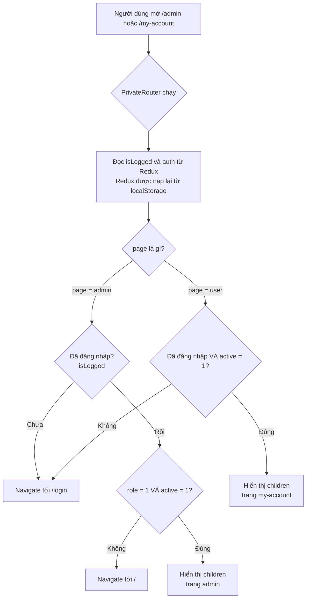

# Bài 24 — `PrivateRouter` — chặn route theo quyền

> **Phần 5 · Chức năng phía khách hàng** — Thời lượng ước tính: **~55 phút**
> ⬅️ Bài trước: [23 — Chức năng Đăng ký / Đăng nhập / Đăng xuất](23-dang-ky-dang-nhap.md) · Bài sau: [25 — Danh sách sản phẩm: lọc, sắp xếp, phân trang, tìm kiếm](25-danh-sach-san-pham.md) ➡️
> 🏠 [Mục lục](README.md)

---

## 🎯 Sau bài này bạn sẽ

- Hiểu **route được bảo vệ** (protected route) là gì và vì sao mọi web có khu vực "chỉ dành cho thành viên / admin" đều cần nó.
- Đọc vanh vách từng dòng `PrivateRouter.js` — component tí hon nhưng canh cửa cho toàn bộ trang quản trị.
- Phân biệt được hai chế độ `page="admin"` và `page="user"`, và biết `<Navigate>` chuyển hướng ra sao.
- Tự tay **qua mặt** `PrivateRouter` bằng cách sửa `localStorage`, để tận mắt hiểu vì sao **kiểm tra ở client không bao giờ là bảo mật**.
- Viết lại `PrivateRouter` theo phong cách hiện đại: tách thành `RequireAuth` + `RequireAdmin` dùng `<Outlet />`, và thêm tính năng "đăng nhập xong quay lại trang cũ".

## 📋 Cần chuẩn bị

- Đã hoàn thành [Bài 23 — Đăng ký / Đăng nhập / Đăng xuất](23-dang-ky-dang-nhap.md): hiểu `authSlice`, hành động `signin`/`logout`, và biết dữ liệu đăng nhập được lưu vào `localStorage` nhờ redux-persist ([Bài 21](21-redux-persist.md)).
- Nhớ lại React Router v6: `createBrowserRouter`, route lồng nhau, `element` ([Bài 15](15-routing-v6.md)).
- Mở sẵn dự án, có ít nhất **1 tài khoản admin** (`role = 1`) và **1 tài khoản khách thường** (`role = 0`).

---

## 1. Route được bảo vệ là gì?

Hãy tưởng tượng quán trà sữa Yotea có hai loại cửa:

- **Cửa trước** — ai đi ngang cũng vào xem thực đơn, đọc tin tức, bỏ hàng vào giỏ. Không cần trình gì cả.
- **Cửa kho & phòng quản lý** — chỉ nhân viên có thẻ mới vào. Bảo vệ đứng ngay cửa, thấy thẻ hợp lệ thì cho qua, không có thẻ thì mời ra ngoài.

Trong một ứng dụng web, "người bảo vệ đứng ở cửa" chính là **route được bảo vệ**. Trước khi cho hiển thị một trang nhạy cảm (ví dụ `/admin`, `/my-account`), ta chèn một lớp kiểm tra:

1. Người này **đã đăng nhập** chưa?
2. Người này **có đủ quyền** để vào khu vực này không (khách thường hay admin)?

Nếu không đạt, thay vì vẽ trang ra, ta **chuyển hướng** họ đi nơi khác (thường là về trang đăng nhập hoặc trang chủ).

Trong Yotea, người bảo vệ đó là một component tên `PrivateRouter`. Nó chỉ vỏn vẹn 24 dòng nhưng đứng gác cho **toàn bộ** trang quản trị và trang "Tài khoản của tôi".

> 📖 **Thuật ngữ:** *protected route* (route được bảo vệ) — một route chỉ render nội dung khi người dùng thoả một điều kiện nào đó (đã đăng nhập, đủ quyền). Không thoả thì bị điều hướng đi.

---

## 2. Sơ đồ luồng bảo vệ route

Đây là bức tranh tổng bạn nên giữ trong đầu suốt cả bài. Khi trình duyệt cố render một route được bọc `PrivateRouter`, mọi thứ chạy qua các chốt sau:



Điểm mấu chốt — và cũng là **cả bài học bảo mật** của bài này: dữ liệu mà `PrivateRouter` dùng để phán xét (`isLogged`, `role`, `active`) **đều đến từ Redux, mà Redux lại nạp từ `localStorage`** — nơi người dùng sửa được. Ta sẽ quay lại chuyện này ở mục 5.

---

## 3. Soi code thật trong dự án

### 3.1. Toàn bộ `PrivateRouter.js`

File nhỏ nên ta trích **nguyên văn cả file**.

`yotea-fe/src/components/admin/PrivateRouter.js:1-25`

```js
import { useSelector } from "react-redux";
import { Navigate } from "react-router-dom";
import { selectAuth, selectStatusLoggin } from "../../redux/authSlice";

const PrivateRouter = ({ children, page }) => {
  const isLogged = useSelector(selectStatusLoggin);
  const auth = useSelector(selectAuth);

  if (page === "admin") {
    if (!isLogged) {
      return <Navigate to="/login" />;
    } else if (!auth.user.role || !auth.user.active) {
      return <Navigate to="/" />;
    }
  } else {
    if (!isLogged || !auth.user.active) {
      return <Navigate to="/login" />;
    }
  }

  return children;
};

export default PrivateRouter;
```

**Đọc từng dòng:**

| Dòng | Code | Ý nghĩa |
|---|---|---|
| 1 | `import { useSelector }` | Hook để **đọc** một mẩu dữ liệu từ Redux store |
| 2 | `import { Navigate }` | Component của React Router: khi được render, nó **chuyển hướng** trình duyệt sang URL khác |
| 3 | `import { selectAuth, selectStatusLoggin }` | Hai selector từ `authSlice` (ta xem ở 3.2) |
| 5 | `({ children, page })` | Nhận **hai props**: `children` là trang cần bảo vệ, `page` là chuỗi `"admin"` hoặc `"user"` |
| 6 | `const isLogged = useSelector(selectStatusLoggin)` | Lấy trạng thái đã đăng nhập chưa (`true`/`false`) |
| 7 | `const auth = useSelector(selectAuth)` | Lấy cả cục dữ liệu đăng nhập: `{ token, user }` |
| 9 | `if (page === "admin")` | Rẽ nhánh: đây là khu admin hay khu user? |
| 10-11 | `if (!isLogged) return <Navigate to="/login" />` | Chưa đăng nhập → đá về trang đăng nhập |
| 12-13 | `else if (!auth.user.role \|\| !auth.user.active)` | Đã đăng nhập nhưng **không phải admin** (`role` là 0) **hoặc** tài khoản **bị khoá** (`active` là 0) → đá về trang chủ `/` |
| 15-18 | nhánh `else` (tức `page="user"`) | Chưa đăng nhập **hoặc** bị khoá → đá về `/login` |
| 21 | `return children` | Qua hết các chốt → render trang thật ra |

> 💡 **Mẹo đọc:** `PrivateRouter` là một component nhưng nó không hẳn "vẽ giao diện". Nó giống một **cái cổng**: hoặc trả về `<Navigate>` (đẩy đi chỗ khác), hoặc trả về `children` (cho trang thật đi qua). Trong React, component **được phép trả về component khác** thay cho JSX của chính mình.

### 3.2. `role` và `active` từ đâu ra?

Hai selector ở dòng 3 nằm trong `authSlice`:

`yotea-fe/src/redux/authSlice.js:58-59`

```js
export const selectStatusLoggin = (state) => state.auth.isLogged;
export const selectAuth = (state) => state.auth.value;
```

Vậy `auth` trong `PrivateRouter` chính là `state.auth.value`. Giá trị này được đặt lúc đăng nhập — nhớ lại [Bài 23](23-dang-ky-dang-nhap.md), `LoginPage.js` dispatch:

`yotea-fe/src/pages/auth/LoginPage.js:42`

```js
dispatch(signinAction(data));
```

với `data` là `{ token, user }` mà backend trả về. Vào tới reducer `signin`:

`yotea-fe/src/redux/authSlice.js:37-40`

```js
signin(state, { payload }) {
  state.isLogged = true;
  state.value = payload;
},
```

Ghép lại: `state.auth.value = { token, user }`. Cho nên trong `PrivateRouter`:

- `auth.user.role` = `role` của người đang đăng nhập (0 = khách, 1 = admin).
- `auth.user.active` = tài khoản còn hoạt động không (1 = hoạt động, 0 = bị khoá).

Và vì `persistConfig.whitelist = ["auth", "cart"]` (xem [Bài 21](21-redux-persist.md)), toàn bộ cục `auth` này được **lưu xuống `localStorage`** dưới khoá `persist:root`. Đóng trình duyệt mở lại vẫn còn đăng nhập — nhưng cũng chính vì nằm ở `localStorage` nên nó **sửa được**.

### 3.3. `<Navigate>` hoạt động thế nào?

`<Navigate to="/login" />` là cách **chuyển hướng bằng cách render một component** trong React Router v6. Khác với `navigate("/login")` (một hàm bạn gọi trong sự kiện/`useEffect`), `<Navigate>` được **trả về từ phần render** — hễ nó xuất hiện trên cây giao diện là router lập tức đổi URL.

Đây đúng là thứ ta cần cho một cái cổng: *"nếu điều kiện không đạt, đừng vẽ trang, hãy render `<Navigate>` để đẩy người dùng đi."*

> 📖 **Thuật ngữ:** `<Navigate to="..." />` mặc định là **replace = false**, tức nó **thêm** một mục vào lịch sử trình duyệt. Hệ quả: bấm nút Back có thể quay lại đúng route vừa bị chặn (rồi lại bị chặn tiếp). Muốn "thay thế" thay vì "thêm", viết `<Navigate to="/login" replace />`. Dự án không dùng `replace` — một chi tiết nhỏ ta sẽ sửa ở phần Tự tay làm.

### 3.4. `PrivateRouter` được bọc ở đâu trong `App.js`?

Đúng **hai chỗ**. Chỗ thứ nhất — trang "Tài khoản của tôi":

`yotea-fe/src/App.js:156-185`

```jsx
{
  path: "my-account",
  element: (
    <PrivateRouter page="user">
      <MyAccountLayout />
    </PrivateRouter>
  ),
  children: [
    {
      path: "",
      element: <UpdateInfoPage />,
    },
    {
      path: "update-password",
      element: <UpdatePasswordPage />,
    },
    {
      path: "cart",
      element: <MyCartPage />,
    },
    {
      path: "cart/page/:page",
      element: <MyCartPage />,
    },
    {
      path: "cart/:id",
      element: <MyCartDetailPage />,
    },
  ],
},
```

Chỗ thứ hai — toàn bộ khu quản trị:

`yotea-fe/src/App.js:188-195`

```jsx
{
  path: "/admin",
  element: (
    <PrivateRouter page="admin">
      <AdminLayout />
    </PrivateRouter>
  ),
  children: [
    // ... Dashboard, user, news, product, slider, category, cart, contact ...
  ],
},
```

**Điểm hay cần nắm:** `PrivateRouter` chỉ bọc **element cha** (`MyAccountLayout` / `AdminLayout`), không bọc từng route con. Nhờ cơ chế route lồng nhau của React Router v6 ([Bài 15](15-routing-v6.md)), khi cổng cha nhả `children` ra thì `MyAccountLayout`/`AdminLayout` render, và các route con (`Dashboard`, `product`, ...) hiện bên trong `<Outlet />` của layout đó. Chặn **một** chỗ là chặn được **cả cụm** — đây chính là lợi ích lớn nhất của việc bảo vệ ở element cha.

### 3.5. Bảng: bốn trạng thái người dùng vào được đâu?

Gộp hết logic ở 3.1 lại thành một bảng tra nhanh. Ký hiệu: ✅ = vào được, 🔒 = bị đá đi (kèm nơi đến).

| Trạng thái người dùng | `isLogged` | `role` | `active` | `/my-account` (`page="user"`) | `/admin` (`page="admin"`) |
|---|:---:|:---:|:---:|---|---|
| Chưa đăng nhập | `false` | — | — | 🔒 → `/login` | 🔒 → `/login` |
| Khách thường | `true` | `0` | `1` | ✅ | 🔒 → `/` |
| Admin | `true` | `1` | `1` | ✅ | ✅ |
| Bị khoá | `true` | 0 hoặc 1 | `0` | 🔒 → `/login` | 🔒 → `/` |

Đọc kỹ hai hàng cuối để thấy sự khác biệt tinh tế giữa hai nhánh:

- **Khách thường vào `/admin`**: đăng nhập rồi (qua chốt `isLogged`), nhưng `!auth.user.role` đúng (role = 0) → nhánh admin đá về **trang chủ `/`**, không phải `/login`. Ý đồ: bạn đã đăng nhập rồi, không cần bắt đăng nhập lại, chỉ là không đủ quyền nên về trang chủ.
- **Tài khoản bị khoá**: ở `page="user"` bị đá về `/login`; ở `page="admin"` lại bị đá về `/` (vì nhánh admin kiểm `active` sau khi đã qua `isLogged`). Cùng một lý do "bị khoá" nhưng đích đến khác nhau — một điểm thiếu nhất quán nhỏ của thiết kế.

> 💡 Thực tế `LoginPage.js:39` đã chặn không cho tài khoản `active = 0` đăng nhập ngay từ đầu (`if (!data.user.active)` thì báo "Tài khoản đã bị khoá"). Nên hàng "Bị khoá" trong bảng chủ yếu xảy ra khi tài khoản bị khoá **sau khi** đã đăng nhập và dữ liệu cũ còn trong `localStorage`.

---

## 4. ⚠️ Sự thật quan trọng nhất của bài: client-side check KHÔNG phải bảo mật

Đây là phần bạn phải đọc kỹ nhất cả bài. Nó lý giải vì sao một tính năng "chặn quyền" nhìn có vẻ chắc chắn lại **hoàn toàn không bảo vệ được gì**.

### 4.1. Vì sao `PrivateRouter` qua mặt được?

Nhìn lại chuỗi này:

```
role thật nằm ở đâu?  →  Redux (state.auth.value.user.role)
Redux lấy từ đâu?     →  localStorage  (khoá "persist:root", nhờ redux-persist)
localStorage là gì?   →  một kho dữ liệu NẰM TRÊN MÁY NGƯỜI DÙNG, sửa được bằng tay
```

`PrivateRouter` đọc `role` từ đầu chuỗi đó. Mà cuối chuỗi là `localStorage` — người dùng mở DevTools sửa một phát là xong. Sửa `role` từ `0` thành `1`, tải lại trang, `PrivateRouter` thấy `role = 1` và **mở toang cửa `/admin`**.

### 4.2. 🛠️ Tự tay qua mặt (làm trên máy bạn để hiểu, không phải để phá ai)

1. Đăng nhập bằng một tài khoản **khách thường** (`role = 0`).
2. Mở DevTools (`F12`) → tab **Application** → **Local Storage** → `http://localhost:3000` → chọn khoá **`persist:root`**.
3. Giá trị của nó là một chuỗi JSON, bên trong có một chuỗi JSON con tên `auth`. Tìm đoạn `..."role":0...` trong phần `user`. Sửa thành `"role":1` (và nếu `active` đang là 0 thì sửa luôn thành 1). Nhấn Enter để lưu.
4. Trên thanh địa chỉ, gõ `http://localhost:3000/admin` rồi Enter (hoặc tải lại trang).

Kết quả: **bạn nhìn thấy toàn bộ giao diện trang quản trị** — Dashboard, danh sách sản phẩm, nút Thêm/Sửa/Xoá... `PrivateRouter` đã bị lừa hoàn toàn.

> ⚠️ **Chỗ này dự án làm chưa chuẩn (và cũng là bản chất của mọi kiểm tra phía client):**
> `PrivateRouter` quyết định dựa trên `role` lấy từ `localStorage` — dữ liệu **do người dùng
> kiểm soát**. Vì thế nó **không phải là một lớp bảo mật**, chỉ là một lớp **trải nghiệm**:
> giúp người dùng bình thường không lạc vào trang họ không nên thấy. Kẻ cố tình sửa
> `localStorage` sẽ vượt qua trong 10 giây.

### 4.3. Nhưng "nhìn thấy" khác với "làm được"

Đây là chỗ nhiều người mới hiểu sai. Bạn vào được `/admin` và thấy nút "Xoá sản phẩm". Bạn bấm nó. Chuyện gì xảy ra?

Frontend gửi một request `DELETE /api/products/:id/:userId` lên backend. Và ở backend, route đó được canh bởi middleware `isAdmin`:

`yotea-be/src/middlewares/checkAuth.js:21-29`

```js
export const isAdmin = (req, res, next) => {
  if (!req.profile.role) {
    res.status(401).json({
      message: "Bạn không phải là Admin",
    });
  } else {
    next();
  }
};
```

Chú ý: `isAdmin` **không** đọc `role` từ request của bạn. Nó đọc `req.profile.role` — mà `req.profile` là user được **tra thẳng từ database** (qua `router.param("userId", userById)`, xem [Bài 12](12-phan-quyen-middleware.md)). Bạn sửa `localStorage` cỡ nào cũng **không sửa được database**. Backend tra ra `role = 0` → trả `401 Bạn không phải là Admin` → thao tác xoá **thất bại**.

Cho nên: sửa `localStorage` cho bạn **thấy** giao diện admin, nhưng **không** cho bạn **thực sự** thay đổi dữ liệu — vì mọi API ghi (POST/PUT/DELETE) của category, product, news, slider, store... đều có `isAdmin` chặn ở backend.

> 🔒 **KẾT LUẬN VÀNG — thuộc lòng câu này:**
> **"Kiểm tra ở client là để trải nghiệm, KHÔNG BAO GIỜ là bảo mật."**
> Bảo mật thật chỉ tồn tại ở backend, nơi kiểm `role` trong **database** qua token đã ký.
> `PrivateRouter` giống tấm biển "Nhân viên only" treo trước cửa — lịch sự nhắc người ta,
> nhưng khoá thật nằm ở cánh cửa kho phía sau (chính là `isAdmin`).

### 4.4. ...trừ những route backend QUÊN khoá cửa

Câu "backend luôn chặn" ở trên chỉ đúng với các route **có** `isAdmin`. Đáng tiếc, một số route trong Yotea **thiếu** lớp bảo vệ đó — với chúng, việc qua mặt `PrivateRouter` không chỉ cho *thấy* mà còn cho *làm thật*. Liệt kê chính xác các chỗ đó:

- **`PUT /api/users/updateInfo/:myId/:userId`** — chỉ có `requireSignin, isAuth`, **không** có `isAdmin`, và `isAuth` không kiểm `:myId`. Bất kỳ khách đã đăng nhập nào cũng gửi được `{"role": 1}` để **tự phong admin trong database** (đây mới là lỗ hổng nghiêm trọng nhất, khác hẳn việc sửa localStorage).
- **`GET /api/users` và `GET /api/users/:id`** — hoàn toàn công khai, trả về **cả trường `password` đã băm** của mọi tài khoản.
- **`POST /orders`, `GET /orders`, `GET /orders/:id`, `DELETE /orders/:id`** — không middleware. Ai cũng liệt kê được mọi đơn hàng (kèm tên/sđt/email/địa chỉ khách) và xoá đơn bất kỳ.
- **Toàn bộ `orderDetail`** (cả 5 thao tác) — mở hoàn toàn.
- **`PATCH /api/products/userUpdate/:id`** — không auth (chủ ý cho khách tăng lượt xem, nhưng cũng cho sửa tuỳ ý `view`/`favorites`).

Phân biệt cho rõ hai chuyện khác nhau về mức độ:

| Việc | Qua mặt được gì | Có chiếm quyền thật không? | Mức nguy hiểm |
|---|---|---|---|
| Sửa `role` trong **localStorage** | `PrivateRouter` phía client → *thấy* UI admin | **Không** — `isAdmin` chặn mọi API ghi có bảo vệ | Trung bình |
| Gửi `{"role":1}` qua **API `updateInfo`** | Ghi thẳng vào **database** | **Có** — thành admin thật | 🔴 Nghiêm trọng |

Toàn bộ danh sách lỗ hổng và cách khai thác/vá được phân tích kỹ ở **[Bài 33 — Rà soát bảo mật](33-ra-soat-bao-mat.md)**. Ở đây bạn chỉ cần khắc cốt: `PrivateRouter` là lớp trải nghiệm, còn an toàn thật hay không là do backend.

### 4.5. ⚠️ Hai lỗi kỹ thuật khác của `PrivateRouter` và `App.js`

**(a) `/checkout` không được bọc `PrivateRouter`.**

Nhìn lại `App.js:148-151`:

```jsx
{
  path: "checkout",
  element: <CheckoutPage />,
},
```

Trang thanh toán nằm **ngoài** mọi cổng bảo vệ — khách vãng lai chưa đăng nhập vẫn vào `/checkout` đặt hàng được. Đây là **chủ ý** của dự án (cho phép mua không cần tài khoản, nhớ dòng `userId: (user && user._id) || ""` ở [Bài 03](03-kien-thuc-nen.md)). Không sai, nhưng cần biết rõ để đừng tưởng nhầm là nó được bảo vệ.

**(b) `PrivateRouter` truy cập `auth.user.role` mà không kiểm `auth.user` có tồn tại không.**

Xem lại dòng 12 và 16:

```js
} else if (!auth.user.role || !auth.user.active) {   // dòng 12
// ...
if (!isLogged || !auth.user.active) {                 // dòng 16
```

Cả hai đều đụng thẳng `auth.user.xxx`. Mà `auth` là `state.auth.value`, và `initialState.value = {}` (object rỗng). Ở nhánh `page="admin"`, nếu vì lý do nào đó `isLogged` là `true` nhưng `auth.user` lại `undefined` (ví dụ dữ liệu `localStorage` bị sửa hỏng, hoặc reducer bị đặt sai), thì `auth.user.role` sẽ ném lỗi `Cannot read properties of undefined (reading 'role')` → **trang trắng**, mà `App.js` lại **không có `errorElement`** nên không có gì hứng lỗi.

Cách viết an toàn là dùng optional chaining: `!auth.user?.role || !auth.user?.active`. Nhánh `page="user"` may mắn hơn một chút vì có `!isLogged` đứng trước chặn bớt, nhưng vẫn nên phòng thủ tương tự.

---

## 5. 🛠️ Tự tay làm — viết lại thành `RequireAuth` + `RequireAdmin` với `<Outlet />`

> Mục tiêu phần này: cuối phần bạn sẽ có hai component gác cổng gọn gàng theo phong cách React Router v6 hiện đại, dùng `<Outlet />` thay cho `children`, phòng thủ được lỗi `auth.user` undefined, và **nhớ trang cũ để đăng nhập xong quay lại đúng chỗ**.

> ⚠️ **Không sửa file dự án.** Toàn bộ code dưới đây là **bạn tự viết thêm** vào các file **mới**. Dự án gốc vẫn giữ nguyên `PrivateRouter.js`. Đây là bài luyện tay để bạn so sánh "cách cũ" và "cách chuẩn".

### Vì sao dùng `<Outlet />` thay cho `children`?

Cách cũ bọc trang vào giữa: `<PrivateRouter><AdminLayout/></PrivateRouter>`. Cách hiện đại của React Router v6 là dùng **route bố cục (layout route)**: component bảo vệ đứng làm `element` của một route cha, còn các trang thật là **route con**; component bảo vệ chỉ việc render `<Outlet />` — nơi router tự cắm route con vào. Ưu điểm: không phải "gói" thủ công, và một cổng bảo vệ được cho **nhiều nhóm route** mà không lồng JSX rối mắt.

### Bước 1 — Tạo `RequireAuth.js` (chặn: phải đăng nhập, phải chưa bị khoá)

```jsx
// yotea-fe/src/components/routing/RequireAuth.js  ← file MỚI, bạn tự tạo
// (Bạn tự viết thêm, dự án chưa có file này.)
import { useSelector } from "react-redux";
import { Navigate, Outlet, useLocation } from "react-router-dom";
import { selectAuth, selectStatusLoggin } from "../../redux/authSlice";

const RequireAuth = () => {
  const isLogged = useSelector(selectStatusLoggin);
  const auth = useSelector(selectAuth);
  const location = useLocation();

  // Chưa đăng nhập HOẶC tài khoản bị khoá → về trang đăng nhập,
  // đồng thời NHỚ trang hiện tại để đăng nhập xong quay lại.
  if (!isLogged || !auth.user?.active) {
    return <Navigate to="/login" replace state={{ from: location }} />;
  }

  // Qua chốt → cho các route con render vào đây.
  return <Outlet />;
};

export default RequireAuth;
```

Ba điểm mới so với bản gốc:

- `<Outlet />` thay cho `return children`.
- `auth.user?.active` (có `?.`) — không nổ trắng trang nếu `auth.user` chưa có.
- `replace` — không nhồi route bị chặn vào lịch sử; và `state={{ from: location }}` — đính kèm "tôi vừa định vào đâu" để trang login đọc lại.

### Bước 2 — Tạo `RequireAdmin.js` (chặn: phải là admin đang hoạt động)

```jsx
// yotea-fe/src/components/routing/RequireAdmin.js  ← file MỚI, bạn tự tạo
// (Bạn tự viết thêm, dự án chưa có file này.)
import { useSelector } from "react-redux";
import { Navigate, Outlet, useLocation } from "react-router-dom";
import { selectAuth, selectStatusLoggin } from "../../redux/authSlice";

const RequireAdmin = () => {
  const isLogged = useSelector(selectStatusLoggin);
  const auth = useSelector(selectAuth);
  const location = useLocation();

  // Chưa đăng nhập → về trang đăng nhập (nhớ trang cũ).
  if (!isLogged) {
    return <Navigate to="/login" replace state={{ from: location }} />;
  }

  // Đăng nhập rồi nhưng không phải admin / bị khoá → về trang chủ.
  if (!auth.user?.role || !auth.user?.active) {
    return <Navigate to="/" replace />;
  }

  return <Outlet />;
};

export default RequireAdmin;
```

### Bước 3 — Cho `LoginPage` "quay lại trang cũ" sau khi đăng nhập

Bản gốc `LoginPage.js:47-51` luôn điều hướng cứng về `/admin` (nếu là admin) hoặc `/` (nếu là khách). Ta muốn: nếu người dùng vừa bị đá ra khỏi trang X thì đăng nhập xong quay lại đúng X. Ý tưởng là đọc `location.state.from` mà `RequireAuth` đã đính kèm.

Đây là **phiên bản `onSubmit` bạn tự viết lại** (chỉ minh hoạ phần điều hướng — bạn tự tạo một `LoginPage` nháp hoặc đọc để hiểu, KHÔNG sửa file dự án):

```jsx
// Bạn tự viết thêm — minh hoạ cách dùng useLocation để quay lại trang cũ.
import { useLocation, useNavigate } from "react-router-dom";

// ...trong component:
const navigate = useNavigate();
const location = useLocation();

// nơi cần quay về sau khi đăng nhập (nếu không có thì tuỳ role)
const from = location.state?.from?.pathname;

const onSubmit = async (dataInput) => {
  try {
    const { data } = await signin(dataInput);

    if (!data.user.active) {
      toast.info("Tài khoản của bạn đã bị khóa, vui lòng liên hệ QTV");
      return;
    }

    dispatch(signinAction(data));
    dispatch(getWishlist(data.user._id));
    toast.success("Đăng nhập thành công");

    if (from) {
      // vừa bị đá ra từ một trang cần đăng nhập → quay lại đúng đó
      navigate(from, { replace: true });
    } else if (data.user.role) {
      navigate("/admin");
    } else {
      navigate("/");
    }
  } catch (error) {
    toast.error("Có lỗi xảy ra, vui lòng thử lại");
  }
};
```

Luồng đầy đủ giờ là: khách chưa đăng nhập bấm vào `/my-account/cart` → `RequireAuth` đá về `/login` kèm `state.from = "/my-account/cart"` → đăng nhập xong → `navigate("/my-account/cart")`. Mượt như các trang chuyên nghiệp.

### Bước 4 — Sửa `App.js` để dùng cổng mới (hướng dẫn, không bắt buộc chạy trên dự án gốc)

Với `<Outlet />`, cổng trở thành một **route cha không có path**, ôm lấy các route con. Cấu trúc mới của khối `/admin` sẽ trông như sau:

```jsx
// Hướng sửa App.js (bạn tự thử trên một nhánh git riêng nếu muốn)
import RequireAuth from "./components/routing/RequireAuth";
import RequireAdmin from "./components/routing/RequireAdmin";

// Khu my-account:
{
  element: <RequireAuth />,          // cổng cha, KHÔNG có path
  children: [
    {
      path: "my-account",
      element: <MyAccountLayout />,
      children: [
        { path: "", element: <UpdateInfoPage /> },
        { path: "update-password", element: <UpdatePasswordPage /> },
        { path: "cart", element: <MyCartPage /> },
        { path: "cart/page/:page", element: <MyCartPage /> },
        { path: "cart/:id", element: <MyCartDetailPage /> },
      ],
    },
  ],
},

// Khu admin:
{
  element: <RequireAdmin />,         // cổng cha, KHÔNG có path
  children: [
    {
      path: "/admin",
      element: <AdminLayout />,
      children: [
        { path: "", element: <Dashboard /> },
        // ... các route admin còn lại giữ nguyên ...
      ],
    },
  ],
},
```

So với bản gốc: không còn `<PrivateRouter page="...">` gói quanh layout nữa. Cổng đứng riêng làm route cha, layout thành route con của cổng, và các trang thật là con của layout. `RequireAuth`/`RequireAdmin` chỉ render `<Outlet />` — router lo phần cắm ghép.

> 💡 **Mẹo:** cách này còn cho phép **một cổng gác nhiều nhóm route** khác nhau mà không cần lặp lại JSX bọc ngoài — càng nhiều khu vực cần bảo vệ, lợi ích càng rõ.

---

## 6. ✅ Kiểm chứng kết quả

Chạy dự án (backend `yotea-be` cổng 8080, frontend `yotea-fe` cổng 3000) rồi kiểm lần lượt:

1. **Chưa đăng nhập, gõ `http://localhost:3000/admin`** → bị đá về `/login`. ✅
2. **Chưa đăng nhập, gõ `http://localhost:3000/my-account`** → bị đá về `/login`. ✅
3. **Đăng nhập bằng khách thường (`role = 0`), gõ `/admin`** → bị đá về trang chủ `/`. ✅
4. **Đăng nhập bằng khách thường, gõ `/my-account`** → vào được, thấy trang "Cập nhật thông tin". ✅
5. **Đăng nhập bằng admin (`role = 1`), gõ `/admin`** → vào được Dashboard. ✅
6. **Bài học bảo mật (mục 4.2):** vẫn ở tài khoản khách thường, sửa `role` trong `localStorage` thành `1`, tải lại `/admin` → **thấy** UI admin. Rồi bấm một nút Xoá/Sửa bất kỳ → mở tab **Network** trong DevTools, xem request → nhận về **`401 Bạn không phải là Admin`**. Đây là bằng chứng tận mắt cho câu "thấy nhưng không làm được".

> 💡 Với phần Tự tay làm: nếu bạn đã ráp `RequireAuth` + `LoginPage` mới, thử bước 1 lại — sau khi đăng nhập, bạn sẽ được đưa **thẳng về `/admin`** (trang vừa định vào) thay vì phải tự bấm lại.

---

## 7. 🐞 Lỗi thường gặp

| Thông báo / hiện tượng | Nguyên nhân | Cách sửa |
|---|---|---|
| `Cannot read properties of undefined (reading 'role')` | `auth.user` chưa tồn tại nhưng `PrivateRouter` vẫn đọc `auth.user.role` (mục 4.5b) | Dùng optional chaining: `auth.user?.role`; hoặc kiểm `isLogged` trước |
| Sửa `role` trong localStorage rồi mà `/admin` vẫn đá ra | Chưa **tải lại trang** — Redux trong bộ nhớ chưa nạp lại từ localStorage | Bấm F5 / gõ lại URL sau khi sửa |
| Vào `/admin` thấy giao diện nhưng bấm nút nào cũng lỗi 401 | Đúng như thiết kế: backend kiểm `role` thật trong DB qua `isAdmin` | Không phải bug — đây là bảo mật đang hoạt động đúng |
| Đăng nhập xong bấm Back lại rơi vào `/login` liên tục | `<Navigate>` không có `replace` nên route bị chặn vẫn nằm trong lịch sử | Thêm `replace` vào `<Navigate>` (xem phần Tự tay làm) |
| Trang trắng khi gõ URL sai | `App.js` không có `errorElement` (không phải lỗi của `PrivateRouter`) | Thêm `errorElement` — bàn ở [Bài 34](34-refactor-du-an.md) |
| `RequireAuth` render nhưng route con không hiện | Quên `<Outlet />`, hoặc quên đặt route con trong `children` của route cổng | Bảo đảm cổng `return <Outlet />` và có `children` |

---

## 8. 📝 Bài tập

**Bài 1.** Không chạy thử, hãy điền vào bảng: với mỗi trạng thái, người dùng gõ `/admin` thì `PrivateRouter` trả về gì (`<Navigate to="/login">`, `<Navigate to="/">`, hay `children`)?

| Trạng thái | Kết quả |
|---|---|
| `isLogged=false` | ? |
| `isLogged=true, role=0, active=1` | ? |
| `isLogged=true, role=1, active=1` | ? |
| `isLogged=true, role=1, active=0` | ? |

<details>
<summary>💡 Xem gợi ý & lời giải</summary>

Theo nhánh `page === "admin"` (dòng 9-14):

| Trạng thái | Kết quả |
|---|---|
| `isLogged=false` | `<Navigate to="/login" />` (trúng `if (!isLogged)`) |
| `role=0, active=1` | `<Navigate to="/" />` (trúng `!auth.user.role`) |
| `role=1, active=1` | `children` — vào được admin |
| `role=1, active=0` | `<Navigate to="/" />` (trúng `!auth.user.active`) |

</details>

**Bài 2.** `LoginPage.js:47-51` sau khi đăng nhập điều hướng admin về `/admin`, khách về `/`. Giả sử một khách thường cố vào `/my-account/update-password` khi chưa đăng nhập, bị đá ra `/login`. Với **bản gốc** (chưa có tính năng "quay lại trang cũ"), sau khi đăng nhập họ sẽ ở đâu? Còn với bản `RequireAuth` bạn viết ở mục 5 thì sao?

<details>
<summary>💡 Xem gợi ý & lời giải</summary>

- **Bản gốc:** `onSubmit` chỉ nhìn `data.user.role`. Khách thường `role = 0` → luôn `navigate("/")`. Họ bị ném về **trang chủ**, mất luôn ý định vào trang đổi mật khẩu — trải nghiệm khó chịu.
- **Bản `RequireAuth`:** khi đá ra, cổng đính `state={{ from: location }}` với `from.pathname = "/my-account/update-password"`. `LoginPage` mới đọc `location.state?.from?.pathname`, đăng nhập xong `navigate(from)` → quay lại **đúng trang đổi mật khẩu**.

Đây chính là mẫu "redirect back after login" mà mọi ứng dụng chuyên nghiệp đều làm.

</details>

**Bài 3.** (suy ngẫm — nối [Bài 33](33-ra-soat-bao-mat.md)) Một bạn đề xuất: "Để chống qua mặt, ta **mã hoá** cục `auth` trước khi lưu vào `localStorage`, người dùng không đọc/sửa được nữa — thế là bảo mật xong." Cách này giải quyết được vấn đề thật sự không? Vì sao?

<details>
<summary>💡 Xem gợi ý & lời giải</summary>

**Không.** Mã hoá `localStorage` chỉ làm việc qua mặt **khó hơn một chút**, không giải quyết gốc rễ. Lý do:

1. Khoá giải mã cũng phải nằm trong JavaScript chạy trên máy người dùng → họ vẫn moi ra được.
2. Kể cả không sửa được `localStorage`, kẻ tấn công **bỏ qua frontend hoàn toàn**, dùng Postman gọi thẳng API với `{"role":1}` — `PrivateRouter` không đứng giữa cuộc gọi đó.

Bản chất: `PrivateRouter` là lớp **trải nghiệm**, không phải lớp bảo mật; cố "gia cố" nó cũng không biến nó thành bảo mật được. Bảo mật thật **chỉ** đến từ việc backend kiểm `role` trong **database** qua token đã ký (`isAdmin`) và **không tin bất cứ gì client gửi lên**. Đây đúng là nguyên tắc vàng của [Bài 33](33-ra-soat-bao-mat.md): *"Không bao giờ tin dữ liệu từ client."*

</details>

---

## 📌 Tóm tắt

- **Route được bảo vệ** = chèn một lớp kiểm tra trước khi render trang nhạy cảm; không đủ điều kiện thì `<Navigate>` đá đi nơi khác.
- `PrivateRouter` đọc `isLogged`, `auth.user.role`, `auth.user.active` từ Redux; hai chế độ: `page="admin"` (bắt đăng nhập + role + active) và `page="user"` (bắt đăng nhập + active).
- Nó được bọc đúng **hai chỗ** trong `App.js`: quanh `MyAccountLayout` (`page="user"`) và quanh `AdminLayout` (`page="admin"`) — chặn ở element cha là chặn cả cụm route con.
- **Câu quan trọng nhất bài:** *"Kiểm tra ở client là để trải nghiệm, KHÔNG BAO GIỜ là bảo mật."* Sửa `role` trong `localStorage` cho bạn **thấy** UI admin nhưng backend vẫn chặn mọi API ghi có `isAdmin` (trừ các route thiếu bảo vệ: `updateInfo`, `GET/DELETE orders`, toàn bộ `orderDetail`, `GET users`, `userUpdate` — xem [Bài 33](33-ra-soat-bao-mat.md)).
- Hai điểm cần biết: `/checkout` **không** được bọc `PrivateRouter` (chủ ý cho khách vãng lai), và `PrivateRouter` đọc `auth.user.role` mà không kiểm `auth.user` tồn tại → nên dùng `?.`.
- Cách hiện đại: tách `RequireAuth`/`RequireAdmin`, render `<Outlet />` thay `children`, và dùng `useLocation`+`state` để "đăng nhập xong quay lại trang cũ".

**Từ khoá tra cứu thêm:** `protected route react router v6`, `Navigate component`, `Outlet layout route`, `client-side auth is not security`, `redirect back after login`, `useLocation state`

➡️ **Bài tiếp theo:** [25 — Danh sách sản phẩm: lọc, sắp xếp, phân trang, tìm kiếm](25-danh-sach-san-pham.md) — rời khu bảo vệ, quay về trang thực đơn để xem một component `ProductContent` phục vụ được cả ba trang khác nhau nhờ kỹ thuật truyền hàm API xuống làm props.
