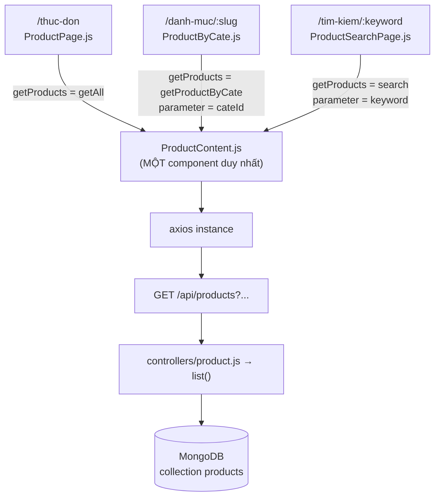

# Bài 25 — Danh sách sản phẩm: lọc, sắp xếp, phân trang, tìm kiếm

> **Phần 5 · Từng chức năng, từ đầu đến cuối** — Thời lượng ước tính: **~90 phút**
> ⬅️ Bài trước: [24 — `PrivateRouter` — chặn route theo quyền](24-private-router.md) · Bài sau: [26 — Chi tiết sản phẩm: lượt xem, đá/đường, sản phẩm liên quan](26-chi-tiet-san-pham.md) ➡️
> 🏠 [Mục lục](README.md)

---

## 🎯 Sau bài này bạn sẽ

- Hiểu **kỹ thuật quan trọng nhất của cả frontend Yotea**: ba trang khác nhau (`ProductPage`, `ProductByCate`, `ProductSearchPage`) dùng **chung một** component `ProductContent`, chỉ khác nhau ở **hàm gọi API được tiêm vào qua props** — đó là *dependency injection*.
- Đọc vanh vách công thức phân trang của dự án: từ URL `/thuc-don/page/2` cho tới `.skip().limit()` trong MongoDB.
- Chỉ ra được ba chỗ dự án làm lãng phí băng thông: **gọi API hai lần để đếm tổng**, **vòng lặp N+1 lấy điểm đánh giá**, và **đổi kiểu hiển thị grid/list cũng bắn lại request**.
- Tự thêm được một tiêu chí sắp xếp mới và một ô "Tìm thấy N sản phẩm".
- Tự tay tối ưu vòng lặp N+1 bằng `Promise.all` và **đo được** con số cải thiện trên tab Network.
- Áp dụng lại đúng kỹ thuật dependency injection đó cho chức năng **Topping** bạn đang xây xuyên suốt giáo trình.

## 📋 Cần chuẩn bị

- Đã hoàn thành [Bài 24](24-private-router.md) — hiểu cách route được bọc và bảo vệ.
- Đã học [Bài 09 — Bộ lọc query](09-bo-loc-query.md): `_sort`, `_order`, `_start`, `_limit`, `q`. Bài này là **phần "đường về"** của bài 09, nhìn từ phía React.
- Đã học [Bài 18 — Tầng gọi API với axios](18-tang-api-axios.md) và [Bài 15 — React Router v6](15-routing-v6.md) (`useParams`).
- Backend chạy ở cổng **8080**, frontend ở **3000**, MongoDB đã có ít nhất **12 sản phẩm** (để thấy được 2 trang phân trang).

---

## 1. Sơ đồ luồng của chức năng này

Đây là đường đi của **một lần bấm vào số trang 2** trên trang thực đơn. Hãy dán sơ đồ này ra
giấy, lát nữa mổ code ta sẽ đối chiếu từng ô.

```
   ┌──────────────────────────── TRÌNH DUYỆT (localhost:3000) ────────────────────────────┐
   │                                                                                       │
   │  Người dùng bấm số "2" trong <Pagination>                                              │
   │        │                                                                               │
   │        │ <Link to="/thuc-don/page/2">      Pagination.js:11                            │
   │        ▼                                                                               │
   │  React Router v6 khớp route "thuc-don/page/:page"      App.js:76-79                    │
   │        │                                                                               │
   │        ▼                                                                               │
   │  ProductPage        const { page } = useParams()       ProductPage.js:9                │
   │        │                                                                               │
   │        │ props:  getProducts={getAll}  page={2}  url="thuc-don"                        │
   │        ▼                                                             ProductPage.js:40-44
   │  ProductContent  ── state cục bộ: products / totalProduct / emptyProduct / filter       │
   │        │            limit = 9 ; totalPage = ceil(total/9) ; start = (2-1)*9 = 9         │
   │        │                                                       ProductContent.js:26-29 │
   │        ▼  useEffect  →  getProducts(9, 9, "createdAt", "desc", undefined)              │
   │                                                                ProductContent.js:31-68 │
   │  api/product.js  getAll()  dựng URL:                                                    │
   │     /products/?_expand=categoryId&_sort=createdAt&_order=desc&_start=9&_limit=9         │
   │                                                                   api/product.js:8-17  │
   │        │  axios instance  baseURL http://localhost:8080/api        api/instance.js:3-5 │
   └────────┼───────────────────────────────────────────────────────────────────────────────┘
            │  HTTP GET
            ▼
   ┌──────────────────────────── SERVER (localhost:8080) ──────────────────────────────────┐
   │  Express                                                                               │
   │     app.use("/api", productRouter)                                    app.js           │
   │        ▼                                                                               │
   │     router.get("/products", list)                            routes/product.js:10      │
   │        ▼                                                                               │
   │     controllers/product.js  →  list()                        controllers/product.js:107│
   │        • _sort/_order  →  sortOpt = { createdAt: -1 }                       :110-118   │
   │        • _start/_limit →  start = "9", limit = "9"                          :120-121   │
   │        • phần query còn lại → filter = {}                                   :123-163   │
   │        ▼                                                                               │
   │     Product.find(filter).populate("categoryId")                                        │
   │            .skip(9).limit(9).sort({createdAt:-1}).exec()                     :165-172  │
   │        ▼                                                                               │
   │  ┌──────────── MongoDB: yotea / collection "products" ────────────┐                    │
   │  │  bỏ qua 9 document đầu, lấy 9 document tiếp theo               │                    │
   │  └───────────────────────────────────────────────────────────────┘                    │
   └────────┬───────────────────────────────────────────────────────────────────────────────┘
            │  HTTP 200 — mảng 9 sản phẩm (JSON)
            ▼
   ┌──────────────────────────── ĐƯỜNG VỀ ─────────────────────────────────────────────────┐
   │  ProductContent: for await từng sản phẩm                      ProductContent.js:42-50 │
   │     ├─ getAvgStar(product._id)      → GET /ratings/?productId=…   api/rating.js:34-42 │
   │     └─ getTotalRating(product._id)  → GET /ratings/?productId=…   api/rating.js:44-47 │
   │             (9 sản phẩm ⇒ 18 request phụ, CHẠY LẦN LƯỢT — vấn đề N+1)                  │
   │        ▼                                                                               │
   │  setProducts(listProduct)  →  React re-render  →  lưới sản phẩm hiện ra   :198-236     │
   └───────────────────────────────────────────────────────────────────────────────────────┘
```

Và đây là bản rút gọn cho **ba biến thể** của cùng chức năng — hãy để ý ô màu duy nhất khác nhau:



---

## 2. ĐIỂM MẤU CHỐT: ba trang, một component

### 2.1. Ví dụ đời thường trước đã

Hãy tưởng tượng một cái **máy pha trà sữa**. Máy lo hết: đun nước, khuấy, đổ ra ly, đóng nắp,
dán tem. Thứ duy nhất nó **không tự quyết** là *lấy nguyên liệu ở đâu*.

- Đưa cho nó ống dẫn từ thùng **trà đen** → ra trà sữa truyền thống.
- Đưa ống dẫn từ thùng **trà ô long** → ra trà sữa ô long.
- Đưa ống dẫn từ thùng **trà đào** → ra trà đào.

Máy không đổi. Chỉ **cái ống** đổi. Người ta gọi cách thiết kế này là
**dependency injection** — "tiêm phụ thuộc".

> 📖 **Thuật ngữ:** *dependency* (phụ thuộc) là thứ mà một khối code **cần** để làm việc nhưng
> **không tự tạo ra**. *Injection* (tiêm) là việc đưa thứ đó từ **bên ngoài** vào, thay vì để
> khối code tự đi tìm. Ở React, cách "tiêm" phổ biến nhất chính là **truyền qua props**.

Trong Yotea:

| Cái máy | Nguyên liệu (dependency) | Kết quả |
|---|---|---|
| `ProductContent` | `getAll` | Trang thực đơn — tất cả sản phẩm |
| `ProductContent` | `getProductByCate` | Trang danh mục — sản phẩm của một danh mục |
| `ProductContent` | `search` | Trang kết quả tìm kiếm |

Một component, **246 dòng** giao diện, phân trang, sắp xếp, đánh giá sao, nút yêu thích —
**viết một lần, dùng ba nơi**.

### 2.2. Xem tận mắt: ba khối JSX gần như giống hệt nhau

`yotea-fe/src/pages/user/ProductPage.js:40-44`

```jsx
<ProductContent
  getProducts={getAll}
  page={Number(page) || 1}
  url="thuc-don"
/>
```

`yotea-fe/src/pages/user/ProductByCate.js:47-52`

```jsx
<ProductContent
  url={`danh-muc/${slug}`}
  getProducts={getProductByCate}
  page={Number(page) || 0}
  parameter={cateId}
/>
```

`yotea-fe/src/pages/user/ProductSearchPage.js:40-45`

```jsx
<ProductContent
  url={`tim-kiem/${keyword}`}
  getProducts={search}
  parameter={keyword}
  page={Number(page) || 0}
/>
```

Ba khối trên chính là **toàn bộ sự khác nhau** giữa ba trang. Đặt cạnh nhau thành bảng:

| Prop | ProductPage | ProductByCate | ProductSearchPage | Dùng để làm gì |
|---|---|---|---|---|
| `getProducts` | `getAll` | `getProductByCate` | `search` | **Hàm được tiêm** — quyết định URL API |
| `page` | `Number(page) \|\| 1` | `Number(page) \|\| 0` | `Number(page) \|\| 0` | Trang hiện tại, lấy từ `useParams()` |
| `url` | `"thuc-don"` | `` `danh-muc/${slug}` `` | `` `tim-kiem/${keyword}` `` | Tiền tố để `Pagination` dựng link |
| `parameter` | *(không truyền)* | `cateId` | `keyword` | Tham số phụ của hàm API |

Ba hàm được tiêm vào đều nằm chung một file, và — đây là chi tiết sống còn — **cùng một chữ ký**:

`yotea-fe/src/api/product.js:8-17`

```js
export const getAll = (
  start = 0,
  limit = 0,
  sort = "createdAt",
  order = "desc"
) => {
  let url = `/${DB_NAME}/?_expand=categoryId&_sort=${sort}&_order=${order}`;
  if (limit) url += `&_start=${start}&_limit=${limit}`;
  return instance.get(url);
};
```

`yotea-fe/src/api/product.js:19-29`

```js
export const getProductByCate = (
  start = 0,
  limit = 0,
  sort = "createdAt",
  order = "desc",
  cateId
) => {
  let url = `/${DB_NAME}/?categoryId=${cateId}&_sort=${sort}&_order=${order}&_expand=categoryId`;
  if (limit) url += `&_start=${start}&_limit=${limit}`;
  return instance.get(url);
};
```

`yotea-fe/src/api/product.js:37-47`

```js
export const search = (
  start = 0,
  limit = 0,
  sort = "createdAt",
  order = "desc",
  keyword
) => {
  let url = `/${DB_NAME}/?_sort=${sort}&_order=${order}&q=${keyword}`;
  if (limit) url += `&_start=${start}&_limit=${limit}`;
  return instance.get(url);
};
```

**Bốn tham số đầu giống hệt nhau: `start, limit, sort, order`.** Tham số **thứ năm** mới là
chỗ khác biệt: `getAll` không có, `getProductByCate` gọi nó là `cateId`, `search` gọi nó là
`keyword`. Bên trong `ProductContent`, tham số thứ năm luôn được gọi bằng cái tên trung tính
`parameter` — nó không cần biết đó là id danh mục hay từ khoá.

> 💡 **Đây là bài học thiết kế quan trọng nhất của bài.** Muốn nhiều hàm "thay thế được cho
> nhau" (interchangeable), chúng phải có **cùng hình dạng**: cùng số tham số, cùng thứ tự,
> cùng kiểu trả về. Trong lập trình người ta gọi đó là **cùng một contract** (hợp đồng).
> Ở đây "hợp đồng" là: *"nhận (start, limit, sort, order, parameter) và trả về một Promise
> axios có `.data` là mảng sản phẩm."*

### 2.3. Nếu KHÔNG dùng dependency injection thì sao?

Bạn sẽ phải viết một trong hai thứ dưới đây — cả hai đều tệ:

```js
// ❌ Cách 1: copy ProductContent thành 3 file gần như y hệt
// ProductContent.js, ProductContentByCate.js, ProductContentSearch.js
// → sửa 1 lỗi phải sửa 3 chỗ, chắc chắn có ngày quên 1 chỗ
```

```js
// ❌ Cách 2: nhét if/else vào giữa ProductContent
// (đoạn này bạn tự viết thêm để đối chiếu, dự án KHÔNG có)
let res;
if (type === "all") res = await getAll(start, limit, sort, order);
else if (type === "cate") res = await getProductByCate(start, limit, sort, order, cateId);
else if (type === "search") res = await search(start, limit, sort, order, keyword);
// → mỗi lần thêm một kiểu danh sách mới, phải mở lại và sửa ProductContent
```

Cách của dự án tránh được cả hai: thêm kiểu danh sách mới **không cần đụng vào**
`ProductContent`. Đây chính là điều bạn sẽ làm với Topping ở phần "Tự tay làm".

---

## 3. Mổ `ProductContent.js` — trái tim của chức năng

### 3.1. Nhận props và khai báo state

`yotea-fe/src/components/user/ProductContent.js:16-29`

```js
const ProductContent = ({ url, page, getProducts, parameter }) => {
  const [emptyProduct, setEmptyProduct] = useState(false);
  const [totalProduct, setTotalProduct] = useState(0);
  const [products, setProducts] = useState([]);
  const [filter, setFilter] = useState({
    view: "grid",
    sort: "createdAt",
    order: "desc",
  });

  const limit = 9;
  const totalPage = Math.ceil(totalProduct / limit);
  page = page < 1 ? 1 : page > totalPage ? totalPage : page;
  const start = (page - 1) * limit > 0 ? (page - 1) * limit : 0;
```

**Đọc từng dòng:**

| Dòng | Code | Ý nghĩa |
|---|---|---|
| 16 | `({ url, page, getProducts, parameter })` | Bóc 4 props. Không có Redux ở đây — **tất cả là state cục bộ** |
| 17 | `emptyProduct` | Cờ "không có sản phẩm nào" → dùng để đổi hẳn giao diện (dòng 128) |
| 18 | `totalProduct` | **Tổng số** sản phẩm (không phải số sản phẩm của trang này) |
| 19 | `products` | Mảng sản phẩm của **trang hiện tại**, đã kèm điểm sao |
| 20-24 | `filter` | Một object gộp 3 thứ: kiểu hiển thị (`view`), trường sắp xếp (`sort`), chiều sắp xếp (`order`) |
| 26 | `const limit = 9` | **Cứng 9 sản phẩm/trang** — không phải state, không cấu hình được |
| 27 | `Math.ceil(totalProduct / limit)` | 12 sản phẩm ⇒ `ceil(12/9)` = **2 trang** |
| 28 | `page = page < 1 ? 1 : page > totalPage ? totalPage : page` | **Kẹp** `page` vào khoảng `[1, totalPage]`: gõ `/thuc-don/page/999` sẽ về trang cuối |
| 29 | `start = (page - 1) * limit > 0 ? … : 0` | Trang 1 → `start = 0`; trang 2 → `start = 9`; trang 3 → `start = 18` |

> ⚠️ **Chỗ này dự án làm chưa chuẩn — sửa thẳng vào prop.** Dòng 28 **gán đè lên chính biến
> `page`**, mà `page` là một **prop**. Trong React, props phải được coi là **chỉ đọc**. Chạy được
> vì đây là biến cục bộ của hàm (không ảnh hưởng component cha), nhưng nó gây hai rắc rối thật:
> (1) người đọc code không còn phân biệt được đâu là "trang cha truyền xuống" và đâu là "trang
> đã kẹp lại"; (2) dòng 68 dùng chính biến đã bị đè này làm dependency của `useEffect`.
> **Cách đúng:**
> ```js
> // đoạn này bạn tự viết thêm, dự án chưa có
> const currentPage = page < 1 ? 1 : page > totalPage ? totalPage : page;
> const start = (currentPage - 1) * limit > 0 ? (currentPage - 1) * limit : 0;
> ```
> Rồi dùng `currentPage` ở mọi nơi. Để ý: **các trang admin đã làm đúng như thế** — xem
> `yotea-fe/src/pages/admin/cart/CartListPage.js:11-16` dùng biến riêng tên `currentPage`.

> ⚠️ **Hệ quả kín đáo của việc kẹp `page`.** Ở **lần render đầu tiên**, `totalProduct` còn là `0`
> ⇒ `totalPage = 0` ⇒ điều kiện `page > totalPage` đúng ⇒ `page` bị kẹp thành **0**. Sau khi
> `getTotalProduct()` chạy xong và set `totalProduct = 12`, `page` mới quay về `1`. Vì `page`
> nằm trong mảng dependency ở dòng 68, **`useEffect` chạy LẦN THỨ HAI** ⇒ **toàn bộ request
> của bài này bị nhân đôi khi mới vào trang**. Bạn sẽ tự đếm được ở phần ✅ Kiểm chứng.

### 3.2. `useEffect` — nơi hai lượt gọi API xảy ra

`yotea-fe/src/components/user/ProductContent.js:31-68`

```js
  useEffect(() => {
    const getData = async () => {
      const { data } = await getProducts(
        start,
        limit,
        filter.sort,
        filter.order,
        parameter
      );

      const listProduct = [];
      for await (let product of data) {
        const ratingNumber = await getAvgStar(product._id);
        const { data: totalRating } = await getTotalRating(product._id);
        listProduct.push({
          ...product,
          ratingNumber,
          totalRating: totalRating.length,
        });
      }

      setProducts(listProduct);
    };
    getData();

    const getTotalProduct = async () => {
      const { data } = await getProducts(
        0,
        0,
        filter.sort,
        filter.order,
        parameter
      );
      setEmptyProduct(!data.length ? true : false);
      setTotalProduct(data.length);
    };
    getTotalProduct();
  }, [page, parameter, filter]);
```

**Đọc theo khối:**

| Dòng | Khối | Ý nghĩa |
|---|---|---|
| 33-39 | `getProducts(start, limit, …)` | **Lượt 1** — lấy đúng 9 sản phẩm của trang hiện tại |
| 41-50 | `for await` | Với **từng** sản phẩm, gọi thêm 2 API để lấy điểm sao và số lượt đánh giá |
| 52 | `setProducts(listProduct)` | Đổ vào state → React vẽ lại lưới |
| 56-63 | `getProducts(0, 0, …)` | **Lượt 2** — gọi lại **cùng API** nhưng `limit = 0` ⇒ URL **không có** `_start/_limit` ⇒ server trả về **TẤT CẢ** sản phẩm |
| 64-65 | `setEmptyProduct` / `setTotalProduct` | Chỉ để lấy đúng **một con số**: `data.length` |
| 68 | `[page, parameter, filter]` | Effect chạy lại khi đổi trang, đổi danh mục/từ khoá, hoặc đổi bộ lọc |

> ⚠️ **Chỗ này dự án làm chưa chuẩn — gọi API hai lần chỉ để đếm.** Lượt 2 tải **toàn bộ**
> sản phẩm về trình duyệt rồi vứt đi 100% dữ liệu, chỉ giữ lại `data.length`. Có 1.000 sản phẩm
> thì mỗi lần vào trang thực đơn, trình duyệt tải về 1.000 document (kèm mô tả, kèm danh mục đã
> populate) chỉ để in ra con số "1000".
>
> **Cách làm đúng:** backend trả tổng số về, thường theo một trong hai kiểu:
> ```js
> // đoạn này bạn tự viết thêm, dự án chưa có — trong controllers/product.js
> const total = await Product.countDocuments(filter);
> res.set("X-Total-Count", total);          // kiểu 1: nhét vào header (json-server làm thế)
> res.json(products);
>
> // hoặc kiểu 2: bọc trong body
> res.json({ data: products, total, page, limit });
> ```
> Với `countDocuments`, MongoDB **đếm bằng index**, không kéo document nào lên. Phía React chỉ
> cần `const total = Number(res.headers["x-total-count"])`.
>
> Cái "gọi 2 lần" này **lặp lại ở 5 chỗ khác** trong dự án — `NewsContent.js`, `OrderList.js`,
> `AdminCommentList.js`, `ListProduct.js`, `ProductListPage.js` — nên sửa đúng một lần ở
> backend là cả app được hưởng.

> ⚠️ **Chỗ này dự án làm chưa chuẩn — đổi grid/list cũng bắn lại request.** `filter` nằm trong
> deps (dòng 68), mà `filter` chứa cả `view: "grid" | "list"`. Bấm nút đổi kiểu hiển thị chỉ là
> chuyện **CSS thuần tuý**, nhưng nó tạo ra một object `filter` mới ⇒ effect chạy lại ⇒ **20
> request bay đi**. Cách đúng: tách `view` ra một state riêng, không để chung với `sort`/`order`.

### 3.3. ⚠️ Vòng lặp N+1 — thủ phạm chính làm trang chậm

Đây là đoạn cần soi kỹ nhất bài:

`yotea-fe/src/components/user/ProductContent.js:41-50`

```js
      const listProduct = [];
      for await (let product of data) {
        const ratingNumber = await getAvgStar(product._id);
        const { data: totalRating } = await getTotalRating(product._id);
        listProduct.push({
          ...product,
          ratingNumber,
          totalRating: totalRating.length,
        });
      }
```

Hai hàm được gọi bên trong nằm ở `yotea-fe/src/api/rating.js:34-47`:

```js
export const getAvgStar = async (productId) => {
  const url = `/${DB_NAME}/?productId=${productId}`;
  const { data } = await instance.get(url);
  const totalRating = data.reduce(
    (total, item) => total + item.ratingNumber,
    0
  );
  return Math.ceil(totalRating / data.length) || 0;
};

export const getTotalRating = (productId) => {
  const url = `/${DB_NAME}/?productId=${productId}`;
  return instance.get(url);
};
```

Nhìn kỹ: **hai hàm gọi CHÍNH XÁC CÙNG MỘT URL** `/ratings/?productId=…`. Một cái tính trung
bình, một cái đếm số lượng — nhưng cả hai đều tải về **y hệt** một mảng đánh giá.

**Đếm số request cho một trang 9 sản phẩm:**

```
1  ×  GET /products?...&_start=0&_limit=9      ← lượt 1 (danh sách trang)
1  ×  GET /products?...                         ← lượt 2 (đếm tổng)
9  ×  GET /ratings/?productId=…                 ← getAvgStar,   nối tiếp nhau
9  ×  GET /ratings/?productId=…                 ← getTotalRating, nối tiếp nhau
──────────────────────────────────────────────
20 request cho MỘT lần vào trang
(và vì effect chạy 2 lần lúc mới vào — xem mục 3.1 — thực tế bạn sẽ thấy ~40)
```

> 📖 **Thuật ngữ:** **vấn đề N+1** — lấy được `N` bản ghi bằng 1 truy vấn, rồi lại bắn thêm
> `N` truy vấn nữa để lấy thông tin phụ cho từng bản ghi. Tổng: `N + 1`. Đây là lỗi hiệu năng
> phổ biến nhất trong lập trình web, và nó **không hề lộ ra khi bạn test với 3 sản phẩm**.

> ⚠️ **Vì sao nó ĐẶC BIỆT chậm ở đây: các request chạy NỐI TIẾP, không song song.**
> `await` bên trong vòng lặp nghĩa là *"gọi xong cái này mới gọi cái kia"*. Nếu mỗi request mất
> 60 ms thì 18 request phụ mất **18 × 60 ≈ 1,1 giây** — trong khi nếu bắn song song thì chỉ mất
> khoảng **60 ms**. Người dùng nhìn thấy lưới sản phẩm trống hơn 1 giây rồi mới có sao.
>
> **Cách khắc phục, xếp theo mức độ triệt để:**
>
> | Cách | Số request/trang | Sửa ở đâu | Đánh giá |
> |---|---|---|---|
> | Giữ nguyên | 20 | — | ❌ |
> | Gộp `getAvgStar` + `getTotalRating` thành 1 lời gọi (chúng cùng URL!) | 11 | frontend | ✅ dễ nhất |
> | Thêm `Promise.all` để 9 sản phẩm chạy song song | 11 (nhưng nhanh gấp ~9 lần) | frontend | ✅✅ bạn sẽ làm ở mục 9 |
> | Backend `$lookup` / aggregate trả sẵn `avgStar` + `totalRating` trong mỗi sản phẩm | **2** | backend | ✅✅✅ chuẩn nhất |
>
> Cách cuối cùng là cách các hệ thống thật làm: điểm trung bình được **tính sẵn** và lưu ngay
> trong document sản phẩm (denormalize), cập nhật mỗi khi có đánh giá mới.

> 💡 **Mẹo đọc code:** `for await (let x of arr)` khi `arr` là **mảng thường** (không phải mảng
> Promise) thì hoàn toàn tương đương `for (let x of arr)`. Chữ `await` ở đây **không tạo ra**
> tính song song, cũng không làm gì thêm — nó chỉ khiến người đọc tưởng là có phép màu. Cái
> thực sự làm chậm là hai chữ `await` **bên trong thân vòng lặp**.

### 3.4. Đổ dữ liệu ra giao diện

Khi không có sản phẩm nào — `ProductContent.js:128-132`:

```jsx
      {emptyProduct ? (
        <div className="col-span-12 lg:col-span-9">
          Không tìm thấy sản phẩm nào
        </div>
      ) : (
```

Khi có sản phẩm, component vẽ `FilterProduct` → lưới sản phẩm → `Pagination`
(lược bớt class Tailwind cho dễ đọc):

`yotea-fe/src/components/user/ProductContent.js:134-140`

```jsx
          <FilterProduct
            filter={filter}
            onUpdateFilter={handlerUpdateFilter}
            start={start}
            limit={limit}
            totalProduct={totalProduct}
          />
```

`yotea-fe/src/components/user/ProductContent.js:198-206` (trích phần cốt lõi của lưới grid):

```jsx
            <div className="grid grid-cols-2 md:grid-cols-3 gap-3 mt-4">
              {products?.map((item, index) => (
                <div className="group" key={index}>
                  <div className="relative bg-[#f7f7f7] overflow-hidden">
                    <Link
                      to={`/san-pham/${item.slug}`}
                      style={{ backgroundImage: `url(${item.image})` }}
                      className="bg-cover pt-[100%] bg-center block"
                    />
```

`yotea-fe/src/components/user/ProductContent.js:239`

```jsx
          <Pagination page={page} totalPage={totalPage} url={url} />
```

> ⚠️ **Ba lỗi nhỏ nhưng thật trong khối JSX này:**
> 1. `key={index}` (dòng 144 và 200) — dùng chỉ số mảng làm `key`. Khi danh sách **đổi thứ tự**
>    (chính là việc bạn làm mỗi lần bấm "Sắp xếp theo"!), React ghép nhầm DOM cũ với dữ liệu
>    mới. Đúng phải là `key={item._id}` — MongoDB đã tặng sẵn một id duy nhất.
> 2. `<li>10 Đã bán</li>` (dòng 182) — con số **hardcode**, mọi sản phẩm đều "đã bán 10".
> 3. Nút "Xem nhanh" (dòng 155-157, 207-209) và "Thêm vào giỏ hàng" (dòng 190-192) **không có
>    `onClick`** — bấm không xảy ra gì. Chỉ là di tích của template HTML gốc.
>
> Và một lỗi cấp hệ thống: `getAll` **không lọc `status`** (`api/product.js:14`), nên sản phẩm
> admin đã đặt "Ẩn" (`status = 0`) **vẫn hiện trên thực đơn cho khách**. So sánh với
> `getProductsRelated` (`api/product.js:32`) — hàm này có `status=1` đàng hoàng.

---

## 4. Mổ `FilterProduct.js` — con đổi state của cha

File chỉ 75 dòng và **không có state nào cả**. Nó là một component "câm" (presentational):
nhận `filter` xuống để biết hiện đang chọn gì, và nhận **một hàm** `onUpdateFilter` để báo
ngược lên trên khi người dùng đổi ý.

`yotea-fe/src/components/user/FilterProduct.js:4-25`

```js
const FilterProduct = ({
  filter,
  onUpdateFilter,
  start,
  limit,
  totalProduct,
}) => {
  const updateView = (view) => {
    onUpdateFilter({
      ...filter,
      view,
    });
  };

  const updateSort = (e) => {
    const sortArr = e.target.value.split("-");
    onUpdateFilter({
      ...filter,
      sort: sortArr[0],
      order: sortArr[1],
    });
  };
```

**Kỹ thuật cần nhớ — "một chuỗi, hai thông tin".** Thẻ `<option>` chỉ mang được **một** giá trị
`value`, nhưng ta cần **hai** thứ: sắp theo trường nào (`sort`) và theo chiều nào (`order`).
Dự án giải bằng cách nhét cả hai vào một chuỗi ngăn bởi dấu `-`, rồi `.split("-")` ra:

```
value = "price-asc"
          │     └── sortArr[1] → order
          └──────── sortArr[0] → sort
```

Danh sách tiêu chí có sẵn — `yotea-fe/src/components/user/FilterProduct.js:60-68`:

```jsx
          <option value="createdAt-desc">Mặc định</option>
          <option value="createdAt-desc">Thứ tự theo ngày tạo: mới nhất</option>
          <option value="createdAt-asc">Thứ tự theo ngày tạo: cũ nhất</option>
          <option value="favorites-asc">Lượt yêu thích: thấp -&gt; cao</option>
          <option value="favorites-desc">Lượt yêu thích: cao -&gt; thấp</option>
          <option value="view-asc">Lượt xem: thấp -&gt; cao</option>
          <option value="view-desc">Lượt xem: cao -&gt; thấp</option>
          <option value="price-asc">Thứ tự theo giá: thấp -&gt; cao</option>
          <option value="price-desc">Thứ tự theo giá: cao -&gt; thấp</option>
```

**Bốn trường được phép sắp xếp: `createdAt`, `favorites`, `view`, `price`** — trùng khớp với
các field trong `yotea-be/src/models/product.js:3-41`. Chọn một option ⇒ `updateSort` chạy ⇒
`onUpdateFilter` (chính là `handlerUpdateFilter` ở `ProductContent.js:70-72`) chạy ⇒
`setFilter` ⇒ `filter` đổi ⇒ effect ở dòng 68 chạy lại ⇒ request mới bay đi với `_sort` mới.

Còn dòng đếm kết quả — `yotea-fe/src/components/user/FilterProduct.js:48-52`:

```jsx
        <span>
          Hiển thị {start + 1} -{" "}
          {start + limit > totalProduct ? totalProduct : start + limit} trong{" "}
          {totalProduct} kết quả
        </span>
```

Với `start = 9`, `limit = 9`, `totalProduct = 12` → in ra `Hiển thị 10 - 12 trong 12 kết quả`.

> ⚠️ **Ba lỗi thật của `FilterProduct`:**
> 1. **Hai option đầu trùng `value="createdAt-desc"`** (dòng 60 và 61). "Mặc định" và "mới nhất"
>    là **cùng một thứ**, chỉ khác nhãn — khiến người dùng tưởng có 9 lựa chọn nhưng thực chất
>    chỉ có 8.
> 2. **`<select>` không có `value`, cũng không có `defaultValue`.** Nó là input *uncontrolled*.
>    Hậu quả rất dễ thấy: đang ở `/thuc-don`, chọn "giá thấp → cao", rồi bấm sang trang 2 →
>    danh sách vẫn sắp theo giá (vì `filter` là state của `ProductContent` không bị mất), nhưng
>    nếu bạn **F5** thì `filter` về mặc định trong khi ô select vẫn hiển thị… mặc định. Còn nếu
>    truyền tiêu chí sắp xếp lên URL (`?sort=price&order=asc`) thì mọi thứ mới nhất quán và
>    **chia sẻ link được**.
> 3. **`start + 1` sai khi danh sách rỗng.** Khi `totalProduct = 0` component này không được
>    render (nhánh `emptyProduct`), nên may mắn chưa lộ ra chữ "Hiển thị 1 - 0 trong 0 kết quả".

---

## 5. Mổ `Pagination.js` — và so với `AdminPagination.js`

`yotea-fe/src/components/user/Pagination.js:5-22` (đã lược class Tailwind)

```jsx
const Pagination = ({ page, totalPage, url }) => {
  const pagination = [];
  for (let i = 1; i <= totalPage; i++) {
    pagination.push(
      <li key={i}>
        <Link
          to={`/${url}/page/${i}`}
          className={`/* ...class Tailwind... */ ${
            page === i
              ? "border-[#D9A953] bg-[#D9A953] text-white"
              : "border-gray-500 text-gray-500"
          }`}
        >
          {i}
        </Link>
      </li>
    );
  }
```

**Đọc từng dòng:**

| Dòng | Code | Ý nghĩa |
|---|---|---|
| 6 | `const pagination = []` | Một **mảng phần tử JSX** — JSX là giá trị, cất vào mảng được như số hay chuỗi |
| 7 | `for (let i = 1; i <= totalPage; i++)` | Sinh **đủ** số trang, không rút gọn |
| 11 | `` to={`/${url}/page/${i}`} `` | Chỗ prop `url` phát huy tác dụng: `thuc-don/page/2`, `danh-muc/tra-sua/page/2`, `tim-kiem/matcha/page/2` |
| 13-15 | `page === i ? … : …` | Tô vàng nút của trang đang đứng |

Phần nút lùi / tiến — `yotea-fe/src/components/user/Pagination.js:24-53` (trích cốt lõi):

```jsx
  return (
    <ul className="flex justify-center mt-5">
      {page > 1 && (
        <li>
          <Link to={`/${url}/page/${page - 1}`} className="/* ...class Tailwind... */">
            <button>
              <FontAwesomeIcon icon={faAngleLeft} />
            </button>
          </Link>
        </li>
      )}

      {totalPage > 1 && pagination}

      {page < totalPage && (
        <li>
          <Link to={`/${url}/page/${page + 1}`} className="/* ...class Tailwind... */">
            <button>
              <FontAwesomeIcon icon={faAngleRight} />
            </button>
          </Link>
        </li>
      )}
    </ul>
  );
```

- `{page > 1 && (…)}` — chỉ vẽ nút "◀" khi **không** đứng ở trang 1.
- `{totalPage > 1 && pagination}` — chỉ 1 trang thì **giấu luôn** dãy số. Rất hợp lý.
- `{page < totalPage && (…)}` — chỉ vẽ "▶" khi chưa tới trang cuối.

### So với `AdminPagination.js`

`yotea-fe/src/components/admin/AdminPagination.js:3-20`

```jsx
const AdminPagination = ({ page, totalPage, url }) => {
  const pagination = [];

  for (let i = 1; i <= totalPage; i++) {
    pagination.push(
      <Link
        key={i}
        to={`/admin/${url}/page/${i}`}
        className={`${
          page === i
            ? "z-10 bg-indigo-50 border-indigo-500 text-indigo-600"
            : "bg-white border-gray-300 text-gray-500 hover:bg-gray-50"
        } relative inline-flex items-center px-4 py-2 border text-sm font-medium`}
      >
        {i}
      </Link>
    );
  }
```

| | `Pagination` (khách) | `AdminPagination` (quản trị) |
|---|---|---|
| Props | `page, totalPage, url` | **giống hệt** |
| Vòng sinh số trang | `for (let i = 1; i <= totalPage; i++)` | **giống hệt** |
| Điều kiện prev/next | `page > 1` / `page < totalPage` | **giống hệt** |
| Ẩn khi 1 trang | `totalPage > 1 && pagination` | **giống hệt** |
| Tiền tố link | `` `/${url}/page/${i}` `` | `` `/admin/${url}/page/${i}` `` |
| Bọc trong | `<li>` bên trong `<ul>` | `<Link>` trần bên trong `<nav>` |
| Icon mũi tên | `<FontAwesomeIcon icon={faAngleLeft} />` | `<svg>` viết tay |
| Hình dạng | Nút tròn màu `#D9A953` | Nút chữ nhật màu indigo |

> ⚠️ **Chỗ này dự án làm chưa chuẩn — hai file là bản sao của nhau.** Khác biệt thực sự chỉ có
> **hai** thứ: tiền tố `/admin` và bộ class CSS. Đúng ra nên có **một** `Pagination` nhận thêm
> prop `prefix` và `variant`. Hiện tại, sửa một lỗi phân trang là phải nhớ sửa ở **hai** nơi —
> mà thực tế đúng là có lỗi chung chưa được sửa ở cả hai:
>
> 1. **Không rút gọn số trang.** 100 trang ⇒ vẽ ra **100 thẻ `<Link>`** dàn ngang, vỡ giao diện.
>    Cách chuẩn: `1 … 4 5 [6] 7 8 … 100`.
> 2. **`<button>` nằm trong `<Link>`** (`Pagination.js:32-34` và `:47-49`) — HTML **không cho
>    phép** đặt phần tử tương tác trong phần tử tương tác khác. Trình duyệt vẫn render, nhưng
>    thẻ `<button>` ở đây thừa hoàn toàn; bỏ đi chỉ để lại `<FontAwesomeIcon>` là đủ.
> 3. **Không có `aria-current="page"`** cho nút đang chọn → trình đọc màn hình không biết đang
>    ở trang mấy.

---

## 6. Phân trang chạy xuyên suốt: URL → MongoDB

Bảng này là **thứ đáng in ra dán lên tường**. Ví dụ: người dùng đang ở `/thuc-don/page/2`,
tổng 12 sản phẩm.

| # | Nơi | Xảy ra gì | Giá trị cụ thể | Nguồn |
|---|---|---|---|---|
| 1 | Thanh địa chỉ | URL | `/thuc-don/page/2` | — |
| 2 | `App.js` | Route khớp | `path: "thuc-don/page/:page"` | `App.js:76-79` |
| 3 | `ProductPage` | `useParams()` | `page = "2"` (**chuỗi**) | `ProductPage.js:9` |
| 4 | `ProductPage` | Ép kiểu + truyền props | `page={Number("2") \|\| 1}` → `2` | `ProductPage.js:42` |
| 5 | `ProductContent` | Tính `totalPage` | `Math.ceil(12/9) = 2` | `ProductContent.js:27` |
| 6 | `ProductContent` | Kẹp `page` | `2` (nằm trong `[1,2]`) | `ProductContent.js:28` |
| 7 | `ProductContent` | Tính `start` | `(2-1)*9 = 9` | `ProductContent.js:29` |
| 8 | `ProductContent` | Gọi hàm được tiêm | `getAll(9, 9, "createdAt", "desc", undefined)` | `ProductContent.js:33-39` |
| 9 | `api/product.js` | Dựng query string | `…&_start=9&_limit=9` | `api/product.js:14-15` |
| 10 | axios | Gắn `baseURL` | `http://localhost:8080/api/products/?…` | `api/instance.js:3-5` |
| 11 | Express | Khớp route | `router.get("/products", list)` | `routes/product.js:10` |
| 12 | Controller | Đọc query | `start = "9"`, `limit = "9"` | `controllers/product.js:120-121` |
| 13 | Mongoose | Truy vấn | `.skip("9").limit("9")` | `controllers/product.js:169-170` |
| 14 | MongoDB | Trả kết quả | 3 document còn lại (thứ 10, 11, 12) | — |
| 15 | Đường về | `res.json(products)` → axios `.data` → `setProducts` | lưới hiện ra | `controllers/product.js:173` |

Phần backend tương ứng — `yotea-be/src/controllers/product.js:107-125`:

```js
export const list = async (req, res) => {
  const populate = req.query["_expand"];

  let sortOpt = {};
  if (req.query["_sort"]) {
    const sortArr = req.query["_sort"].split(",");
    const orderArr = (req.query["_order"] || "").split(",");

    sortArr.forEach((sort, index) => {
      sortOpt[sort] = orderArr[index] === "desc" ? -1 : 1;
    });
  }

  const start = req.query["_start"];
  const limit = req.query["_limit"];

  const filter = {};

  const { _expand, _sort, _order, ...query } = req.query;
```

và chỗ thi hành — `yotea-be/src/controllers/product.js:165-173`:

```js
  try {
    const products = await Product.find(filter)
      .select("-__v")
      .populate(populate)
      .skip(start)
      .limit(limit)
      .sort(sortOpt)
      .exec();
    res.json(products);
```

> ⚠️ **Quả bom hẹn giờ ở dòng 125.** Dòng `const { _expand, _sort, _order, ...query } = req.query;`
> chỉ loại ra **ba** khoá kỹ thuật. `_start` và `_limit` **vẫn nằm trong `query`** ⇒ vòng lặp
> `queryArr.forEach` bên dưới nhét chúng vào `filter` thành
> `{ _start: { $in: ["9"] }, _limit: { $in: ["9"] } }`. Hiện tại **may mắn không sao** vì
> Mongoose 6 mặc định `strictQuery: true` — các field không có trong schema bị **âm thầm loại**
> khỏi filter. Nâng lên Mongoose 7 (mặc định `strictQuery: false`) thì **mọi API phân trang của
> cả dự án trả về mảng rỗng**. Cách sửa đúng:
> ```js
> // đoạn này bạn tự viết thêm, dự án chưa có
> const { _expand, _sort, _order, _start, _limit, ...query } = req.query;
> ```
> Chuyện này đã được phân tích kỹ ở [Bài 09](09-bo-loc-query.md).

---

## 7. Chức năng tìm kiếm

### 7.1. Từ ô search tới trang kết quả

Người dùng gõ từ khoá ở header (`WebsiteLayout.js`), bấm Enter → `navigate("/tim-kiem/matcha")`
→ React Router khớp `App.js:88-91` → `ProductSearchPage` chạy.

`yotea-fe/src/pages/user/ProductSearchPage.js:8-13`

```js
const ProductSearchPage = () => {
  const { keyword, page } = useParams();

  useEffect(() => {
    updateTitle(`Kết quả tìm kiếm cho "${keyword}"`);
  }, []);
```

Rồi truyền hàm `search` xuống `ProductContent` (đã trích ở mục 2.2). Trong `ProductContent`,
`parameter` chính là `keyword`, được đưa vào **tham số thứ năm** của `search`:

`yotea-fe/src/api/product.js:44`

```js
  let url = `/${DB_NAME}/?_sort=${sort}&_order=${order}&q=${keyword}`;
```

### 7.2. Chữ `q` gặp MongoDB ở đâu

`yotea-be/src/controllers/product.js:154-155`

```js
    } else if (item === "q" && query["q"]) {
      filter["$text"] = { $search: `"${query["q"]}"` };
```

Nghĩa là `?q=matcha` được dịch thành:

```js
Product.find({ $text: { $search: "\"matcha\"" } })
```

Hoạt động được là nhờ **wildcard text index** khai ở `yotea-be/src/models/product.js:43`:

```js
productSchema.index({'$**': 'text'});
```

`'$**'` nghĩa là *"đánh chỉ mục văn bản cho **mọi** trường chuỗi của document"* — nên tìm được
cả trong `name`, `description`, `slug`. (Chi tiết đã học ở [Bài 09](09-bo-loc-query.md).)

> ⚠️ **Hạn chế thật của text index — phải nói thẳng với người học.** `$text` **không phải** là
> "tìm gần đúng". Nó tách văn bản thành **từ nguyên vẹn** (token) rồi so khớp cả từ:
>
> | Người dùng gõ | Sản phẩm "Trà sữa matcha" có ra không? | Vì sao |
> |---|---|---|
> | `matcha` | ✅ | khớp trọn từ `matcha` |
> | `Matcha` | ✅ | `$text` không phân biệt hoa/thường |
> | `mat` | ❌ | `mat` **không phải** một từ trong tài liệu |
> | `match` | ❌ | không có tiền tố/`LIKE` — chỉ khớp cả từ |
> | `tra sua` (thiếu dấu) | ❌ | `tra` ≠ `trà`, khác token hoàn toàn |
> | `sữa trà` (đảo thứ tự) | ❌ | dấu `"…"` ở dòng 155 biến nó thành **tìm cụm chính xác** |
>
> Người Việt gõ **không dấu** là chuyện thường ngày, nên hạn chế thứ 5 là nghiêm trọng nhất.
> **Cách khắc phục:**
> - **Dễ nhất, đủ dùng cho dự án nhỏ:** đổi sang regex không phân biệt hoa thường —
>   dự án đã có sẵn cơ chế `_like` (`controllers/product.js:128-135`), chỉ cần frontend đổi
>   `q=${keyword}` thành `name_like=${keyword}`, sẽ tìm được cả **một phần từ**. Đánh đổi:
>   regex không dùng được index nếu không neo `^`, chậm khi dữ liệu lớn.
> - **Chuẩn cho tiếng Việt:** lưu thêm một trường `searchName` đã **bỏ dấu + viết thường**
>   (`"tra sua matcha"`) và tìm trên trường đó; frontend cũng bỏ dấu từ khoá trước khi gửi.
> - **Chuyên nghiệp:** dùng MongoDB Atlas Search hoặc Elasticsearch (có fuzzy, có gợi ý).

> ⚠️ **Hai lỗi nhỏ nữa của luồng tìm kiếm:**
> 1. **Từ khoá không được `encodeURIComponent`** (`api/product.js:44`). Gõ từ khoá chứa `&`
>    hoặc `#` là query string vỡ. Đúng phải là `` `&q=${encodeURIComponent(keyword)}` ``.
> 2. **`search` KHÔNG có `_expand=categoryId`** (so `api/product.js:44` với `:14` và `:26`).
>    Hệ quả nhìn thấy được: trên trang kết quả tìm kiếm, dòng tên danh mục phía trên tên sản
>    phẩm (`item.categoryId?.name`, `ProductContent.js:219`) **luôn trống**. Nhờ có `?.` nên
>    không nổ, chỉ mất chữ. Bạn có thể tự kiểm chứng ngay ở phần ✅ bên dưới.
> 3. **`useEffect` deps `[]` nhưng dùng `keyword`** (`ProductSearchPage.js:11-13`) → tìm từ khoá
>    khác trong khi vẫn đang ở trang kết quả thì **tiêu đề tab** giữ nguyên từ khoá cũ (danh
>    sách thì vẫn đổi, vì `ProductContent` có `parameter` trong deps).

---

## 8. Trang danh mục: `ProductByCate` + `NavProduct`

### 8.1. Đổi slug thành id trước khi lọc

URL là `/danh-muc/tra-sua` (đẹp, SEO tốt), nhưng MongoDB lọc theo `categoryId` là **ObjectId**.
Nên trang phải **dịch** slug → id trước:

`yotea-fe/src/pages/user/ProductByCate.js:9-20`

```js
const ProductByCate = () => {
  const { slug, page } = useParams();
  const [cateId, setCateId] = useState();

  useEffect(() => {
    const getIdCate = async () => {
      const { data } = await get(slug);
      setCateId(data._id);
      updateTitle(`${data.name}`);
    };
    getIdCate();
  }, [slug]);
```

`cateId` sau đó được tiêm xuống làm `parameter` (`ProductByCate.js:51`), và trong
`getProductByCate` nó trở thành `?categoryId=<id>` (`api/product.js:26`).

> ⚠️ **Bug thật, mở Console là thấy ngay.** Ở **lần render đầu tiên**, `cateId` còn là
> `undefined` (state khởi tạo rỗng ở dòng 11) — nhưng `ProductContent` **vẫn gọi API ngay**
> vì `useEffect` ở `ProductContent.js:31-68` **không hề kiểm tra** `parameter` có giá trị chưa.
> Request bay đi là:
> ```
> GET /api/products/?categoryId=undefined&_sort=createdAt&_order=desc&_expand=categoryId&_start=0&_limit=9
> ```
> Backend nhận `categoryId: { $in: ["undefined"] }`, Mongoose thử cast chuỗi `"undefined"` thành
> ObjectId → **CastError** → HTTP 400 → axios reject → **unhandled promise rejection** trong
> Console. May là ngay sau đó `cateId` có giá trị, effect chạy lại và trang hiện đúng, nên
> người dùng không thấy gì. **Cách sửa** (đoạn này bạn tự viết thêm):
> ```js
> useEffect(() => {
>   if (parameter === undefined && getProducts !== getAll) return;  // guard
>   …
> }, [page, parameter, filter]);
> ```
> hoặc gọn hơn: ở `ProductByCate`, chỉ render `<ProductContent>` khi đã có `cateId`.

> ⚠️ **Bất nhất `page={Number(page) || 0}`.** `ProductPage.js:42` truyền `1`, còn
> `ProductByCate.js:50` và `ProductSearchPage.js:44` truyền `0`. Không vỡ chỉ vì
> `ProductContent.js:28` kẹp lại. Nhưng đây đúng là loại bất nhất khiến người mới đọc code
> mất 20 phút tự hỏi "tại sao chỗ này 1 chỗ kia 0".

### 8.2. `NavProduct` — cột danh mục bên trái

`yotea-fe/src/components/user/NavProduct.js:7-24`

```js
const NavProduct = ({ cateId }) => {
  const [categories, setCategories] = useState();
  const [productTop10, setProductTop10] = useState();

  useEffect(() => {
    const getCate = async () => {
      const { data } = await getAll();
      setCategories(data);
    };

    const getTop10 = async () => {
      const { data } = await getFavorites();
      setProductTop10(data);
    };

    getTop10();
    getCate();
  }, []);
```

Hai lời gọi độc lập, **không** chờ nhau (đúng — chúng chạy song song một cách tự nhiên vì
không có `await` giữa chúng). `getFavorites` là — `yotea-fe/src/api/product.js:91-94`:

```js
export const getFavorites = () => {
  const url = `/${DB_NAME}/?_sort=favorites&_order=desc&_limit=10`;
  return instance.get(url);
};
```

Đây chính là bộ lọc query của [Bài 09](09-bo-loc-query.md) dùng ở dạng đơn giản nhất: sắp theo
`favorites` giảm dần, lấy 10 cái đầu.

Phần đánh dấu danh mục đang xem — `yotea-fe/src/components/user/NavProduct.js:33-46` (lược class):

```jsx
          {categories?.map((item, index) => (
            <li key={index}>
              <Link
                to={`/danh-muc/${item.slug}`}
                className={`${
                  item._id === cateId
                    ? "text-black font-semibold"
                    : "text-[#D9A953]"
                } /* ...class Tailwind... */`}
              >
                {item.name}
              </Link>
            </li>
          ))}
```

`cateId` được truyền xuống **chỉ để tô đậm** mục đang xem (`ProductByCate.js:45`).
`ProductPage` và `ProductSearchPage` gọi `<NavProduct />` không props (`ProductPage.js:38`,
`ProductSearchPage.js:38`) ⇒ `cateId === undefined` ⇒ không mục nào được tô đậm. Đúng ý đồ.

> ⚠️ **Khối "Lọc theo giá" là cái vỏ rỗng.** `NavProduct.js:49-53` có đúng một thẻ `<h2>`
> "LỌC THEO GIÁ" và… hết. Không slider, không input, không handler. Người dùng nhìn thấy tiêu
> đề rồi tự hỏi mình bị mù. Bạn sẽ có cơ hội tự làm nó ở phần Bài tập.

---

## 9. 🛠️ Tự tay làm

> Mục tiêu phần này: cuối phần bạn sẽ (1) thêm được một tiêu chí sắp xếp mới, (2) có ô
> "Tìm thấy N sản phẩm" hiện cả khi danh sách rỗng, (3) **đo được bằng số** mức cải thiện khi
> thay vòng lặp N+1 bằng `Promise.all`, và (4) áp dụng dependency injection cho Topping.

> 🔒 **Trước khi bắt đầu:** đây là bài **hiếm hoi** ta chạm vào file có sẵn của dự án. Hãy tạo
> nhánh riêng để lát nữa trả lại nguyên trạng dễ dàng. Đứng ở thư mục gốc repo:
> ```bash
> git checkout -b thuc-hanh-bai-25
> ```
> Muốn quay về: `git checkout main`.

### Bước 1 — Thêm một tiêu chí sắp xếp mới

Mở `yotea-fe/src/components/user/FilterProduct.js`, nhìn xuống dòng 65-66. Bạn sẽ thấy dự án
**đã có sẵn** hai option `view-asc` và `view-desc`. Việc đầu tiên: **kiểm chứng** đường đi của
chúng — chọn "Lượt xem: cao → thấp", mở tab Network, và bạn phải thấy:

```
GET http://localhost:8080/api/products/?_expand=categoryId&_sort=view&_order=desc&_start=0&_limit=9
```

Đó chính là `sort=view` + `order=desc` đi trọn từ thẻ `<option>` xuống MongoDB. Hiểu rồi thì
làm y hệt cho một tiêu chí **chưa hề có**: sắp xếp theo **tên A → Z**. Thêm 2 dòng vào cuối
danh sách option (`FilterProduct.js:68`):

```jsx
{/* yotea-fe/src/components/user/FilterProduct.js — 2 dòng MỚI, bạn tự thêm */}
<option value="name-asc">Tên sản phẩm: A -&gt; Z</option>
<option value="name-desc">Tên sản phẩm: Z -&gt; A</option>
```

**Không cần sửa bất cứ file nào khác.** Vì sao? Vì `updateSort` chỉ `.split("-")` cái chuỗi
`value` rồi ném lên trên; `api/product.js` chỉ nhét vào `_sort=`; và
`controllers/product.js:110-118` chỉ dựng `sortOpt[sort]` — **không nơi nào có danh sách trường
được phép**. Đây vừa là **sức mạnh** (thêm tiêu chí tốn 2 dòng), vừa là **rủi ro** — xem hộp
cảnh báo cuối bước 3.

Nhân tiện, sửa luôn lỗi trùng `value` ở dòng 60-61: đổi option đầu thành nhãn trung tính, ví dụ
xoá hẳn dòng 61 vì nó y hệt dòng 60.

### Bước 2 — Ô "Tìm thấy N sản phẩm"

Dòng "Hiển thị 1 - 9 trong 12 kết quả" đã có (`FilterProduct.js:48-52`), **nhưng nó biến mất
hoàn toàn khi danh sách rỗng** — vì lúc đó `ProductContent` rẽ sang nhánh `emptyProduct` và
không render `FilterProduct` nữa. Ta thêm một ô luôn hiển thị, đặt ngay trong `ProductContent`.

Mở `yotea-fe/src/components/user/ProductContent.js`, sửa khối `return` (từ dòng 126):

```jsx
{/* yotea-fe/src/components/user/ProductContent.js — đoạn MỚI, bạn tự viết */}
return (
  <div className="col-span-12 lg:col-span-9">
    <p className="mb-3 text-sm text-gray-600">
      Tìm thấy <strong className="text-[#D9A953]">{totalProduct}</strong> sản phẩm
    </p>

    {emptyProduct ? (
      <div>Không tìm thấy sản phẩm nào</div>
    ) : (
      <>
        <FilterProduct
          filter={filter}
          onUpdateFilter={handlerUpdateFilter}
          start={start}
          limit={limit}
          totalProduct={totalProduct}
        />

        {/* ...giữ nguyên toàn bộ phần lưới grid/list cũ... */}

        <Pagination page={page} totalPage={totalPage} url={url} />
      </>
    )}
  </div>
);
```

Điểm cần chú ý: `col-span-12 lg:col-span-9` phải được **chuyển lên** thẻ ngoài cùng, nếu không
lưới 12 cột của trang sẽ vỡ (`ProductPage.js:37` là `grid grid-cols-12`).

### Bước 3 — Tối ưu vòng lặp N+1 bằng `Promise.all`

Đây là bước quan trọng nhất. Mở `ProductContent.js`, thay khối `for await` ở dòng 41-50 bằng:

```js
// yotea-fe/src/components/user/ProductContent.js — phiên bản MỚI, bạn tự viết
const listProduct = await Promise.all(
  data.map(async (product) => {
    const [ratingNumber, { data: totalRating }] = await Promise.all([
      getAvgStar(product._id),
      getTotalRating(product._id),
    ]);

    return {
      ...product,
      ratingNumber,
      totalRating: totalRating.length,
    };
  })
);

setProducts(listProduct);
```

**Đọc từng tầng:**

| Tầng | Code | Ý nghĩa |
|---|---|---|
| Ngoài | `Promise.all(data.map(async …))` | 9 sản phẩm được xử lý **song song**, không ai chờ ai |
| Trong | `Promise.all([getAvgStar, getTotalRating])` | 2 request của **cùng một** sản phẩm cũng chạy song song |
| Kết quả | `const [a, b] = await …` | Destructuring mảng — nhận kết quả **đúng thứ tự đã truyền vào** |

Vẫn 18 request, nhưng thời gian không còn là `18 × 60 ms` mà chỉ còn ≈ thời gian của **request
chậm nhất**.

Muốn triệt để hơn nữa? Bỏ luôn `getTotalRating` — nó gọi **cùng URL** với `getAvgStar`
(so `rating.js:35` với `rating.js:45`). Viết một hàm thay thế cả hai:

```js
// yotea-fe/src/api/rating.js — hàm MỚI, bạn tự thêm (dự án chưa có)
export const getRatingSummary = async (productId) => {
  const { data } = await instance.get(`/${DB_NAME}/?productId=${productId}`);
  const sum = data.reduce((total, item) => total + item.ratingNumber, 0);
  return {
    ratingNumber: Math.ceil(sum / data.length) || 0,
    totalRating: data.length,
  };
};
```

Dùng nó, số request phụ giảm từ **18 xuống 9**, và vẫn chạy song song.

> ⚠️ **Cảnh báo bảo mật nhỏ nhưng thật, liên quan tới bước 1.** Vì backend nhận **bất kỳ** tên
> trường nào vào `_sort` (`controllers/product.js:111-118`), người dùng gõ tay
> `?_sort=password` trên các API khác vẫn được chấp nhận. Với `products` thì vô hại (không có
> trường nhạy cảm), nhưng `GET /api/users` — vốn **đã công khai và trả cả `password` băm**
> (xem [Bài 33](33-ra-soat-bao-mat.md)) — thì cho phép sắp xếp theo mật khẩu. Cách đúng là
> **danh sách trắng** ở backend:
> ```js
> // đoạn này bạn tự viết thêm, dự án chưa có
> const ALLOWED_SORT = ["createdAt", "price", "view", "favorites", "name"];
> if (!ALLOWED_SORT.includes(sort)) return;
> ```

### Bước 4 — Áp dụng dependency injection cho Topping

Đây là lúc mạch thực hành Topping của bạn gặp bài học hôm nay. Hiện `ToppingPage.js` (bạn viết
ở [Bài 22](22-rtk-query.md)) chỉ gọi `useGetToppingsQuery({ start: 0, limit: 12 })` — cứng ngắc,
không phân trang, không tái sử dụng được. Hãy làm lại theo đúng khuôn `ProductContent`.

**4.1 — Tạo component chung `ToppingContent`:**

```jsx
// yotea-fe/src/components/user/ToppingContent.js  ← file MỚI, bạn tự tạo
import { useEffect, useState } from "react";
import ToppingCard from "./ToppingCard";
import Pagination from "./Pagination";

const ToppingContent = ({ url, page, getToppings, parameter }) => {
  const [toppings, setToppings] = useState([]);
  const [total, setTotal] = useState(0);

  const limit = 9;
  const totalPage = Math.ceil(total / limit);
  const currentPage = page < 1 ? 1 : page > totalPage ? totalPage : page;
  const start = (currentPage - 1) * limit > 0 ? (currentPage - 1) * limit : 0;

  useEffect(() => {
    const getData = async () => {
      const { data } = await getToppings(start, limit, "createdAt", "desc", parameter);
      setToppings(data);
    };
    getData();
  }, [currentPage, parameter]);

  return (
    <div className="col-span-12 lg:col-span-9">
      <p className="mb-3 text-sm text-gray-600">Tìm thấy {total} topping</p>

      <div className="grid grid-cols-2 md:grid-cols-3 gap-3">
        {toppings?.map((item) => (
          <ToppingCard key={item._id} topping={item} />
        ))}
      </div>

      <Pagination page={currentPage} totalPage={totalPage} url={url} />
    </div>
  );
};

export default ToppingContent;
```

Chú ý: ta **cố tình dùng `currentPage` riêng** thay vì đè lên prop `page` — sửa luôn
anti-pattern đã nêu ở mục 3.1. Và `<Pagination>` được **dùng lại y nguyên** của dự án, không
phải viết mới — đúng tinh thần component tái sử dụng.

**4.2 — Hai trang, một component:**

```jsx
// yotea-fe/src/pages/user/ToppingPage.js  ← SỬA lại file bạn đã có
import { useParams } from "react-router-dom";
import { getAll } from "../../api/topping";
import ToppingContent from "../../components/user/ToppingContent";

const ToppingPage = () => {
  const { page } = useParams();
  return (
    <ToppingContent getToppings={getAll} page={Number(page) || 1} url="topping" />
  );
};

export default ToppingPage;
```

```jsx
// yotea-fe/src/pages/user/ToppingSearchPage.js  ← file MỚI, bạn tự tạo
import { useParams } from "react-router-dom";
import { search } from "../../api/topping";
import ToppingContent from "../../components/user/ToppingContent";

const ToppingSearchPage = () => {
  const { keyword, page } = useParams();
  return (
    <ToppingContent
      getToppings={search}
      parameter={keyword}
      page={Number(page) || 1}
      url={`tim-kiem-topping/${keyword}`}
    />
  );
};

export default ToppingSearchPage;
```

**4.3 — Bảo đảm `search` trong `api/topping.js` cùng chữ ký với `getAll`.** Đây là điều kiện
sống còn của dependency injection: 4 tham số đầu phải giống hệt.

```js
// yotea-fe/src/api/topping.js  ← THÊM (nếu bạn chưa có hàm search)
export const search = (start = 0, limit = 0, sort = "createdAt", order = "desc", keyword) => {
  let url = `/${DB_NAME}/?_sort=${sort}&_order=${order}&q=${encodeURIComponent(keyword)}`;
  if (limit) url += `&_start=${start}&_limit=${limit}`;
  return instance.get(url);
};
```

(Để ý: ta thêm `encodeURIComponent` — sửa luôn lỗi đã nêu ở mục 7.2.)

**4.4 — Khai báo 4 route** trong `yotea-fe/src/App.js`, đặt cạnh các route sản phẩm:

```jsx
// yotea-fe/src/App.js — 4 route MỚI, bạn tự thêm
{ path: "topping", element: <ToppingPage /> },
{ path: "topping/page/:page", element: <ToppingPage /> },
{ path: "tim-kiem-topping/:keyword", element: <ToppingSearchPage /> },
{ path: "tim-kiem-topping/:keyword/page/:page", element: <ToppingSearchPage /> },
```

---

## 10. ✅ Kiểm chứng kết quả

### 10.1. Đếm request TRƯỚC khi tối ưu

1. Đứng ở `yotea-be`, chạy `npm start`. Đứng ở `yotea-fe`, chạy `npm start`.
2. Mở `http://localhost:3000/thuc-don`.
3. Mở DevTools (F12) → tab **Network** → lọc **Fetch/XHR** → bấm 🚫 để xoá sạch → **F5**.

Bạn phải thấy (với 12 sản phẩm trong database):

```
products/?_expand=categoryId&_sort=createdAt&_order=desc&_start=0&_limit=9   200
products/?_expand=categoryId&_sort=createdAt&_order=desc                    200   ← lượt đếm tổng
ratings/?productId=6650…01    200
ratings/?productId=6650…01    200   ← TRÙNG URL với dòng trên!
ratings/?productId=6650…02    200
ratings/?productId=6650…02    200
…                                    (còn 14 dòng nữa)
```

Ở góc dưới DevTools, con số **requests** sẽ vào khoảng **20**, và vì `page` bị kẹp lại (mục 3.1)
bạn rất có thể thấy **~40**. Ghi lại con số **Finish** (thời gian tải xong) — ví dụ `1.24 s`.

### 10.2. Đếm lại SAU khi tối ưu

Áp dụng Bước 3 rồi lặp lại quy trình trên. Kết quả mong đợi:

| | Trước | Sau `Promise.all` | Sau khi gộp thêm `getRatingSummary` |
|---|---|---|---|
| Số request | ~20 | ~20 | **~11** |
| Cách chạy | nối tiếp | **song song** | song song |
| Finish (máy local, ví dụ) | ~1.2 s | ~0.3 s | ~0.25 s |

> 💡 **Mẹo đọc biểu đồ Waterfall:** cột bên phải tab Network vẽ thanh thời gian. **Trước** khi
> tối ưu, các thanh xếp thành **bậc thang chéo xuống** (mỗi cái bắt đầu sau khi cái trước xong).
> **Sau** khi tối ưu, chúng **thẳng hàng dọc** (cùng bắt đầu một lúc). Đây là hình ảnh trực quan
> nhất về nối tiếp vs song song mà bạn sẽ gặp trong đời lập trình.

### 10.3. Kiểm chứng phân trang và sắp xếp

| Thao tác | URL trình duyệt | Request phải thấy |
|---|---|---|
| Bấm số **2** | `/thuc-don/page/2` | `…&_start=9&_limit=9` |
| Gõ tay `/thuc-don/page/999` | giữ nguyên | `_start=9` (bị kẹp về trang cuối) |
| Chọn "giá thấp → cao" | không đổi | `…&_sort=price&_order=asc&…` |
| Chọn "Tên A → Z" (bạn vừa thêm) | không đổi | `…&_sort=name&_order=asc&…` |
| Bấm danh mục "Trà sữa" | `/danh-muc/tra-sua` | `…?categoryId=6650…&_sort=…` |
| Tìm "matcha" | `/tim-kiem/matcha` | `…&q=matcha&_start=0&_limit=9` |

### 10.4. Kiểm chứng bằng Postman (tầng backend)

```
GET http://localhost:8080/api/products/?_expand=categoryId&_sort=price&_order=asc&_start=0&_limit=3
```

Phải nhận về mảng đúng **3** phần tử, giá tăng dần, và `categoryId` là **object đầy đủ**
(không phải chuỗi id):

```json
[
  {
    "_id": "6650a1f2c4e8b91234abcd01",
    "name": "Trà tắc",
    "price": 20000,
    "slug": "tra-tac",
    "view": 12,
    "favorites": 3,
    "categoryId": { "_id": "6650a1f2c4e8b91234abcd99", "name": "Trà trái cây" }
  }
]
```

Rồi thử tìm kiếm để tự chứng minh hạn chế ở mục 7.2:

```
GET http://localhost:8080/api/products/?q=matcha     → có kết quả
GET http://localhost:8080/api/products/?q=match      → []
GET http://localhost:8080/api/products/?q=tra        → []   (trong khi q=trà thì có)
```

### 10.5. Kiểm chứng Topping

Mở `http://localhost:3000/topping/page/2` → phải thấy trang 2 của danh sách topping và thanh
phân trang tròn màu vàng **y hệt** trang sản phẩm (vì dùng chung `Pagination`).
Mở `http://localhost:3000/tim-kiem-topping/tran-chau` → cùng một `ToppingContent`, chỉ khác
hàm được tiêm.

---

## 11. 🐞 Lỗi thường gặp

| Thông báo / hiện tượng | Nguyên nhân | Cách sửa |
|---|---|---|
| `Cast to ObjectId failed for value "undefined"` (400) khi mở `/danh-muc/...` | `ProductContent` gọi API trước khi `cateId` kịp có giá trị | Guard `if (!parameter) return;` trong `useEffect`, hoặc chỉ render `<ProductContent>` khi đã có `cateId` (mục 8.1) |
| Thanh phân trang **không hiện** | `totalPage <= 1` (`Pagination.js:39`) — database có ≤ 9 sản phẩm | Thêm sản phẩm, hoặc giảm `limit` ở `ProductContent.js:26` để test |
| Trang thực đơn trắng trơn, Console báo `Cannot read properties of undefined` | Backend chưa chạy / MongoDB chưa bật | `net start MongoDB`, rồi `npm start` ở `yotea-be` |
| Tìm kiếm luôn ra rỗng dù gõ đúng tên | Gõ thiếu dấu, hoặc gõ một phần từ. `$text` chỉ khớp **cả từ có dấu** | Xem các cách khắc phục ở mục 7.2 |
| Đổi từ grid sang list mà tab Network lại nổ ra 20 request | `view` nằm chung object `filter` trong deps (`ProductContent.js:68`) | Tách `view` thành `useState` riêng |
| Sắp xếp xong bấm sang trang 2 thì **mất** tiêu chí sắp xếp | Sau khi điều hướng, `filter` bị khởi tạo lại về mặc định | Đưa `sort`/`order` lên query string của URL |
| Thêm `<option>` mới nhưng chọn xong không thấy đổi gì | Sai định dạng `value` — phải đúng `truong-chieu` để `.split("-")` bóc được | `value="name-asc"`, không phải `value="name_asc"` |
| Sản phẩm đã đặt "Ẩn" vẫn hiện trên thực đơn | `getAll` không lọc `status` (`api/product.js:14`) | Thêm `&status=1` vào URL trong `getAll` |
| `Warning: Each child in a list should have a unique "key" prop` | Dùng `key={index}` khi map (`ProductContent.js:144`, `:200`) | Đổi sang `key={item._id}` |
| Đổi trang nhưng danh sách trang 1 vẫn hiện một lúc rồi mới đổi | Không có trạng thái loading — dự án **không** có | Thêm `const [loading, setLoading] = useState(true)` quanh lời gọi API |

---

## 12. 📝 Bài tập

**Bài 1.** Không chạy code, hãy tính: trang `/danh-muc/tra-sua/page/3`, danh mục đó có **20**
sản phẩm. Cho biết `totalPage`, `page` sau khi kẹp, `start`, và URL đầy đủ mà axios gửi đi.

<details>
<summary>💡 Xem gợi ý & lời giải</summary>

- `limit = 9` (`ProductContent.js:26`)
- `totalPage = Math.ceil(20 / 9) = Math.ceil(2.22…) = 3`
- `page` từ `useParams()` là `"3"` → `Number("3") || 0` = `3` (`ProductByCate.js:50`)
- Kẹp: `3 < 1`? không. `3 > 3`? không → `page = 3`
- `start = (3 - 1) * 9 = 18`, mà `18 > 0` nên giữ `18`
- Hàm được gọi: `getProductByCate(18, 9, "createdAt", "desc", "<cateId>")`
- URL (`api/product.js:26-27`):

```
http://localhost:8080/api/products/?categoryId=<cateId>&_sort=createdAt&_order=desc&_expand=categoryId&_start=18&_limit=9
```

Trang 3 chỉ có **2** sản phẩm (thứ 19 và 20). Câu hỏi thưởng: `FilterProduct` sẽ in gì?
→ `Hiển thị 19 - 20 trong 20 kết quả`, vì `start + limit = 27 > 20` nên rơi vào nhánh
`totalProduct` (`FilterProduct.js:50`).

</details>

**Bài 2.** `ProductContent` hiện gọi API **hai lần** mỗi lần render, một lần chỉ để đếm. Hãy
sửa **backend** để trả tổng số qua header, rồi sửa **frontend** để bỏ hẳn lượt gọi thứ hai.

<details>
<summary>💡 Xem gợi ý & lời giải</summary>

**Backend** — `yotea-be/src/controllers/product.js`, trong hàm `list`, thay khối `try` (dòng
165-173) bằng:

```js
// đoạn này bạn tự viết thêm, dự án chưa có
try {
  const total = await Product.countDocuments(filter);

  const products = await Product.find(filter)
    .select("-__v")
    .populate(populate)
    .skip(start)
    .limit(limit)
    .sort(sortOpt)
    .exec();

  res.set("Access-Control-Expose-Headers", "X-Total-Count");
  res.set("X-Total-Count", total);
  res.json(products);
}
```

> Dòng `Access-Control-Expose-Headers` **bắt buộc** phải có. Mặc định CORS chỉ cho JavaScript
> phía trình duyệt đọc được vài header chuẩn; header tự đặt như `X-Total-Count` bị **giấu đi**
> nếu không khai báo. Đây là cái bẫy khiến rất nhiều người mới ngồi debug cả buổi vì
> `res.headers["x-total-count"]` luôn `undefined`.

**Frontend** — `ProductContent.js`, xoá hẳn hàm `getTotalProduct` (dòng 56-67) và sửa `getData`:

```js
const { data, headers } = await getProducts(start, limit, filter.sort, filter.order, parameter);

const total = Number(headers["x-total-count"]) || 0;
setTotalProduct(total);
setEmptyProduct(total === 0);
```

Kết quả đo được: từ **20 request** xuống **10**, và request nặng nhất (tải toàn bộ sản phẩm) biến mất.

</details>

**Bài 3.** Làm sống khối "Lọc theo giá" đang rỗng ở `NavProduct.js:49-53`: hai ô nhập giá
"Từ" – "Đến" và một nút Lọc. Không được sửa backend.

<details>
<summary>💡 Xem gợi ý & lời giải</summary>

Backend **đã sẵn sàng** — nó hiểu `_gte` và `_lte` (`controllers/product.js:138-153`).
Chỉ cần dựng đúng URL:

```
/api/products/?price_gte=20000&price_lte=40000&_expand=categoryId&_sort=createdAt&_order=desc
```

Cách sạch nhất là **không sửa `NavProduct`** mà đưa khoảng giá lên URL để trang tự đọc bằng
`useSearchParams` — như vậy link chia sẻ được. Bản đơn giản:

```jsx
// yotea-fe/src/components/user/NavProduct.js — đoạn MỚI, bạn tự viết
const [priceFrom, setPriceFrom] = useState("");
const [priceTo, setPriceTo] = useState("");
const navigate = useNavigate();

const handleFilterPrice = (e) => {
  e.preventDefault();
  navigate(`/thuc-don?price_gte=${priceFrom || 0}&price_lte=${priceTo || 999999999}`);
};
```

Rồi thêm một hàm mới vào tầng api — giữ **đúng chữ ký 5 tham số** để tiêm được vào
`ProductContent`:

```js
// yotea-fe/src/api/product.js — hàm MỚI, bạn tự thêm
export const getByPrice = (start = 0, limit = 0, sort = "createdAt", order = "desc", range) => {
  let url = `/${DB_NAME}/?price_gte=${range.from}&price_lte=${range.to}&_expand=categoryId&_sort=${sort}&_order=${order}`;
  if (limit) url += `&_start=${start}&_limit=${limit}`;
  return instance.get(url);
};
```

Và… **hết**. Không phải đụng vào `ProductContent` một dòng nào — chỉ cần một trang mới truyền
`getProducts={getByPrice}` và `parameter={{ from, to }}`. Đó chính là phần thưởng của
dependency injection: **thêm chức năng mà không sửa code cũ**.

> 💡 Nguyên tắc này có tên riêng: **Open/Closed Principle** — *"mở để mở rộng, đóng để sửa đổi"*.

</details>

**Bài 4.** `Pagination` hiện vẽ **tất cả** số trang. Hãy sửa để với 100 trang nó chỉ hiện
`1 … 4 5 [6] 7 8 … 100`.

<details>
<summary>💡 Xem gợi ý & lời giải</summary>

```jsx
// yotea-fe/src/components/user/Pagination.js — đoạn MỚI, bạn tự viết
const DELTA = 2;                       // số nút mỗi bên nút hiện tại
const pageNumbers = [];

for (let i = 1; i <= totalPage; i++) {
  if (i === 1 || i === totalPage || (i >= page - DELTA && i <= page + DELTA)) {
    pageNumbers.push(i);
  } else if (pageNumbers[pageNumbers.length - 1] !== "...") {
    pageNumbers.push("...");
  }
}
```

Rồi khi render, phần tử `"..."` vẽ ra `<li className="px-2">…</li>` **không phải `<Link>`**.

Nhớ đặt `key` cho phần tử `"..."` — không dùng chính chuỗi `"..."` làm key vì có thể xuất
hiện **hai lần** (một bên trái, một bên phải) → key trùng. Dùng `key={`gap-${index}`}`.

**Bước cuối, quan trọng nhất:** sửa xong thì **áp dụng luôn cho `AdminPagination.js`** — hoặc
tốt hơn, gộp hai file thành một component nhận thêm prop `prefix` (`""` hoặc `"/admin"`). Đây
là bài tập dọn dẹp mà [Bài 34 — Refactor](34-refactor-du-an.md) sẽ nói kỹ.

</details>

---

## 📌 Tóm tắt

- **Ba trang, một component.** `ProductPage` / `ProductByCate` / `ProductSearchPage` chỉ khác
  nhau ở **hàm API được tiêm qua prop `getProducts`** — `getAll` / `getProductByCate` / `search`.
  Điều kiện để làm được: cả ba hàm phải **cùng chữ ký** `(start, limit, sort, order, parameter)`.
- **Kỹ thuật này gọi là dependency injection.** Lợi ích cụ thể: thêm một kiểu danh sách mới
  (lọc theo giá, danh sách topping…) **không cần sửa một dòng nào** trong `ProductContent`.
- Công thức phân trang chạy xuyên suốt: `URL /page/2` → `useParams()` → prop `page` →
  `start = (page-1)*limit` → query `_start`/`_limit` → `.skip().limit()` của Mongoose.
- **Ba chỗ lãng phí thật** cần nhớ: (1) gọi API hai lần chỉ để đếm tổng; (2) vòng lặp N+1 gọi
  `getAvgStar` + `getTotalRating` cho từng sản phẩm, **nối tiếp nhau**; (3) đổi grid/list cũng
  bắn lại toàn bộ request vì `view` bị nhốt chung object `filter` trong deps.
- `Promise.all` biến 18 request nối tiếp thành 18 request song song — nhìn thấy được ngay trên
  biểu đồ Waterfall của tab Network.
- **`$text` của MongoDB tìm theo TỪ nguyên vẹn**: gõ thiếu dấu hoặc gõ một phần từ sẽ không ra
  kết quả. Với tiếng Việt, cần trường phụ đã bỏ dấu, hoặc chuyển sang `_like`.
- `Pagination` và `AdminPagination` là **bản sao** của nhau, khác đúng hai thứ: tiền tố `/admin`
  và bộ class CSS. Cả hai đều vẽ **tất cả** số trang, chưa rút gọn.

**Từ khoá tra cứu thêm:** `dependency injection react props`, `render props pattern`,
`N+1 query problem`, `Promise.all vs sequential await`, `mongodb text index limitations`,
`mongoose skip limit pagination`, `X-Total-Count header`, `Access-Control-Expose-Headers`

➡️ **Bài tiếp theo:** [26 — Chi tiết sản phẩm: lượt xem, đá/đường, sản phẩm liên quan](26-chi-tiet-san-pham.md) — bấm vào một sản phẩm trong lưới bạn vừa mổ xẻ, và bạn sẽ thấy dự án tăng lượt xem bằng một API **không cần đăng nhập** ai cũng spam được.
