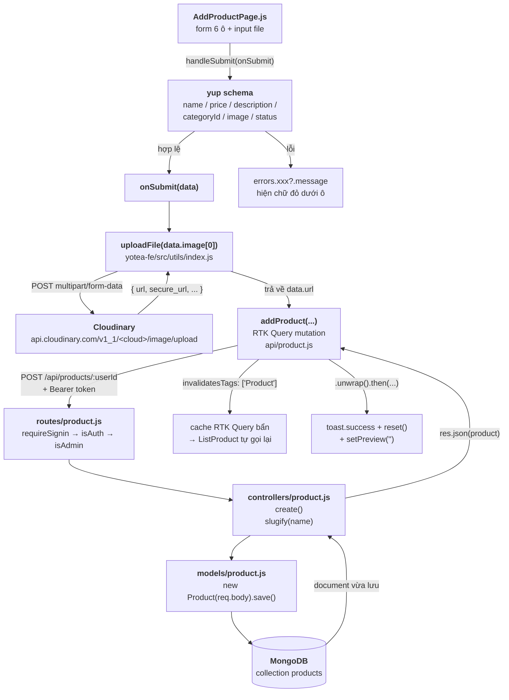

# Bài 32 — Trang quản trị: CRUD, phân trang, upload ảnh Cloudinary

> **Phần 5 · Từng chức năng, từ đầu đến cuối** — Thời lượng ước tính: **~150 phút**
> ⬅️ Bài trước: [31 — Tin tức, liên hệ, cửa hàng và slider trang chủ](31-tin-tuc-lien-he-cua-hang.md) · Bài sau: [33 — Rà soát bảo mật: dự án đang sai ở đâu](33-ra-soat-bao-mat.md) ➡️
> 🏠 [Mục lục](README.md)

---

## 🎯 Sau bài này bạn sẽ

- Đọc hiểu được **toàn bộ khu vực `/admin`**: 8 nhóm màn hình quản trị được dựng theo cùng một khuôn mẫu.
- Mổ được `AdminLayout.js` — sidebar, menu, `<Outlet />` — và biết vì sao mục *Profile* bấm vào là hỏng.
- Nắm được **khuôn mẫu chung**: trang danh sách (gọi API → phân trang → sửa/xoá) → trang thêm (react-hook-form + yup + upload ảnh) → trang sửa (`reset()` nạp dữ liệu cũ).
- **Tự tạo tài khoản Cloudinary miễn phí** của riêng mình, tạo *unsigned upload preset*, và hiểu hàm `uploadFile()` làm gì từng dòng.
- Đọc được bảng trạng thái đơn hàng (`status` 0→4) và biết admin đổi trạng thái đơn bằng cách nào.
- Tự viết trọn **3 màn quản trị Topping** (danh sách / thêm / sửa) + route + mục menu — bài tổng duyệt trước đồ án cuối khoá.

## 📋 Cần chuẩn bị

- Đã hoàn thành [Bài 31 — Tin tức, liên hệ, cửa hàng và slider](31-tin-tuc-lien-he-cua-hang.md).
- Nhớ lại [Bài 20 — `createAsyncThunk`](20-async-thunk.md) và [Bài 22 — RTK Query](22-rtk-query.md), vì khu admin dùng **cả hai**.
- Backend + frontend đang chạy (`npm start` ở cả `yotea-be/` và `yotea-fe/`).
- Một **tài khoản admin** (user có `role = 1`, `active = 1`) để đăng nhập vào `/admin`.
- Một trình duyệt có mạng — bài này sẽ đăng ký Cloudinary.

---

## 0. Sơ đồ luồng — "Thêm một sản phẩm" đi trọn các lớp

Đây là chức năng đại diện cho **cả khu admin**. Mọi màn "thêm" khác (tin tức, danh mục, slider, user) chỉ là bản sao của luồng này với tên field khác.



Còn đây là **đường về** vẽ phẳng cho dễ nhớ — cùng một mạch, đọc từ trái sang phải rồi quay ngược lại:

```
   TRÌNH DUYỆT                          MẠNG                    SERVER              DB
┌──────────────────┐              ┌────────────────┐      ┌───────────────┐   ┌──────────┐
│ AddProductPage   │              │                │      │               │   │          │
│  ├ react-hook-form│              │                │      │               │   │          │
│  ├ yup validate  │              │                │      │               │   │          │
│  ├ uploadFile ───┼──── ① ──────►│ Cloudinary API │      │               │   │          │
│  │            ◄──┼──── ② ───────│ (trả về url)   │      │               │   │          │
│  └ addProduct ───┼──── ③ ──────►│ POST /api/     │─────►│ router        │   │          │
│                  │              │  products/:uid │      │  ↓ middleware │   │          │
│                  │              │                │      │  ↓ controller │──►│ products │
│                  │              │                │      │  ↓ model      │◄──│          │
│  toast + reset ◄─┼──── ④ ───────┼────────────────┼──────│ res.json()    │   │          │
│  cache invalid ──┼──── ⑤ ──────►│ GET /api/      │─────►│ list()        │──►│ products │
│  bảng tự vẽ lại ◄┼──────────────┼────────────────┼──────│               │◄──│          │
└──────────────────┘              └────────────────┘      └───────────────┘   └──────────┘
```

> 💡 Điểm quan trọng nhất của sơ đồ: **ảnh KHÔNG đi qua server Yotea**. Trình duyệt tự đẩy file lên
> Cloudinary (bước ①②), rồi chỉ gửi **một chuỗi URL** về backend (bước ③). Backend Yotea không hề
> biết đến file ảnh, không có thư mục `uploads/`, không cài `multer`.

---

## 1. Khu `/admin` gồm những gì

### 1.1. Cửa vào

`yotea-fe/src/App.js:188-199`

```jsx
    {
      path: "/admin",
      element: (
        <PrivateRouter page="admin">
          <AdminLayout />
        </PrivateRouter>
      ),
      children: [
        {
          path: "",
          element: <Dashboard />,
        },
```

Mọi thứ trong `/admin` đều nằm **bên trong** `<PrivateRouter page="admin">` (đã học ở [Bài 24](24-private-router.md)) và **bên trong** `<AdminLayout />`. Muốn thêm màn quản trị mới, bạn chỉ việc thêm một phần tử vào mảng `children` này.

### 1.2. Điểm danh đủ 8 nhóm màn hình quản trị

| # | Nhóm | URL gốc | Trang danh sách | Trang thêm | Trang sửa / chi tiết | Phân trang? |
|---|---|---|---|---|---|---|
| 1 | Đơn hàng | `/admin/cart` | `cart/CartListPage.js` | — (khách tự đặt) | `cart/CartDetailPage.js` | ✅ |
| 2 | Người dùng | `/admin/user` | `user/UserListPage.js` | `user/AddUserPage.js` | `user/EditUserPage.js` | ✅ |
| 3 | Tin tức | `/admin/news` | `news/NewsListPage.js` | `news/AddNewsPage.js` | `news/EditNewsPage.js` | ✅ |
| 4 | Danh mục tin | `/admin/category-news` | `category-news/CateNewsListPage.js` | `AddCateNewsPage.js` | `EditCateNewsPage.js` | ❌ |
| 5 | Sản phẩm | `/admin/product` | `product/ProductListPage.js` | `product/AddProductPage.js` | `product/EditProductPage.js` | ✅ |
| 6 | Danh mục SP | `/admin/category` | `category/CategoryListPage.js` | `category/AddCategoryPage.js` | `category/EditCategoryPage.js` | ❌ |
| 7 | Slider | `/admin/slider` | `slider/SliderListPage.js` | `slider/AddSlidePage.js` | `slider/EditSlidePage.js` | ❌ |
| 8 | Liên hệ | `/admin/contact` | `contact/ContactListPage.js` | — (khách tự gửi) | `contact/ContactDetailPage.js` | ✅ |

Cộng thêm `Dashboard.js` là **9 mục** trong sidebar.

### 1.3. Những màn là **code chết**

| File | Vì sao chết |
|---|---|
| `pages/admin/profile/AdminUpdateInfoPage.js` | `App.js` **không import**, **không có route** `/admin/profile` |
| `pages/admin/profile/AdminUpdatePassword.js` | như trên |
| `components/admin/StoreList.js` | không file nào import; cũng không có route `/admin/store` |
| `components/admin/AdminCommentList.js` | không file nào import → **màn kiểm duyệt bình luận chưa được nối vào router** |

Bạn có thể tự kiểm chứng bằng lệnh sau (đứng ở gốc repo):

```bash
grep -rn "AdminCommentList\|StoreList\|AdminUpdateInfoPage" yotea-fe/src
```

Kết quả chỉ ra đúng dòng khai báo và dòng `export default` **trong chính file đó** — không có nơi nào import.

> ⚠️ **Chỗ này dự án làm chưa chuẩn:** viết xong 4 file rồi quên nối vào router là chuyện rất hay xảy
> ra ở bài tập lớn. Cách phòng: mỗi khi tạo một page mới, **việc đầu tiên** là thêm route và bấm thử
> URL đó, rồi mới ngồi viết giao diện. Ngoài ra hãy bật ESLint rule `no-unused-modules` hoặc chạy
> `npx depcheck` / `npx unimported` định kỳ để soi file mồ côi.

---

## 2. Mổ `AdminLayout.js` — bộ khung của mọi màn quản trị

File: `yotea-fe/src/pages/layouts/AdminLayout.js` (236 dòng). Lưu ý đường dẫn: nó nằm trong `pages/layouts/`, **không phải** `layouts/`.

### 2.1. Đầu file — lấy user và hàm đăng xuất

`yotea-fe/src/pages/layouts/AdminLayout.js:17-24`

```jsx
const AdminLayout = () => {
  const { user } = useSelector(selectAuth);

  const dispatch = useDispatch();

  const handleLogout = () => {
    dispatch(logout());
  };
```

**Đọc từng dòng:**

| Dòng | Code | Ý nghĩa |
|---|---|---|
| 18 | `const { user } = useSelector(selectAuth);` | Lấy `state.auth.value.user` — dùng để hiện avatar ở góc phải |
| 20 | `const dispatch = useDispatch();` | Chuẩn bị để bắn action |
| 22-24 | `handleLogout` | `dispatch(logout())` — reducer đặt `value = {}` và `isLogged = false`, `PrivateRouter` lập tức đá về `/login` |

### 2.2. Sidebar — 9 mục menu

Sidebar là thẻ `<nav className="dashboard__sidebar ...">` cố định bên trái, rộng `w-60`. Mỗi mục là một `<NavLink>`. Đây là mục đầu tiên, trích nguyên văn:

`yotea-fe/src/pages/layouts/AdminLayout.js:40-53`

```jsx
            <NavLink
              to="/admin/"
              className="sidebar__item flex items-center px-4 py-3 transition cursor-pointer group hover:bg-gray-800 hover:text-gray-200"
            >
              <svg
                className="shrink-0 w-5 h-5 mr-2 text-gray-400 transition group-hover:text-gray-300"
                xmlns="http://www.w3.org/2000/svg"
                viewBox="0 0 20 20"
                fill="currentcolor"
              >
                <path d="M10.707 2.293a1 1 0 00-1.414.0l-7 7a1 1 0 001.414 1.414L4 10.414V17a1 1 0 001 1h2a1 1 0 001-1v-2a1 1 0 011-1h2a1 1 0 011 1v2a1 1 0 001 1h2a1 1 0 001-1v-6.586l.293.293a1 1 0 001.414-1.414l-7-7z" />
              </svg>
              <span>Dashboard</span>
            </NavLink>
```

8 mục còn lại có cấu trúc y hệt, chỉ khác `to`, icon và chữ:

| Dòng | `to` | Icon | Nhãn |
|---|---|---|---|
| 40-53 | `/admin/` | SVG ngôi nhà (inline) | Dashboard |
| 55-63 | `/admin/cart` | `faShoppingCart` | Cart |
| 65-75 | `/admin/user` | `faNewspaper` ⚠️ | Users |
| 77-87 | `/admin/news` | `faNewspaper` | News |
| 89-99 | `/admin/category-news` | `faThList` | Categories News |
| 101-111 | `/admin/product` | `faProductHunt` | Products |
| 113-123 | `/admin/category` | `faThList` | Categories Products |
| 125-135 | `/admin/slider` | `faSlidersH` | Slider |
| 137-147 | `/admin/contact` | `faComment` | Contact |

> ⚠️ **Chỗ này dự án làm chưa chuẩn:** mục **Users** dùng icon `faNewspaper` (tờ báo) — copy-paste
> từ mục News mà quên đổi. Icon đúng phải là `faUsers` / `faUser`. Ngoài ra `AdminLayout.js:3,9`
> import `faCode` và `faStore` nhưng **không dùng ở đâu** → import thừa.
>
> ⚠️ **Không mục nào có route con `page/:page`** trong menu, nên khi bạn đang ở `/admin/product/page/3`
> thì `NavLink` "Products" **không** được tô sáng. `NavLink` chỉ tự thêm class `active` khi URL khớp;
> ở đây dự án cũng không truyền hàm `className={({isActive}) => ...}` nên **thực ra không mục nào
> bao giờ đổi màu** — chỉ có `hover`.

### 2.3. Thanh header trên cùng và `<Outlet />`

`yotea-fe/src/pages/layouts/AdminLayout.js:225-227`

```jsx
          <main>
            <Outlet />
          </main>
```

📖 **Thuật ngữ:** *`<Outlet />`* — cái "lỗ" trong layout để React Router nhét **route con** vào.
Khi URL là `/admin/product`, router render `<AdminLayout />` rồi thay `<Outlet />` bằng
`<ProductListPage />`. Nhờ vậy sidebar và header **không bị vẽ lại** khi bạn chuyển màn.

Vùng nội dung được đẩy sang phải bằng `className="ml-0 transition md:ml-60"` (`:150`) để không bị sidebar `w-60` che.

### 2.4. ⚠️ Link chết `/admin/profile`

`yotea-fe/src/pages/layouts/AdminLayout.js:208-213`

```jsx
                  <Link
                    to="/admin/profile"
                    className="block px-4 py-2 text-sm text-gray-700 hover:bg-gray-100"
                  >
                    Profile
                  </Link>
```

> ⚠️ **Chỗ này dự án làm chưa chuẩn — LINK CHẾT:** trong `App.js` **không có** route nào khớp
> `/admin/profile` (xem lại bảng route ở mục 1.2). Bấm vào mục *Profile* trong menu avatar →
> React Router không tìm ra route, mà `App.js` cũng **không khai báo `errorElement`** → bạn nhận
> được **trang trắng** kèm thông báo lỗi mặc định của router.
>
> Hai file đáng lẽ phải phục vụ link này — `pages/admin/profile/AdminUpdateInfoPage.js` và
> `AdminUpdatePassword.js` — đã viết xong nhưng **không được import vào `App.js`**.
>
> **Cách làm đúng:** hoặc (a) thêm route `{ path: "profile", element: <AdminUpdateInfoPage /> }` vào
> mảng `children` của `/admin`, hoặc (b) xoá luôn mục menu. Và **luôn** khai báo `errorElement` cho
> route gốc để URL sai ra trang 404 tử tế thay vì màn trắng. Ta sẽ làm cả hai ở [Bài 34](34-refactor-du-an.md).

### 2.5. Những nút chỉ để trang trí

| Vị trí | Thứ | Vấn đề |
|---|---|---|
| `:152-157` | Nút `☰` mở sidebar trên mobile | **Không có `onClick`** → trên điện thoại sidebar `-translate-x-full` không bao giờ mở ra được |
| `:158-167` | Ô Search ở header | Không `onSubmit`, không `state` |
| `:169-190` | Chuông thông báo | Không `onClick` |
| `:229` | `<div ... dashboard__overlay />` | Lớp phủ khi mở sidebar mobile, `hidden` cứng, không ai bật |

> ⚠️ Đây là dấu vết của việc **bê nguyên một template HTML tĩnh** (Tailwind UI) vào React mà chưa nối
> logic. Rất phổ biến trong đồ án. Khi bạn gặp một nút "không làm gì", đừng vội nghĩ mình đọc sót —
> hãy `grep` tên class/id của nó, thường là không có handler thật.

---

## 3. Mổ `Dashboard.js` — sự thật phũ phàng

Toàn bộ file, `yotea-fe/src/pages/admin/Dashboard.js:1-7`:

```jsx
import React from "react";

const Dashboard = () => {
  return <div>Dashboard</div>;
};

export default Dashboard;
```

**Nó hiển thị số liệu gì?** — **Không có số liệu nào.** Bảy dòng, in ra đúng chữ `Dashboard`.

- Không `useState`, không `useEffect`, không gọi API, không `useSelector`.
- Không có ô "Doanh thu hôm nay", không biểu đồ, không đếm đơn hàng / sản phẩm / user.
- **Có tính đúng không?** Câu hỏi không áp dụng — không có phép tính nào để mà sai.

> ⚠️ **Chỗ này dự án làm chưa chuẩn:** route mặc định của cả khu quản trị (`/admin`) trỏ vào một
> component rỗng. Người dùng đăng nhập admin xong nhìn thấy màn hình gần như trắng.
>
> **Cách làm đúng (gợi ý để bạn tự làm ở phần Bài tập):** Dashboard nên gọi vài API sẵn có rồi tính:
> tổng đơn (`GET /api/orders` → `data.length`), doanh thu (`reduce` cộng `totalPrice - priceDecrease`
> của các đơn `status === 3`), tổng sản phẩm, tổng user. Tuy nhiên backend **không trả về `total`**
> trong header hay body, nên hiện tại muốn đếm là phải **tải hết bản ghi về rồi lấy `.length`** —
> đúng cái anti-pattern mà cả dự án đang mắc (xem mục 4.2).

---

## 4. KHUÔN MẪU CHUNG của mọi màn quản trị

Đây là mục quan trọng nhất bài. Nắm được khuôn này thì 8 nhóm màn hình kia bạn đọc lướt trong 5 phút.

```
                       ┌─────────────────────────────────────────┐
   /admin/<res>        │  TRANG DANH SÁCH  (<Res>ListPage.js)    │
   /admin/<res>/page/n │  ├ đọc :page từ useParams()             │
                       │  ├ công thức phân trang (limit=10)      │
                       │  ├ <List<Res> start limit />  ← bảng    │
                       │  │    ├ gọi API / thunk / RTK Query     │
                       │  │    ├ nút Edit → Link                 │
                       │  │    └ nút Delete → Swal → xoá         │
                       │  └ <AdminPagination page totalPage url/>│
                       └────────────┬───────────────┬────────────┘
                    "Thêm" ─────────┘               └───────── "Edit"
                        ▼                                     ▼
      ┌──────────────────────────────┐      ┌──────────────────────────────┐
      │ TRANG THÊM (Add<Res>Page.js) │      │ TRANG SỬA (Edit<Res>Page.js) │
      │ ├ schema yup (CÓ image)      │      │ ├ schema yup (BỎ image)      │
      │ ├ useForm + yupResolver      │      │ ├ useEffect → get(slug|id)   │
      │ ├ preview ảnh (useState)     │      │ ├ reset(data) nạp giá trị cũ │
      │ ├ uploadFile(...) → url      │      │ ├ chỉ upload NẾU chọn ảnh mới│
      │ ├ POST                       │      │ ├ PUT                        │
      │ └ toast.success + reset()    │      │ └ toast.success + navigate() │
      └──────────────────────────────┘      └──────────────────────────────┘
```

### 4.1. Trang danh sách — công thức phân trang lặp y hệt 5 lần

`yotea-fe/src/pages/admin/product/ProductListPage.js:6-17`

```js
const ProductListPage = () => {
  const { data: products } = useGetProductsQuery({});
  const totalItem = products?.length || 0;

  const { page } = useParams();

  const limit = 10;
  const totalPage = Math.ceil(totalItem / limit);
  let currentPage = Number(page) || 1;
  currentPage =
    currentPage < 1 ? 1 : currentPage > totalPage ? totalPage : currentPage;
  const start = (currentPage - 1) * limit > 0 ? (currentPage - 1) * limit : 0;
```

**Đọc từng dòng:**

| Dòng | Code | Ý nghĩa |
|---|---|---|
| 7 | `useGetProductsQuery({})` | Gọi RTK Query **không truyền `start`/`limit`** → tải **TOÀN BỘ** sản phẩm |
| 8 | `products?.length \|\| 0` | Dùng độ dài mảng làm **tổng số bản ghi** |
| 10 | `const { page } = useParams()` | Lấy số trang từ URL `/admin/product/page/3` → `page = "3"` (chuỗi!) |
| 12 | `const limit = 10` | Mỗi trang 10 dòng — hằng số cứng, lặp ở cả 5 trang list |
| 13 | `Math.ceil(totalItem / limit)` | 27 bản ghi ÷ 10 = 2.7 → **3 trang** |
| 14 | `Number(page) \|\| 1` | Đổi chuỗi sang số; `undefined`/`NaN`/`0` đều rơi về `1` |
| 15-16 | ternary kẹp | Ép `currentPage` nằm trong `[1, totalPage]` |
| 17 | `start` | Bỏ qua bao nhiêu bản ghi: trang 3 → `(3-1)*10 = 20` |

Đoạn 6 dòng này (từ `const limit = 10`) **lặp nguyên xi** ở `CartListPage:11-16`, `ContactListPage:12-17`, `NewsListPage:12-17`, `ProductListPage:12-17`, `UserListPage:14-19`.

> ⚠️ **Chỗ này dự án làm chưa chuẩn — 2 request cho 1 trang:** `ProductListPage` gọi
> `useGetProductsQuery({})` để lấy tổng, rồi `ListProduct` bên trong lại gọi
> `useGetProductsQuery({ start, limit })` để lấy đúng 10 dòng. **Mỗi lần vào trang là 2 request**, và
> request đầu kéo về **toàn bộ** bảng sản phẩm chỉ để đếm.
>
> Nguyên nhân gốc: backend `list()` trả về **mảng trần**, không kèm tổng số. Cách đúng là backend trả
> `{ data: [...], total: 27 }` hoặc set header `X-Total-Count`, rồi FE đọc header đó. Ta sẽ sửa ở
> [Bài 34](34-refactor-du-an.md).
>
> ⚠️ **Bug clamp khi bảng rỗng:** `totalItem = 0` → `totalPage = 0` → dòng 15-16 thấy
> `currentPage (1) > totalPage (0)` nên gán `currentPage = 0`. Kết quả `<AdminPagination page={0}>`.
> May là `AdminPagination` chỉ render dãy số khi `totalPage > 1` nên không lộ ra, nhưng logic vẫn sai.
> Cách đúng: `const totalPage = Math.max(1, Math.ceil(totalItem / limit));`

### 4.2. Bảng dữ liệu + nút Xoá với SweetAlert2

`yotea-fe/src/components/admin/ListProduct.js:8-30`

```js
const ListProduct = ({ start, limit }) => {
  const { data: products } = useGetProductsQuery({ start, limit });
  const [deleteProduct] = useDeleteProductMutation();

  const handleRemove = async (id) => {
    Swal.fire({
      title: "Bạn có chắc chắn muốn xóa không?",
      text: "Bạn không thể hoàn tác sau khi xóa!",
      icon: "warning",
      showCancelButton: true,
      confirmButtonColor: "#3085d6",
      cancelButtonColor: "#d33",
      confirmButtonText: "Yes, delete it!",
    }).then((result) => {
      if (result.isConfirmed) {
        deleteProduct(id)
          .unwrap()
          .then(() => {
            Swal.fire("Thành công!", "Đã xóa thành công.", "success");
          });
      }
    });
  };
```

📖 **Thuật ngữ:** *SweetAlert2* (`Swal`) — thư viện hộp thoại đẹp thay cho `alert()`/`confirm()` xấu
xí của trình duyệt. `Swal.fire({...})` trả về một **Promise**; khi người dùng bấm nút, promise
resolve với object `result`, trong đó `result.isConfirmed === true` nghĩa là họ bấm nút xác nhận.

Khối `Swal.fire` này được **copy y hệt ở 9 file**: `CategoryListPage`, `CateNewsList`, `ContactList`,
`ListProduct`, `ListSlider`, `NewsList`, `StoreList`, `UserList`, `AdminCommentList`.

> ✅ **`ListProduct` là component xoá DUY NHẤT làm đúng.** Nó dùng `.unwrap().then(...)` — chỉ báo
> "Đã xóa thành công" **sau khi** server trả 2xx.
>
> ⚠️ 6 component còn lại viết kiểu này (ví dụ `ContactList.js:31-32`):
>
> ```js
> dispatch(deleteContact(id));
> Swal.fire("Thành công!", "Đã xóa thành công.", "success");
> ```
>
> `dispatch(thunk)` trả về promise nhưng **không ai chờ**, và `createAsyncThunk` **nuốt lỗi** (không
> throw ra ngoài). Kết quả: server trả 401/500 thì người dùng **vẫn thấy "Đã xóa thành công"** trong
> khi dòng dữ liệu vẫn còn nguyên sau khi F5.
> **Cách đúng:** `await dispatch(deleteContact(id)).unwrap()` bọc trong `try/catch`.
>
> ⚠️ Ngay cả `ListProduct` cũng **thiếu `.catch()`** → xoá lỗi thì im lặng, không báo gì.

Phần thân bảng, `yotea-fe/src/components/admin/ListProduct.js:95-102`:

```jsx
        {products?.map((item, index) => (
          <tr key={index}>
            <td /* ...class Tailwind... */>
              {++index + start}
            </td>
            <td /* ...class Tailwind... */>
              {item._id}
            </td>
```

> ⚠️ `{++index + start}` — **sửa thẳng tham số `index` của `.map`**. Nó chạy được (STT trang 3 bắt
> đầu từ 21) nhưng là anti-pattern kinh điển: biến của callback không nên bị mutate. Lặp ở 6 file.
> **Cách đúng:** `{index + 1 + start}`.
>
> ⚠️ `key={index}` — dùng chỉ số mảng làm `key`. Khi xoá dòng giữa bảng, React ghép nhầm DOM cũ với
> dữ liệu mới. **Cách đúng:** `key={item._id}`.

Cuối mỗi dòng là cặp nút Edit/Delete, `yotea-fe/src/components/admin/ListProduct.js:141-152`:

```jsx
              <Link
                to={`/admin/product/${item.slug}/edit`}
                className=/* ...class Tailwind... */
              >
                Edit
              </Link>
              <button
                className=/* ...class Tailwind... */
                onClick={() => handleRemove(item._id)}
              >
                Delete
              </button>
```

Chú ý: **Edit dùng `slug`**, **Delete dùng `_id`**. Hai khoá khác nhau trong cùng một dòng bảng — nhớ kỹ điều này, mục 6 sẽ cho thấy nó gây bug thế nào.

### 4.3. Trang thêm — react-hook-form + yup + toast

Bộ ba luôn đi cùng nhau:

| Thư viện | Việc |
|---|---|
| `react-hook-form` | Quản lý giá trị các ô input mà **không** cần `useState` cho từng ô |
| `yup` + `@hookform/resolvers/yup` | Mô tả luật hợp lệ bằng schema, tự sinh thông báo lỗi tiếng Việt |
| `react-toastify` | Bật thông báo nhỏ ở góc màn hình (`<ToastContainer />` đặt ở `App.js:356`) |

Xem chi tiết ở mục 5.

### 4.4. Trang sửa — bí quyết `reset()`

Trang sửa khác trang thêm đúng **ba** điểm:

1. **Schema bỏ trường ảnh** (để sửa mà không bắt chọn lại ảnh).
2. **Có `useEffect` nạp bản ghi cũ** rồi gọi `reset(data)` để đổ vào form.
3. **Chỉ upload ảnh khi người dùng thực sự chọn file mới.**

📖 **Thuật ngữ:** *`reset(values)`* — hàm của react-hook-form, ghi đè **toàn bộ** giá trị form bằng
object bạn truyền vào. Đây là cách chuẩn để "nạp dữ liệu cũ" vì dữ liệu về **bất đồng bộ** (sau khi
component đã render xong), nên không thể dùng `defaultValues` lúc khởi tạo `useForm`.

---

## 5. Soi kỹ `AddProductPage.js`

### 5.1. Schema yup

`yotea-fe/src/pages/admin/product/AddProductPage.js:15-27`

```js
const schema = yup.object().shape({
  name: yup.string().required("Vui lòng nhập tên sản phẩm"),
  price: yup
    .string()
    .required("Vui lòng nhập giá sản phẩm")
    .test("min", "Vui lòng nhập lại giá SP", (value) => Number(value) >= 0),
  description: yup.string().required("Vui lòng nhập mô tả SP"),
  categoryId: yup.string().required("Vui lòng chọn danh mục SP"),
  image: yup
    .mixed()
    .test("require", "Vui lòng chọn ảnh SP", (value) => value.length),
  status: yup.number().required("Vui lòng chọn trạng thái SP"),
});
```

**Đọc từng dòng:**

| Dòng | Luật | Giải thích |
|---|---|---|
| 16 | `name` bắt buộc | chuỗi rỗng → báo lỗi |
| 17-20 | `price` là **string** rồi mới `Number(value) >= 0` | `yup.mixed().test(tên, thông_báo, hàm_kiểm)`; hàm trả `false` là lỗi |
| 21 | `description` bắt buộc | |
| 22 | `categoryId` bắt buộc | giá trị là `_id` của danh mục |
| 23-25 | `image` là `mixed()` + `value.length` | `<input type="file">` trả về một **`FileList`**; chưa chọn file thì `length === 0` → falsy → lỗi. **Đây chính là chỗ "bắt buộc phải upload ảnh khi THÊM"** |
| 26 | `status` là **number** | yup tự ép `"1"` → `1` |

> ⚠️ **Chỗ này dự án làm chưa chuẩn — 3 lỗ hổng validate:**
> 1. `price: yup.string()` + `Number(value) >= 0`: `Number("") === 0` nên **ô giá để trống vẫn lọt**
>    qua test `min` (may là `.required()` chặn được), còn `Number("abc")` là `NaN`, và `NaN >= 0` là
>    `false` nên báo lỗi — đúng nhưng thông báo sai ngữ nghĩa. **Cách đúng:**
>    `yup.number().typeError("Giá phải là số").min(0, "...").required("...")`.
> 2. `status: yup.number().required()`: chọn option placeholder `""` → yup ép thành `NaN`, mà `NaN`
>    **không phải** `undefined` nên `.required()` **vẫn pass** → có thể submit khi chưa chọn trạng
>    thái. **Cách đúng:** thêm `.typeError("Vui lòng chọn trạng thái SP")`.
> 3. `image: value.length` — nếu `value` là `undefined` (trình duyệt lạ) thì đọc `.length` gây
>    **TypeError trong resolver**. **Cách đúng:** `(value) => value?.length > 0`.

### 5.2. Ô chọn danh mục lấy dữ liệu từ đâu

`yotea-fe/src/pages/admin/product/AddProductPage.js:29-41`

```js
const AddProductPage = () => {
  const dispatch = useDispatch();
  const categories = useSelector(selectCatesProduct);
  const [addProduct] = useAddProductMutation();
  const [preview, setPreview] = useState();

  useEffect(() => {
    dispatch(getCates());
  }, []);

  const handlePreview = (e) => {
    setPreview(URL.createObjectURL(e.target.files[0]));
  };
```

Đường đi của danh sách danh mục:

```
useEffect  →  dispatch(getCates())            [redux/categoryProductSlice.js:8-14]
              └─ getAll()                     [api/category.js:7-11]
                 └─ GET /api/category/?_sort=createdAt&_order=desc
                    └─ routes/category.js → controllers/category.js list()
                       └─ Category.find(...)  → MongoDB
              ← payload  →  state.cateProduct.value
useSelector(selectCatesProduct)               [categoryProductSlice.js:64]
              → categories → <option> trong <select>
```

Và đây là ô `<select>`, `yotea-fe/src/pages/admin/product/AddProductPage.js:166-178`:

```jsx
                  <select
                    id="form__add-product-cate"
                    {...register("categoryId")}
                    defaultValue=""
                    className=/* ...class Tailwind... */
                  >
                    <option value="">-- Chọn danh mục sản phẩm --</option>
                    {categories?.map((cate, index) => (
                      <option key={index} value={cate._id}>
                        {cate.name}
                      </option>
                    ))}
                  </select>
```

Điểm mấu chốt: `value={cate._id}` — **cái gửi lên server là ObjectId của danh mục**, còn `{cate.name}` chỉ là chữ cho người xem.

Ô trạng thái, `yotea-fe/src/pages/admin/product/AddProductPage.js:190-199`:

```jsx
                  <select
                    id="form__add-product-stt"
                    {...register("status")}
                    defaultValue={0}
                    className=/* ...class Tailwind... */
                  >
                    <option value="">-- Chọn trạng thái sản phẩm --</option>
                    <option value={0}>Ẩn</option>
                    <option value={1}>Hiển thị</option>
                  </select>
```

> ⚠️ `defaultValue={0}` đặt trên `<select>` **đã có `{...register(...)}`** là xung đột: react-hook-form
> mới là bên quản lý giá trị. **Cách đúng:** `useForm({ resolver, defaultValues: { status: 0 } })`.

### 5.3. Ô chọn file và preview

`yotea-fe/src/pages/admin/product/AddProductPage.js:245-251`

```jsx
                          <input
                            id="form__add-product-image"
                            {...register("image")}
                            onChange={(e) => handlePreview(e)}
                            type="file"
                            className="sr-only"
                          />
```

**Đọc từng dòng:**

| Dòng | Ý nghĩa |
|---|---|
| 247 | `{...register("image")}` trải ra `{ name, onChange, onBlur, ref }` của react-hook-form |
| 248 | `onChange` viết **SAU** spread → **ghi đè** `onChange` của RHF |
| 250 | `className="sr-only"` — giấu input thật, người dùng bấm vào `<label>` đẹp ở trên (`:240-244`) |

> ⚠️ **Chỗ này dự án làm chưa chuẩn — thứ tự spread:** vì `onChange` của RHF bị ghi đè, react-hook-form
> chỉ còn nắm được file thông qua `ref` (RHF v7 đọc `ref.current.files` lúc submit) → **may mà vẫn
> chạy**. Nhưng đây là pattern rất dễ vỡ. **Cách đúng:**
>
> ```js
> // đoạn này bạn tự viết thêm, dự án chưa có
> const { onChange: rhfOnChange, ...rest } = register("image");
> <input type="file" {...rest} onChange={(e) => { rhfOnChange(e); handlePreview(e); }} />
> ```
>
> ⚠️ `URL.createObjectURL(...)` (`:40`) **không bao giờ được `URL.revokeObjectURL`** → mỗi lần chọn
> ảnh lại giữ thêm một blob trong bộ nhớ. Lặp ở **9 form**. **Cách đúng:** lưu url cũ và gọi
> `URL.revokeObjectURL(urlCu)` trước khi tạo url mới, hoặc dọn trong `useEffect` cleanup.
>
> ⚠️ Input **không có `accept="image/*"`**, không kiểm dung lượng dù UI ghi "PNG, JPG, GIF up to 10MB"
> (`:256`) — dòng chữ đó chỉ là trang trí.

### 5.4. `onSubmit` — nơi mọi thứ gặp nhau

`yotea-fe/src/pages/admin/product/AddProductPage.js:50-69`

```js
  const onSubmit = async (data) => {
    try {
      const url = await uploadFile(data.image[0]);

      addProduct({
        ...data,
        image: url,
        price: +data.price,
        status: +data.status,
      })
        .unwrap()
        .then(() => {
          toast.success("Thêm sản phẩm thành công");
          setPreview("");
          reset();
        });
    } catch (error) {
      toast.error("Có lỗi xảy ra, vui lòng thử lại");
    }
  };
```

**Đọc từng dòng:**

| Dòng | Code | Ý nghĩa |
|---|---|---|
| 52 | `uploadFile(data.image[0])` | `data.image` là `FileList`; `[0]` là `File` đầu tiên. **Chờ upload xong mới đi tiếp** |
| 54 | `addProduct({...})` | Mutation của RTK Query → `POST /api/products/:userId` |
| 57 | `price: +data.price` | Dấu `+` đứng trước chuỗi là cách ép sang số ngắn gọn: `+"35000" === 35000` |
| 58 | `status: +data.status` | tương tự |
| 60 | `.unwrap()` | Biến kết quả mutation thành promise "thật": thành công thì resolve, lỗi thì **reject** |
| 61-65 | `.then(...)` | Chỉ chạy khi server trả 2xx: toast + xoá preview + `reset()` làm trắng form |

> ⚠️ **Chỗ này dự án làm chưa chuẩn — `try/catch` bắt hụt:** khối `try` chỉ ôm **lời gọi đồng bộ**.
> Khi `.unwrap()` reject (API 400/401/500), promise vỡ **ngoài** phạm vi `try` → trình duyệt in
> `Unhandled promise rejection`, **không có toast lỗi**, người dùng bấm mãi không hiểu vì sao.
> **Cách đúng:** thêm `.catch(() => toast.error("..."))` sau `.then(...)`, hoặc dùng
> `await addProduct({...}).unwrap()` để lỗi rơi đúng vào `catch`.

---

## 6. Soi kỹ `EditProductPage.js`

### 6.1. Schema — bỏ hẳn `image`

`yotea-fe/src/pages/admin/product/EditProductPage.js:15-24`

```js
const schema = yup.object().shape({
  name: yup.string().required("Vui lòng nhập tên sản phẩm"),
  price: yup
    .string()
    .required("Vui lòng nhập giá sản phẩm")
    .test("min", "Vui lòng nhập lại giá SP", (value) => Number(value) >= 0),
  description: yup.string().required("Vui lòng nhập mô tả SP"),
  categoryId: yup.string().required("Vui lòng chọn danh mục SP"),
  status: yup.number().required("Vui lòng chọn trạng thái SP"),
});
```

So với `AddProductPage.js:15-27` — **thiếu đúng khối `image`**. Đó là chủ ý: sửa sản phẩm mà không muốn đổi ảnh thì để trống ô file.

### 6.2. Nạp dữ liệu cũ bằng `reset()`

`yotea-fe/src/pages/admin/product/EditProductPage.js:64-76`

```js
  useEffect(() => {
    dispatch(getCates());

    const getProduct = async () => {
      const { data } = await get(slug);
      setPreview(data.image);
      reset({
        ...data,
        categoryId: data.categoryId?._id,
      });
    };
    getProduct();
  }, []);
```

**Đọc từng dòng:**

| Dòng | Ý nghĩa |
|---|---|
| 65 | Nạp danh sách danh mục cho `<select>` (giống trang thêm) |
| 68 | `get(slug)` → `GET /api/products/<slug>/?_expand=categoryId` |
| 69 | Đổ URL ảnh cũ vào ô preview → người dùng **thấy ngay** ảnh hiện tại |
| 70-73 | `reset()` đổ toàn bộ bản ghi vào form |
| 72 | **Điểm dạy quan trọng:** vì có `_expand=categoryId`, `data.categoryId` là **cả object danh mục**, không phải chuỗi id. `<select>` chỉ so khớp được với chuỗi, nên phải rút `._id` ra |

> 💡 **Mẹo:** mỗi khi trang sửa có `<select>` mà "không tự chọn đúng mục cũ", 90% là do bạn quên
> chuyển object đã `populate` về `_id` như dòng 72.

### 6.3. Giữ ảnh cũ nếu không chọn ảnh mới

`yotea-fe/src/pages/admin/product/EditProductPage.js:43-58`

```js
  const onSubmit = async (data) => {
    try {
      if (typeof data.image === "object" && data.image.length) {
        data.image = await uploadFile(data.image[0]);
      }

      updateProduct(data)
        .unwrap()
        .then(() => {
          toast.success("Cập nhật SP thành công");
          navigate("/admin/product");
        });
    } catch (error) {
      toast.error("Có lỗi xảy ra, vui lòng thử lại");
    }
  };
```

Dòng 45 là **trái tim của trang sửa**. Giải thích thật kỹ:

| Tình huống | `data.image` là gì | `typeof` | `.length` | Kết quả |
|---|---|---|---|---|
| Người dùng **không** chọn ảnh mới | Chuỗi URL cũ do `reset()` nạp vào, ví dụ `"http://res.cloudinary.com/..."` | `"string"` | (không xét) | Điều kiện **false** → bỏ qua upload → gửi nguyên URL cũ lên server ✅ |
| Người dùng **có** chọn ảnh mới | `FileList` có 1 phần tử | `"object"` | `1` | Điều kiện **true** → upload → thay `data.image` bằng URL mới ✅ |
| Bấm vào ô file rồi bấm Cancel | `FileList` rỗng | `"object"` | `0` | Điều kiện **false** → giữ ảnh cũ ✅ |

Mẫu 3 dòng này lặp y hệt ở `EditCategoryPage:43-45`, `EditNewsPage:40-42`, `EditSlidePage`, `EditUserPage:67-69`, `AdminUpdateInfoPage`.

> ⚠️ **BUG NẶNG — trang sửa sản phẩm không nạp được dữ liệu:** `App.js:274-277` khai báo route là
> `":id/edit"`, nhưng `EditProductPage.js:32` lại đọc `const { slug } = useParams();`.
> **Tên tham số không khớp** → `slug === undefined` → gọi `get(undefined)` → request
> `GET /api/products/undefined` → form trống trơn.
>
> Nghịch lý: **giá trị trong URL lại đúng là slug** (do `ListProduct.js:142` sinh ra
> `/admin/product/${item.slug}/edit`). Chỉ có **tên** tham số trong `App.js` bị đặt sai.
> **Cách đúng:** đổi `App.js` thành `path: ":slug/edit"`. Cùng lỗi ở `EditCategoryPage:28`,
> `EditNewsPage:27`, `EditCateNewsPage:25`. Riêng `EditSlidePage:22` và `EditUserPage:50` dùng `id` —
> **đúng**, vì route của chúng cũng là `:id` và link sinh ra từ `item._id`.
>
> ⚠️ **Bất nhất giữa thêm và sửa:** `AddProductPage` ép `price: +data.price`, `status: +data.status`;
> `EditProductPage` **gửi thẳng `data`** nên `price`/`status` là **chuỗi**. May là Mongoose tự cast
> `"1"` → `1` theo schema, nhưng đây vẫn là bất nhất rõ rệt.
>
> ⚠️ `EditProductPage.js:266` có `<div className="error-image ..." />` **rỗng**, không bind `errors` —
> tàn dư của trang thêm, code chết.

---

## 7. UPLOAD ẢNH CLOUDINARY

### 7.1. Toàn bộ hàm `uploadFile`

`yotea-fe/src/utils/index.js:3-12`

```js
export const uploadFile = async (fileName) => {
  const formData = new FormData();
  formData.append("file", fileName);
  formData.append("upload_preset", "kkio3wiw");
  const { data } = await axios.post(
    "https://api.cloudinary.com/v1_1/levantuan/image/upload",
    formData
  );
  return data.url;
};
```

Mười dòng này là **toàn bộ** hệ thống upload ảnh của Yotea. Không có `multer`, không có thư mục `uploads/` trên server, backend không hề đụng vào file.

**Đọc từng dòng:**

| Dòng | Code | Ý nghĩa |
|---|---|---|
| 3 | `uploadFile(fileName)` | Tham số đặt tên nhầm — nó nhận **object `File`**, không phải tên file |
| 4 | `new FormData()` | Tạo "phong bì" kiểu `multipart/form-data` |
| 5 | `append("file", fileName)` | Nhét file vào trường `file` — tên trường Cloudinary quy định |
| 6 | `append("upload_preset", "kkio3wiw")` | Nhét **tên preset**; đây là "vé" cho phép upload không cần chữ ký |
| 7-10 | `axios.post(url, formData)` | axios thấy body là `FormData` nên **tự đặt** `Content-Type: multipart/form-data; boundary=...` |
| 11 | `return data.url` | Trả về **một chuỗi URL** |

### 7.2. `FormData` là gì

📖 **Thuật ngữ:** *`FormData`* — API sẵn có của trình duyệt, mô phỏng một biểu mẫu HTML có
`enctype="multipart/form-data"`. Khác với JSON (chỉ chở được chữ và số), `FormData` chở được **dữ liệu
nhị phân** (ảnh, video, PDF).

```
POST /v1_1/levantuan/image/upload HTTP/1.1
Content-Type: multipart/form-data; boundary=----WebKitFormBoundaryAbC123

------WebKitFormBoundaryAbC123
Content-Disposition: form-data; name="file"; filename="tra-sua-tran-chau.jpg"
Content-Type: image/jpeg

<...hàng trăm KB dữ liệu nhị phân của tấm ảnh...>
------WebKitFormBoundaryAbC123
Content-Disposition: form-data; name="upload_preset"

kkio3wiw
------WebKitFormBoundaryAbC123--
```

`boundary` là chuỗi ngẫu nhiên đóng vai trò "vách ngăn" giữa các phần. Bạn **không được** tự đặt
`Content-Type` khi gửi `FormData` — nếu đặt tay, `boundary` sẽ mất và server không tách được các phần.

### 7.3. Unsigned upload là gì

Cloudinary có **hai** cách nhận file:

| | **Signed upload** | **Unsigned upload** |
|---|---|---|
| Ai ký | Server của bạn, dùng **API Secret** | Không ai ký |
| Vé vào cửa | Chữ ký `signature` + `timestamp` | Chỉ cần tên **upload preset** |
| API Secret lộ ra trình duyệt? | Không | Không (vì không dùng đến) |
| Ai upload được? | Chỉ người server bạn cho phép | **Bất kỳ ai biết cloud name + tên preset** |
| Kiểm soát | Chặt | Lỏng — chỉ giới hạn bằng cấu hình preset |
| Dùng khi | Ứng dụng thật, cần kiểm duyệt | Đồ án, prototype, ảnh công khai |

📖 **Thuật ngữ:** *upload preset* — một "hồ sơ cấu hình sẵn" trên Cloudinary: lưu vào thư mục nào,
tự resize không, định dạng gì, có cho phép unsigned không. Khi bạn gửi kèm `upload_preset=kkio3wiw`,
Cloudinary tra ra hồ sơ đó và áp dụng.

> 🔒 **Ghi chú bảo mật:** unsigned preset nghĩa là **bất kỳ ai** xem source trang web của bạn (Ctrl+U
> hoặc tab Network) đều đọc được cloud name + preset, và có thể tự viết một vòng lặp đẩy hàng nghìn
> ảnh rác lên tài khoản của bạn cho tới khi hết quota. Với dự án thật, cách đúng là: FE xin server
> một chữ ký (`GET /api/cloudinary/signature`), server ký bằng API Secret giữ trong `.env`, FE gửi
> file kèm chữ ký đó. Cloudinary còn cho phép giới hạn preset theo **Allowed origins** — hãy bật.

### 7.4. ⚠️ Cloud name và preset trong dự án là của người khác

> ⚠️ **Chỗ này dự án làm chưa chuẩn — HARDCODE TÀI KHOẢN NGƯỜI KHÁC:**
>
> - Cloud name: **`levantuan`**
> - Upload preset: **`kkio3wiw`**
>
> Đây là tài khoản Cloudinary của **tác giả gốc bài giảng** mà đồ án này tham khảo, **không phải** của
> bạn. Nó bị nhúng cứng vào mã nguồn, không qua biến môi trường.
>
> Hệ quả bạn sẽ gặp ngay khi chạy dự án hôm nay:
> 1. Tài khoản đó **có thể đã bị xoá, khoá, hoặc đã tắt unsigned preset** → mọi lần bấm "Thêm sản
>    phẩm" đều **thất bại ở bước upload**, và vì `try/catch` bắt hụt (mục 5.4) nên bạn chỉ thấy...
>    không có gì xảy ra.
> 2. Nếu nó còn sống, thì **mọi ảnh bạn upload đang nằm trên tài khoản của người lạ** — họ xoá lúc
>    nào thì toàn bộ ảnh sản phẩm của bạn hỏng lúc đó.
> 3. Ảnh mẫu (placeholder) `https://res.cloudinary.com/levantuan/image/upload/v1644302455/...` lặp ở
>    **9 file** cũng thuộc tài khoản này.
>
> **Bắt buộc:** trước khi làm phần "Tự tay làm", bạn phải có tài khoản Cloudinary của **chính mình**.

### 7.5. Tự tạo tài khoản Cloudinary miễn phí — làm theo từng bước

**Bước 1 — Đăng ký (2 phút).**
1. Mở trình duyệt, vào `https://cloudinary.com/users/register_free`.
2. Điền email, mật khẩu, tên. Chọn Role = *Developer*, Primary interest = *Programmable Media*.
3. Bấm **Create account** → mở hộp thư, bấm link xác nhận.

**Bước 2 — Lấy Cloud name.**
1. Sau khi đăng nhập, bạn đứng ở màn **Dashboard** (hoặc bấm **Programmable Media → Dashboard**).
2. Nhìn khối **Product Environment Credentials**, dòng **Cloud name** — ví dụ `dq7xk2abc`.
3. Chép lại. Đây là thứ sẽ thay cho chữ `levantuan` trong URL.

> 💡 API Key và API Secret ở ngay dưới — **đừng** chép chúng vào code frontend. Unsigned upload không cần.

**Bước 3 — Tạo unsigned upload preset.**
1. Bấm biểu tượng **bánh răng ⚙ (Settings)** ở thanh bên trái (hoặc góc trên bên phải).
2. Chọn tab **Upload** → cuộn xuống mục **Upload presets**.
3. Bấm **Add upload preset**.
4. **Upload preset name**: gõ `yotea_unsigned` (hoặc để tên tự sinh, miễn là bạn chép lại).
5. **Signing Mode**: đổi từ `Signed` sang **`Unsigned`** ← **BƯỚC QUAN TRỌNG NHẤT**.
6. **Folder**: gõ `yotea` để mọi ảnh gom vào một thư mục cho gọn.
7. (Tuỳ chọn) tab **Upload Manipulations** → **Incoming transformation** → đặt `width 1000, crop limit` để tự thu nhỏ ảnh quá to.
8. Bấm **Save** ở góc trên bên phải.
9. Quay lại danh sách preset, xác nhận dòng của bạn ghi `Unsigned`. Chép **tên preset**.

**Bước 4 — Thử trước bằng terminal (không cần code).**

```bash
# thay <CLOUD_NAME> và <PRESET> bằng của bạn; đứng ở thư mục nào cũng được
curl -X POST "https://api.cloudinary.com/v1_1/<CLOUD_NAME>/image/upload" \
  -F "file=@anh-thu.jpg" \
  -F "upload_preset=<PRESET>"
```

Nếu đúng, bạn nhận JSON dài, trong đó có:

```json
{
  "public_id": "yotea/xyz123",
  "url": "http://res.cloudinary.com/<CLOUD_NAME>/image/upload/v1.../yotea/xyz123.jpg",
  "secure_url": "https://res.cloudinary.com/<CLOUD_NAME>/image/upload/v1.../yotea/xyz123.jpg"
}
```

Nếu sai preset, bạn nhận `{"error":{"message":"Upload preset not found"}}`.
Nếu preset còn để `Signed`, bạn nhận `{"error":{"message":"Upload preset must be whitelisted for unsigned uploads"}}`.

**Bước 5 — Dùng trong dự án.** Ở phần "Tự tay làm" bên dưới, bạn sẽ tạo **file mới**
`yotea-fe/src/utils/cloudinary.js` chứa hàm upload dùng tài khoản của bạn — **không sửa** `utils/index.js`
(ta để dành việc dọn dẹp đó cho [Bài 34](34-refactor-du-an.md)).

### 7.6. ⚠️ `data.url` thay vì `data.secure_url`

Dòng cuối hàm là `return data.url;`. Cloudinary trả về **cả hai**:

| Trường | Giá trị | |
|---|---|---|
| `data.url` | `http://res.cloudinary.com/...` | **HTTP** — không mã hoá |
| `data.secure_url` | `https://res.cloudinary.com/...` | **HTTPS** — mã hoá |

> ⚠️ **Chỗ này dự án làm chưa chuẩn:** dùng `data.url` nghĩa là **URL http:// được ghi thẳng vào
> database**. Khi bạn deploy website lên tên miền https (Vercel/Netlify đều mặc định https), trình
> duyệt gặp ảnh http trong trang https sẽ coi là **mixed content** và **chặn không tải ảnh** (Chrome
> hiện icon ổ khoá gạch chéo, ảnh vỡ). Tệ hơn: URL đã nằm trong DB rồi, sửa code không đủ — phải chạy
> script cập nhật lại toàn bộ bản ghi cũ.
>
> **Cách đúng — đổi đúng một chữ:**
>
> ```js
> // đoạn này bạn tự viết thêm, dự án chưa có
> return data.secure_url;
> ```

---

## 8. Phân trang admin — `AdminPagination` và người anh em phía khách

### 8.1. `AdminPagination.js`

`yotea-fe/src/components/admin/AdminPagination.js:3-20`

```jsx
const AdminPagination = ({ page, totalPage, url }) => {
  const pagination = [];

  for (let i = 1; i <= totalPage; i++) {
    pagination.push(
      <Link
        key={i}
        to={`/admin/${url}/page/${i}`}
        className={`${
          page === i
            ? "z-10 bg-indigo-50 border-indigo-500 text-indigo-600"
            : "bg-white border-gray-300 text-gray-500 hover:bg-gray-50"
        } relative inline-flex items-center px-4 py-2 border text-sm font-medium`}
      >
        {i}
      </Link>
    );
  }
```

**Đọc từng dòng:**

| Dòng | Ý nghĩa |
|---|---|
| 3 | Nhận đúng 3 props, **không có state, không gọi API** — component thuần trình bày |
| 4-6 | Dựng sẵn một mảng phần tử React bằng vòng `for` thường (không phải `.map`) |
| 10 | `` to={`/admin/${url}/page/${i}`} `` — **tự chèn tiền tố `/admin`**. Nên cha chỉ cần truyền `url="product"` |
| 12 | `page === i` — so sánh **strict**, nên `page` bắt buộc phải là **số** (đó là lý do cha ép `Number(page)`) |

Ba khối điều kiện ở phần return:

```jsx
{page > 1 && ( <Link to={`/admin/${url}/page/${page - 1}`}> … Previous … </Link> )}   // :32-52
{totalPage > 1 && pagination}                                                          // :54
{page < totalPage && ( <Link to={`/admin/${url}/page/${page + 1}`}> … Next … </Link> )} // :56-76
```

### 8.2. So với `Pagination.js` phía khách

`yotea-fe/src/components/user/Pagination.js:5-22`

```jsx
const Pagination = ({ page, totalPage, url }) => {
  const pagination = [];
  for (let i = 1; i <= totalPage; i++) {
    pagination.push(
      <li key={i}>
        <Link
          to={`/${url}/page/${i}`}
          className={`w-10 h-10 rounded-full border-2 flex items-center justify-center font-semibold mx-0.5 cursor-pointer transition ease-linear duration-200 hover:bg-[#D9A953] hover:border-[#D9A953] hover:text-white ${
            page === i
              ? "border-[#D9A953] bg-[#D9A953] text-white"
              : "border-gray-500 text-gray-500"
          }`}
        >
          {i}
        </Link>
      </li>
    );
  }
```

**Bảng so sánh:**

| Tiêu chí | `components/admin/AdminPagination.js` | `components/user/Pagination.js` |
|---|---|---|
| Props | `{ page, totalPage, url }` | `{ page, totalPage, url }` — **giống hệt** |
| Thuật toán | vòng `for` 1→`totalPage` | **giống hệt** |
| URL sinh ra | `` `/admin/${url}/page/${i}` `` — tự chèn `/admin` | `` `/${url}/page/${i}` `` — cha truyền url đầy đủ |
| Thẻ bọc | `<div id="pagination"><nav aria-label="Pagination">` | `<ul className="flex justify-center mt-5">` |
| Mỗi nút | `<Link>` phẳng | `<li><Link>…</Link></li>` |
| Icon Prev/Next | SVG heroicons dán inline | FontAwesome `faAngleLeft`/`faAngleRight` |
| Kiểu dáng | chữ nhật liền khối, màu **indigo** | tròn `rounded-full`, màu thương hiệu **`#D9A953`** |
| `limit` bên gọi | 10 (mọi trang admin) | 9 (sản phẩm) / 8 (tin tức) / 4 (bình luận) |
| a11y | có `aria-label` + `sr-only` | không có |
| HTML hợp lệ | ✅ | ❌ `<button>` **lồng trong** `<Link>` (`:32-34`, `:47-49`) |

> ⚠️ **Cả hai đều thiếu dấu `…`:** nếu có 500 trang thì in đủ 500 nút, tràn màn hình. Cách đúng là
> chỉ hiện `1 … 4 5 [6] 7 8 … 50`.
>
> ⚠️ **Trùng lặp logic:** hai file cùng thuật toán, khác mỗi lớp áo. Đúng ra nên là **một** component
> nhận thêm prop `variant` và `basePath`.

---

## 9. Quản lý đơn hàng

### 9.1. `CartListPage.js` — trang danh sách đặc biệt (không có "Thêm")

`yotea-fe/src/pages/admin/cart/CartListPage.js:6-16`

```js
const CartListPage = () => {
  const [totalItem, setTotalItem] = useState(0);

  const { page } = useParams();

  const limit = 10;
  const totalPage = Math.ceil(totalItem / limit);
  let currentPage = Number(page) || 1;
  currentPage =
    currentPage < 1 ? 1 : currentPage > totalPage ? totalPage : currentPage;
  const start = (currentPage - 1) * limit > 0 ? (currentPage - 1) * limit : 0;
```

Khác `ProductListPage`: tổng số đơn **không** tự lấy được, mà **con set ngược lên cha** qua callback:

`yotea-fe/src/pages/admin/cart/CartListPage.js:68-78`

```jsx
                <OrderList
                  onSetTotal={setTotalItem}
                  start={start}
                  limit={limit}
                />

                <AdminPagination
                  page={currentPage}
                  totalPage={totalPage}
                  url="cart"
                />
```

### 9.2. `OrderList.js` — bảng đơn hàng

`yotea-fe/src/components/admin/OrderList.js:9-19`

```js
  useEffect(() => {
    const getOrders = async () => {
      const { data } = await getAll();

      onSetTotal(data.length);

      const { data: orderList } = await getAll(start, limit);
      setOrders(orderList);
    };
    getOrders();
  }, [start]);
```

Lại là mẫu **"gọi 2 lần: một lần đếm, một lần lấy trang"** — `getAll()` không truyền `limit` nên tải **toàn bộ đơn hàng** về chỉ để đọc `.length`.

Cột trạng thái, `yotea-fe/src/components/admin/OrderList.js:100-118`:

```jsx
            <td className="px-6 py-4 whitespace-nowrap">
              <span
                className={`${
                  item.status !== 4
                    ? "bg-green-100 text-green-800"
                    : "bg-red-100 text-red-800"
                } px-2 inline-flex text-xs leading-5 font-semibold rounded-full`}
              >
                {!item.status
                  ? "Đơn hàng mới"
                  : item.status === 1
                  ? "Đã xác nhận"
                  : item.status === 2
                  ? "Đang giao hàng"
                  : item.status === 3
                  ? "Đã giao hàng"
                  : "Đã hủy"}
              </span>
            </td>
```

Cột Actions chỉ có **một** nút, `yotea-fe/src/components/admin/OrderList.js:123-128`:

```jsx
              <Link
                to={`/admin/cart/${item._id}/detail`}
                className=/* ...class Tailwind... */
              >
                Detail
              </Link>
```

→ **Không cho xoá đơn** ở màn danh sách. Hợp lý về nghiệp vụ (đơn hàng là chứng từ, chỉ nên huỷ chứ không xoá).

### 9.3. BẢNG GIÁ TRỊ `status` ↔ NHÃN TRẠNG THÁI

Lấy đúng từ code — cột "nhãn ngắn" từ `OrderList.js:108-116`, cột "nhãn dài" từ `CartDetailPage.js:127-137`, cột "nút" từ `CartDetailPage.js:70-108`, và cột "dropdown tìm kiếm" từ `CartListPage.js:53-59`:

| `status` | Nhãn ở bảng (`OrderList`) | Nhãn ở trang chi tiết (`CartDetailPage`) | Nút chuyển tiếp | Nhãn trong dropdown (`CartListPage`) | Màu badge |
|---|---|---|---|---|---|
| `0` | Đơn hàng mới | `Đang chờ xác nhận` | **Xác nhận ĐH** → `handleUpdateStt(1)` | Đơn hàng mới | xanh |
| `1` | Đã xác nhận | `Đã xác nhận lúc <thời gian>` | **Đang giao hàng** → `handleUpdateStt(2)` | Đã xác nhận | xanh |
| `2` | Đang giao hàng | `Đang giao hàng lúc <thời gian>` | **Đã giao hàng** → `handleUpdateStt(3)` | Đang giao hàng | xanh |
| `3` | Đã giao hàng | `Đã giao thành công lúc <thời gian>` | *(hết đường)* | `Đã giao hoàng` ⚠️ sai chính tả | xanh |
| `4` | Đã hủy | `Đã bị hủy lúc <thời gian>` | *(hết đường)* | Đã hủy | **đỏ** |

Nút **Hủy ĐH** → `handleUpdateStt(4)`, chỉ hiện khi `order.status !== 4 && order.status !== 3` (`CartDetailPage.js:98`).

> ⚠️ `{!item.status ? "Đơn hàng mới" : ...}` — dùng `!` gộp `0`, `undefined`, `null`, `""` **thành
> một**. Nếu một đơn cũ thiếu trường `status` thì vẫn hiện "Đơn hàng mới". **Cách đúng:**
> `item.status === 0 ? ...`. Tốt hơn nữa: tách một object hằng
> `const ORDER_STATUS = { 0: "Đơn hàng mới", 1: "Đã xác nhận", ... }` rồi tra `ORDER_STATUS[item.status]`
> — thay cho chuỗi ternary lồng 5 tầng đang bị **copy ở 2 nơi với 2 cách viết khác nhau**.

### 9.4. `CartDetailPage.js` — đổi trạng thái đơn

`yotea-fe/src/pages/admin/cart/CartDetailPage.js:34-57`

```js
  const handleUpdateStt = (status) => {
    Swal.fire({
      title: "Bạn có chắc chắn muốn cập nhật trạng thái đơn hàng?",
      text: "Bạn không thể hoàn tác sau khi cập nhật!",
      icon: "warning",
      showCancelButton: true,
      confirmButtonColor: "#3085d6",
      cancelButtonColor: "#d33",
      confirmButtonText: "Yes!",
    }).then(async (result) => {
      if (result.isConfirmed) {
        setLoading(true);

        const { data } = await update({
          ...order,
          status,
        });

        Swal.fire("Thành công!", "Đơn hàng đã được cập nhật.", "success");
        setOrder(data);
        setLoading(false);
      }
    });
  };
```

Đường đi đầy đủ khi admin bấm "Xác nhận ĐH":

```
Bấm nút  →  handleUpdateStt(1)
         →  Swal.fire xác nhận
         →  update({ ...order, status: 1 })          [api/order.js:33-40]
            └─ PUT /api/orders/<orderId>/<adminId>   + header Authorization: Bearer <token>
               └─ routes/order.js:11  requireSignin → isAuth → update
                  └─ controllers/order.js update()
                     └─ Order.findOneAndUpdate(...)  → MongoDB collection orders
         ←  res.json(orderMoi)
         →  setOrder(data)  →  React vẽ lại nhãn + đổi nút sang bước kế tiếp
```

> ⚠️ **Chỗ này dự án làm chưa chuẩn — 4 vấn đề trong 20 dòng:**
> 1. `update({ ...order, status })` gửi **nguyên cả object đơn hàng** lên (kèm `_id`, `createdAt`,
>    `userId`, `totalPrice`…). Chỉ cần đổi `status` mà gửi cả cục → nếu client sửa `totalPrice` trước
>    khi gửi thì server **ghi đè luôn**. Cách đúng: chỉ gửi `{ status }`, hoặc dùng `PATCH`.
> 2. `await update(...)` **không có `try/catch`**. API lỗi → promise reject → `setLoading(false)` ở
>    dòng 54 **không bao giờ chạy** → vòng xoay loading (`<Loading active={loading} />`, `:267`) quay
>    **vĩnh viễn**, phải F5.
> 3. `Swal.fire("Thành công!")` ở dòng 52 chạy **trước khi** kiểm tra kết quả — trên lý thuyết là sau
>    `await` nên OK, nhưng nếu API 4xx thì cả dòng này lẫn 2 dòng sau đều bị bỏ qua và không có thông
>    báo lỗi nào.
> 4. **Không có transition guard ở server**: UI chỉ *ẩn* nút, còn API cho phép nhảy từ `0` thẳng lên
>    `3`, hoặc từ `4` (đã huỷ) về `1`. Ai gọi thẳng API là làm được. Cách đúng: kiểm tra chuyển
>    trạng thái hợp lệ **trong controller**.
>
> ⚠️ `CartDetailPage.js:18` `const { user } = useSelector(selectAuth);` — khai báo rồi **không dùng ở
> đâu** → biến chết.
>
> 🔒 **Ghi chú bảo mật:** `routes/order.js:8-12` cho thấy `POST /orders`, `GET /orders`,
> `GET /orders/:id`, `DELETE /orders/:id` **hoàn toàn không có middleware**. Ai cũng gọi được
> `GET http://localhost:8080/api/orders` để lấy **toàn bộ tên, số điện thoại, email, địa chỉ** khách
> hàng, và `DELETE` để xoá đơn bất kỳ. Chỉ `PUT` là có `requireSignin, isAuth`. Chi tiết ở
> [Bài 33](33-ra-soat-bao-mat.md).

---

## 10. Kiểm duyệt bình luận — `AdminCommentList.js`

`yotea-fe/src/components/admin/AdminCommentList.js:11-20`

```js
  useEffect(() => {
    const getComment = async () => {
      const { data } = await get(id);
      onSetTotal(data.length);

      const { data: listComment } = await get(id, start, limit);
      setComments(listComment);
    };
    getComment();
  }, [start]);
```

Hàm xoá, `yotea-fe/src/components/admin/AdminCommentList.js:22-42`:

```js
  const handleRemoveCmt = async (id) => {
    Swal.fire({
      title: "Bạn có chắc chắn muốn xóa không?",
      text: "Bạn không thể hoàn tác sau khi xóa!",
      icon: "warning",
      showCancelButton: true,
      confirmButtonColor: "#3085d6",
      cancelButtonColor: "#d33",
      confirmButtonText: "Yes, delete it!",
    }).then((result) => {
      if (result.isConfirmed) {
        remove(id)
          .then(() => {
            Swal.fire("Thành công!", "Đã xóa thành công.", "success");
          })
          .then(() =>
            setComments((prev) => prev?.filter((item) => item._id !== id))
          );
      }
    });
  };
```

Bảng hiển thị 5 cột: STT, Người bình luận (avatar + `fullName` + `email`), Nội dung, Thời gian, nút Delete.

> ☠️ **MÀN NÀY LÀ CODE CHẾT.** Không file nào import `AdminCommentList`. Không có route
> `/admin/comment`. Nghĩa là **chức năng kiểm duyệt bình luận chưa tồn tại trong ứng dụng** — bạn
> không có cách nào bấm vào nó từ giao diện.
>
> ⚠️ Dấu hiệu dở dang rõ nhất: `:9` `const { id } = useParams();` rồi `:13` `get(id)` — `get` của
> `api/comment.js:15` nhận **`productId`**. Tức component này được thiết kế để nằm trong một route có
> `:id` là **id sản phẩm**, kiểu `/admin/product/:id/comments`. Route đó chưa bao giờ được tạo.
>
> ⚠️ `:96` `item.userId.avatar` **không optional chaining** → nếu một bình luận mồ côi (user đã bị
> xoá) thì **crash cả bảng**. Cách đúng: `item.userId?.avatar`.
>
> ⚠️ `remove(id)` không `.catch()`; và `.then(...).then(...)` xâu chuỗi kiểu này khiến việc lọc mảng
> chạy **kể cả khi** người dùng bấm OK trên hộp thoại "Thành công" — trông thì đúng, nhưng nếu API
> lỗi thì cả hai `.then` đều bị bỏ qua **và** hộp thoại thành công cũng không hiện → im lặng tuyệt đối.

---

## 11. Quản lý liên hệ

### 11.1. `ContactListPage.js` — lấy tổng từ Redux

`yotea-fe/src/pages/admin/contact/ContactListPage.js:7-17`

```js
const ContactListPage = () => {
  const totalItem = useSelector(selectTotalContact);

  const { page } = useParams();

  const limit = 10;
  const totalPage = Math.ceil(totalItem / limit);
  let currentPage = Number(page) || 1;
  currentPage =
    currentPage < 1 ? 1 : currentPage > totalPage ? totalPage : currentPage;
  const start = (currentPage - 1) * limit > 0 ? (currentPage - 1) * limit : 0;
```

Đây là **cách thứ ba** để lấy tổng số bản ghi trong cùng một dự án:

| Cách | Ai dùng | Cơ chế |
|---|---|---|
| A | `ProductListPage` | RTK Query `useGetProductsQuery({})` rồi `.length` |
| B | `CartListPage` | con gọi callback `onSetTotal` set state cho cha |
| C | `ContactListPage`, `NewsListPage`, `UserListPage` | thunk lưu `totalContact` vào **Redux**, cha `useSelector` |

Cách C nằm ở `yotea-fe/src/redux/contactSlice.js:9-18`:

```js
export const getContacts = createAsyncThunk(
  "contact/getContacts",
  async ({ start, limit }) => {
    const { data } = await getAll();
    const totalContact = data.length;

    const { data: dataContact } = await getAll(start, limit);
    return { totalContact, dataContact };
  }
);
```

Vẫn là **2 request**, chỉ khác chỗ chứa kết quả.

### 11.2. `ContactDetailPage.js` — form chỉ để xem

`yotea-fe/src/pages/admin/contact/ContactDetailPage.js:11-17`

```js
  useEffect(() => {
    const getContact = async () => {
      const { data } = await get(id);
      setContact({ ...data, createdAt: formatDate(data.createdAt) });
    };
    getContact();
  }, []);
```

Mọi ô đều `disabled` + `defaultValue`, ví dụ `yotea-fe/src/pages/admin/contact/ContactDetailPage.js:54-59`:

```jsx
                  <input
                    type="text"
                    disabled
                    className=/* ...class Tailwind... */
                    defaultValue={contact?.name}
                  />
```

> ⚠️ **BUG NẶNG — form này luôn rỗng.** `defaultValue` trên input **uncontrolled** chỉ được React áp
> dụng **ở lần render đầu tiên**. Lúc đó `contact` còn là `undefined` (dữ liệu về sau, bất đồng bộ).
> Khi `setContact` chạy và component render lại, React **không** đụng vào `value` của DOM nữa →
> mọi ô vẫn trắng.
>
> **Cách đúng (3 lựa chọn):**
> 1. Dùng controlled: `value={contact?.name ?? ""} readOnly`.
> 2. Ép remount cả form: thêm `key={contact?._id}` lên thẻ cha.
> 3. Chỉ hiện khi có dữ liệu: `{contact && ( <form>…</form> )}`.
>
> ⚠️ `:100` `defaultValue={contact?.store.name}` — optional chaining **nửa vời**. Nếu `contact` có
> nhưng `store` chưa được populate thì `undefined.name` → **TypeError**, trắng màn. Phải là
> `contact?.store?.name`. Lỗi y hệt ở `ContactList.js:113` — `{item.store.name}` **không có `?.` nào**,
> đủ để làm sập cả bảng danh sách.
>
> ⚠️ `:110-114` ô "Ngày gửi" có `id="a"` (id vô nghĩa) và **quên `disabled`** trong khi 5 ô còn lại đều
> có → admin gõ được vào ô này (dù không lưu đi đâu).
>
> ⚠️ `:40` bọc tất cả trong `<form action="" method="POST">` dù không submit gì. Bấm Enter trong ô
> "Ngày gửi" sẽ khiến trình duyệt **reload trang**.

---

## 12. ⚠️ Dự án trộn 3 phong cách lấy dữ liệu trong cùng khu admin

Đây là điều gây bối rối nhất khi bạn đọc code khu `/admin` lần đầu:

| Màn | Cách lấy dữ liệu | Nơi khai báo |
|---|---|---|
| **Sản phẩm** (list/add/edit/delete) | **RTK Query** `useGetProductsQuery`, `useAddProductMutation`, `useUpdateProductMutation`, `useDeleteProductMutation` | `api/product.js:96-147` |
| Danh mục SP, Tin tức, Danh mục tin, Slider, User, Liên hệ | **createAsyncThunk + slice** | `redux/*.js` |
| Đơn hàng, Chi tiết liên hệ, Bình luận | **gọi axios trực tiếp** trong `useEffect` + `useState` | `api/order.js`, `api/contact.js`, `api/comment.js` |

> ⚠️ **Chỗ này dự án làm chưa chuẩn:** ba phong cách cùng tồn tại. Hệ quả thực tế:
> - Xoá một sản phẩm → RTK Query `invalidatesTags: ["Product"]` tự nạp lại bảng. ✅
> - Xoá một liên hệ → slice tự lọc mảng trong reducer. ✅ nhưng phải viết tay từng case.
> - Xoá một bình luận → tự `setComments(prev => prev.filter(...))`. ✅ nhưng nếu có 2 component cùng
>   hiển thị bình luận thì component kia **không biết** và vẫn hiện dòng đã xoá.
>
> **Cách đúng:** chọn **một** phong cách cho cả dự án. Với dữ liệu server thuần CRUD như thế này,
> RTK Query là lựa chọn gọn nhất (xem lại [Bài 22](22-rtk-query.md)).
>
> ⚠️ **Và cụ thể ở `ProductListPage.js:7`:** `useGetProductsQuery({})` — truyền object **rỗng**,
> **không có `start`/`limit`**. Endpoint `getProducts` (`api/product.js:104-106`) có
> `limit = 0` mặc định và `if (limit) url += ...` → điều kiện false → URL **không kèm phân trang** →
> tải hết. Trang này *cố ý* làm vậy để đếm tổng, nhưng nó vô tình dạy sai: nhiều bạn copy dòng đó
> sang chỗ khác rồi thắc mắc "sao phân trang không ăn".

---

## 13. 🛠️ Tự tay làm — 3 màn quản trị Topping

> Mục tiêu phần này: cuối phần bạn vào được `http://localhost:3000/admin/topping`, thấy bảng topping
> có phân trang, bấm **Thêm topping** để tạo mới kèm **ảnh upload lên tài khoản Cloudinary của chính
> bạn**, bấm **Edit** để sửa mà không cần chọn lại ảnh, bấm **Delete** để xoá có xác nhận. Và có một
> mục **Toppings** trong sidebar.
>
> Đây là **bài tổng duyệt**: bạn sẽ dùng lại đúng khuôn mẫu ở mục 4 — nhưng làm **đúng** ở những chỗ
> dự án làm sai.

### Những gì bạn đã có từ các bài trước

| Từ bài | Bạn đã có |
|---|---|
| 05, 07, 08, 09, 12, 13 | `yotea-be/src/models/topping.js`, `routes/topping.js`, `controllers/topping.js` — CRUD + slug + bộ lọc + `isAdmin` + swagger |
| 18 | `yotea-fe/src/api/topping.js` — `getAll / get / add / update / remove` |
| 20 | `yotea-fe/src/redux/toppingSlice.js` |
| 22 | RTK Query trong `api/topping.js` |
| 15, 25 | Route `/topping` và `ToppingPage`, `ToppingCard` phía khách |

Bài này giả định `api/topping.js` của bạn export những thứ sau. **Nếu bạn đặt tên khác, đổi lại cho khớp:**

```js
// yotea-fe/src/api/topping.js — bạn đã viết ở bài 18 & 22
export const getAll = (start = 0, limit = 0) => { ... };   // GET /api/toppings
export const get    = (slug) => { ... };                   // GET /api/toppings/:slug
export const {
  useGetToppingsQuery,
  useAddToppingMutation,
  useUpdateToppingMutation,
  useDeleteToppingMutation,
} = toppingApi;
```

Và model `Topping` có các trường: `name`, `price`, `image`, `slug`, `status`, `timestamps`.
**Nếu model của bạn chưa có `image` hoặc `status`, hãy thêm vào trước khi làm tiếp** — bài này cần cả hai.

### Bước 0 — Tạo helper upload của riêng bạn

Bạn đã có cloud name + preset ở mục 7.5. Tạo **file MỚI** (không sửa `utils/index.js`):

```js
// yotea-fe/src/utils/cloudinary.js  ← file MỚI, bạn tự tạo
import axios from "axios";

// TODO: thay 2 hằng số này bằng của TÀI KHOẢN CLOUDINARY CỦA BẠN
const CLOUD_NAME = "dq7xk2abc";        // Dashboard → Cloud name
const UPLOAD_PRESET = "yotea_unsigned"; // Settings → Upload → Upload presets (Unsigned)

export const uploadImage = async (file) => {
  const formData = new FormData();
  formData.append("file", file);
  formData.append("upload_preset", UPLOAD_PRESET);

  const { data } = await axios.post(
    `https://api.cloudinary.com/v1_1/${CLOUD_NAME}/image/upload`,
    formData
  );

  // KHÁC dự án: dùng secure_url (https) thay vì url (http)
  return data.secure_url;
};
```

> 💡 Ba khác biệt so với `utils/index.js`: (1) cloud name/preset là **của bạn**, (2) đưa lên hằng số
> có tên rõ ràng thay vì nhét thẳng vào chuỗi, (3) trả `secure_url`. Ở [Bài 34](34-refactor-du-an.md)
> ta sẽ đẩy nốt 2 hằng số này ra file `.env`.

### Bước 1 — `ToppingListPage.js`

```jsx
// yotea-fe/src/pages/admin/topping/ToppingListPage.js  ← file MỚI, bạn tự tạo
import { Link, useParams } from "react-router-dom";
import Swal from "sweetalert2";
import { toast } from "react-toastify";
import {
  useGetToppingsQuery,
  useDeleteToppingMutation,
} from "../../../api/topping";
import AdminPagination from "../../../components/admin/AdminPagination";
import { formatCurrency } from "../../../utils";

const ToppingListPage = () => {
  const { page } = useParams();

  // Lấy TẤT CẢ để đếm tổng (giống dự án) — biết là chưa tối ưu, xem ghi chú bên dưới
  const { data: allToppings } = useGetToppingsQuery({});
  const totalItem = allToppings?.length || 0;

  const limit = 10;
  // KHÁC dự án: Math.max(1, ...) để không bao giờ ra totalPage = 0
  const totalPage = Math.max(1, Math.ceil(totalItem / limit));
  let currentPage = Number(page) || 1;
  currentPage =
    currentPage < 1 ? 1 : currentPage > totalPage ? totalPage : currentPage;
  const start = (currentPage - 1) * limit;

  const { data: toppings, isLoading } = useGetToppingsQuery({ start, limit });
  const [deleteTopping] = useDeleteToppingMutation();

  const handleRemove = (id) => {
    Swal.fire({
      title: "Bạn có chắc chắn muốn xóa topping này?",
      text: "Bạn không thể hoàn tác sau khi xóa!",
      icon: "warning",
      showCancelButton: true,
      confirmButtonColor: "#3085d6",
      cancelButtonColor: "#d33",
      confirmButtonText: "Xóa",
      cancelButtonText: "Hủy",
    }).then((result) => {
      if (result.isConfirmed) {
        deleteTopping(id)
          .unwrap()
          .then(() => Swal.fire("Thành công!", "Đã xóa topping.", "success"))
          // KHÁC dự án: CÓ .catch() nên xoá lỗi là biết ngay
          .catch(() => toast.error("Xóa thất bại, vui lòng thử lại"));
      }
    });
  };

  return (
    <>
      <header className="z-10 fixed top-14 left-0 md:left-60 right-0 px-4 py-1.5 bg-white shadow-[0_1px_2px_rgba(0,0,0,0.1)] flex items-center justify-between">
        <div className="flex items-center text-sm text-gray-600">
          <h5 className="pr-5">Toppings</h5>
          <span>DS topping</span>
        </div>
        <Link to="/admin/topping/add">
          <button
            type="button"
            className="inline-flex items-center px-2 py-1 rounded-md shadow-sm text-sm font-medium text-white bg-indigo-600 hover:bg-indigo-700"
          >
            Thêm topping
          </button>
        </Link>
      </header>

      <div className="p-6 mt-24 overflow-hidden">
        <div className="shadow overflow-hidden border-b border-gray-200 sm:rounded-lg">
          <table className="min-w-full divide-y divide-gray-200">
            <thead className="bg-gray-50">
              <tr>
                {["STT", "Ảnh", "Tên topping", "Giá", "Trạng thái", "Actions"].map((h) => (
                  <th key={h} className="px-6 py-3 text-left text-xs font-medium text-gray-500 uppercase">
                    {h}
                  </th>
                ))}
              </tr>
            </thead>
            <tbody className="bg-white divide-y divide-gray-200">
              {isLoading && (
                <tr>
                  <td colSpan={6} className="px-6 py-4 text-sm text-gray-500">
                    Đang tải...
                  </td>
                </tr>
              )}

              {toppings?.map((item, index) => (
                // KHÁC dự án: key là _id, và STT không mutate index
                <tr key={item._id}>
                  <td className="px-6 py-4 text-sm text-gray-500">
                    {index + 1 + start}
                  </td>
                  <td className="px-6 py-4">
                    
                  </td>
                  <td className="px-6 py-4 text-sm font-medium text-gray-900">
                    {item.name}
                  </td>
                  <td className="px-6 py-4 text-sm text-gray-500">
                    {formatCurrency(item.price || 0)}
                  </td>
                  <td className="px-6 py-4">
                    <span
                      className={`px-2 inline-flex text-xs leading-5 font-semibold rounded-full ${
                        item.status
                          ? "bg-green-100 text-green-800"
                          : "bg-red-100 text-red-800"
                      }`}
                    >
                      {item.status ? "Hiển thị" : "Ẩn"}
                    </span>
                  </td>
                  <td className="px-6 py-4 text-sm font-medium">
                    <Link
                      to={`/admin/topping/${item.slug}/edit`}
                      className="h-8 inline-flex items-center px-3 rounded-md shadow-sm text-white bg-indigo-600 hover:bg-indigo-700"
                    >
                      Edit
                    </Link>
                    <button
                      onClick={() => handleRemove(item._id)}
                      className="h-8 inline-flex items-center px-3 ml-3 rounded-md shadow-sm text-white bg-red-600 hover:bg-red-700"
                    >
                      Delete
                    </button>
                  </td>
                </tr>
              ))}
            </tbody>
          </table>

          <AdminPagination
            page={currentPage}
            totalPage={totalPage}
            url="topping"
          />
        </div>
      </div>
    </>
  );
};

export default ToppingListPage;
```

> 💡 Chú ý dòng `` to={`/admin/topping/${item.slug}/edit`} `` — nút Edit sinh **slug**. Ở Bước 5 ta sẽ
> khai báo route là `:slug/edit` (**không** phải `:id/edit` như dự án) để tránh đúng cái bug ở mục 6.3.

### Bước 2 — `AddToppingPage.js`

```jsx
// yotea-fe/src/pages/admin/topping/AddToppingPage.js  ← file MỚI, bạn tự tạo
import { useState } from "react";
import { useForm } from "react-hook-form";
import { yupResolver } from "@hookform/resolvers/yup";
import * as yup from "yup";
import { Link } from "react-router-dom";
import { toast } from "react-toastify";
import { useAddToppingMutation } from "../../../api/topping";
import { uploadImage } from "../../../utils/cloudinary";

const schema = yup.object().shape({
  name: yup.string().required("Vui lòng nhập tên topping"),
  price: yup
    .number()
    .typeError("Giá phải là số")            // KHÁC dự án: chặn được chữ và ô rỗng
    .min(0, "Giá không được âm")
    .required("Vui lòng nhập giá topping"),
  image: yup
    .mixed()
    .test("require", "Vui lòng chọn ảnh topping", (value) => value?.length > 0),
  status: yup
    .number()
    .typeError("Vui lòng chọn trạng thái")  // KHÁC dự án: chặn được option rỗng
    .required("Vui lòng chọn trạng thái"),
});

const AddToppingPage = () => {
  const [preview, setPreview] = useState("");
  const [loading, setLoading] = useState(false);
  const [addTopping] = useAddToppingMutation();

  const {
    register,
    handleSubmit,
    formState: { errors },
    reset,
  } = useForm({
    resolver: yupResolver(schema),
    defaultValues: { status: 1 },   // KHÁC dự án: defaultValues thay vì defaultValue trên <select>
  });

  // tách onChange của RHF ra để không bị ghi đè
  const { onChange: rhfOnChangeImage, ...imageField } = register("image");

  const handlePreview = (e) => {
    const file = e.target.files?.[0];
    if (!file) return;
    setPreview((old) => {
      if (old) URL.revokeObjectURL(old);   // KHÁC dự án: dọn blob cũ, không rò rỉ bộ nhớ
      return URL.createObjectURL(file);
    });
  };

  const onSubmit = async (data) => {
    setLoading(true);
    try {
      const image = await uploadImage(data.image[0]);   // ① lên Cloudinary CỦA BẠN
      await addTopping({ ...data, image }).unwrap();    // ② POST về backend Yotea
      toast.success("Thêm topping thành công");
      reset();
      setPreview("");
    } catch (error) {
      // KHÁC dự án: await + try/catch nên MỌI lỗi đều rơi vào đây
      toast.error(
        error?.data?.message || "Có lỗi xảy ra, vui lòng thử lại"
      );
    } finally {
      setLoading(false);
    }
  };

  return (
    <>
      <header className="z-10 fixed top-14 left-0 md:left-60 right-0 px-4 py-1.5 bg-white shadow flex items-center justify-between">
        <div className="flex items-center text-sm text-gray-600">
          <h5 className="pr-5">Toppings</h5>
          <span>Thêm topping</span>
        </div>
        <Link to="/admin/topping">
          <button className="px-2 py-1 rounded-md text-sm text-white bg-indigo-600">
            DS topping
          </button>
        </Link>
      </header>

      <div className="p-6 mt-24">
        <form onSubmit={handleSubmit(onSubmit)}>
          <div className="shadow sm:rounded-md bg-white p-6 grid grid-cols-6 gap-6">
            <div className="col-span-6">
              <label className="block text-sm font-medium text-gray-700">Tên topping</label>
              <input
                type="text"
                {...register("name")}
                placeholder="VD: Trân châu đen"
                className="py-2 px-3 mt-1 border block w-full rounded-md border-gray-300"
              />
              <div className="text-sm mt-0.5 text-red-500">{errors.name?.message}</div>
            </div>

            <div className="col-span-6 md:col-span-3">
              <label className="block text-sm font-medium text-gray-700">Giá (VNĐ)</label>
              <input
                type="number"
                {...register("price")}
                placeholder="VD: 8000"
                className="py-2 px-3 mt-1 border block w-full rounded-md border-gray-300"
              />
              <div className="text-sm mt-0.5 text-red-500">{errors.price?.message}</div>
            </div>

            <div className="col-span-6 md:col-span-3">
              <label className="block text-sm font-medium text-gray-700">Trạng thái</label>
              <select
                {...register("status")}
                className="mt-1 block w-full py-2 px-3 border border-gray-300 rounded-md"
              >
                <option value="">-- Chọn trạng thái --</option>
                <option value={0}>Ẩn</option>
                <option value={1}>Hiển thị</option>
              </select>
              <div className="text-sm mt-0.5 text-red-500">{errors.status?.message}</div>
            </div>

            <div className="col-span-6 md:col-span-3">
              <label className="block text-sm font-medium text-gray-700">Xem trước ảnh</label>
              
            </div>

            <div className="col-span-6">
              <label className="block text-sm font-medium text-gray-700">Ảnh topping</label>
              <input
                type="file"
                accept="image/*"                       {/* KHÁC dự án: chỉ cho chọn ảnh */}
                {...imageField}
                onChange={(e) => {
                  rhfOnChangeImage(e);   // để RHF/yup biết đã có file
                  handlePreview(e);      // rồi mới hiện preview
                }}
                className="mt-1 block w-full text-sm"
              />
              <div className="text-sm mt-0.5 text-red-500">{errors.image?.message}</div>
            </div>

            <div className="col-span-6 text-right">
              <button
                type="submit"
                disabled={loading}       {/* KHÁC dự án: chặn double-click */}
                className="py-2 px-4 rounded-md text-white bg-indigo-600 hover:bg-indigo-700 disabled:opacity-50"
              >
                {loading ? "Đang lưu..." : "Thêm topping"}
              </button>
            </div>
          </div>
        </form>
      </div>
    </>
  );
};

export default AddToppingPage;
```

### Bước 3 — `EditToppingPage.js`

```jsx
// yotea-fe/src/pages/admin/topping/EditToppingPage.js  ← file MỚI, bạn tự tạo
import { useEffect, useState } from "react";
import { useForm } from "react-hook-form";
import { yupResolver } from "@hookform/resolvers/yup";
import * as yup from "yup";
import { Link, useNavigate, useParams } from "react-router-dom";
import { toast } from "react-toastify";
import { get, useUpdateToppingMutation } from "../../../api/topping";
import { uploadImage } from "../../../utils/cloudinary";

// GIỐNG AddToppingPage nhưng BỎ trường `image`
// → cho phép sửa mà không cần chọn lại ảnh
const schema = yup.object().shape({
  name: yup.string().required("Vui lòng nhập tên topping"),
  price: yup
    .number()
    .typeError("Giá phải là số")
    .min(0, "Giá không được âm")
    .required("Vui lòng nhập giá topping"),
  status: yup
    .number()
    .typeError("Vui lòng chọn trạng thái")
    .required("Vui lòng chọn trạng thái"),
});

const EditToppingPage = () => {
  const { slug } = useParams();          // khớp với route ":slug/edit" ở Bước 5
  const navigate = useNavigate();
  const [preview, setPreview] = useState("");
  const [loading, setLoading] = useState(true);
  const [updateTopping] = useUpdateToppingMutation();

  const {
    register,
    handleSubmit,
    formState: { errors },
    reset,
  } = useForm({ resolver: yupResolver(schema) });

  const { onChange: rhfOnChangeImage, ...imageField } = register("image");

  useEffect(() => {
    const getTopping = async () => {
      try {
        const { data } = await get(slug);
        setPreview(data.image);
        reset(data);        // ← nạp toàn bộ dữ liệu cũ vào form
      } catch (error) {
        toast.error("Không tải được topping này");
      } finally {
        setLoading(false);
      }
    };
    getTopping();
  }, [slug, reset]);        // KHÁC dự án: khai đủ deps, không để [] rỗng

  const handlePreview = (e) => {
    const file = e.target.files?.[0];
    if (!file) return;
    setPreview((old) => {
      if (old?.startsWith("blob:")) URL.revokeObjectURL(old);
      return URL.createObjectURL(file);
    });
  };

  const onSubmit = async (data) => {
    setLoading(true);
    try {
      // ĐÂY LÀ TRÁI TIM CỦA TRANG SỬA:
      // - không chọn ảnh mới → data.image là CHUỖI url cũ → bỏ qua upload
      // - có chọn ảnh mới    → data.image là FileList     → upload lấy url mới
      if (typeof data.image === "object" && data.image?.length) {
        data.image = await uploadImage(data.image[0]);
      }

      await updateTopping(data).unwrap();
      toast.success("Cập nhật topping thành công");
      navigate("/admin/topping");
    } catch (error) {
      toast.error(error?.data?.message || "Có lỗi xảy ra, vui lòng thử lại");
    } finally {
      setLoading(false);
    }
  };

  return (
    <>
      <header className="z-10 fixed top-14 left-0 md:left-60 right-0 px-4 py-1.5 bg-white shadow flex items-center justify-between">
        <div className="flex items-center text-sm text-gray-600">
          <h5 className="pr-5">Toppings</h5>
          <span>Cập nhật topping</span>   {/* nhớ: KHÔNG copy nhầm chữ "Thêm" như dự án */}
        </div>
        <Link to="/admin/topping">
          <button className="px-2 py-1 rounded-md text-sm text-white bg-indigo-600">
            DS topping
          </button>
        </Link>
      </header>

      <div className="p-6 mt-24">
        {/* phần form giống hệt AddToppingPage, chỉ đổi chữ nút thành "Cập nhật topping"
            và ảnh preview lấy từ state `preview` đã được set bằng data.image */}
        <form onSubmit={handleSubmit(onSubmit)}>
          {/* ...copy y nguyên khối grid 6 cột từ AddToppingPage... */}
          <div className="col-span-6 text-right">
            <button
              type="submit"
              disabled={loading}
              className="py-2 px-4 rounded-md text-white bg-indigo-600 disabled:opacity-50"
            >
              {loading ? "Đang lưu..." : "Cập nhật topping"}
            </button>
          </div>
        </form>
      </div>
    </>
  );
};

export default EditToppingPage;
```

### Bước 4 — Thêm route vào `App.js`

Mở `yotea-fe/src/App.js`. Thêm 3 dòng import cạnh các import admin khác (khoảng dòng 56):

```js
// yotea-fe/src/App.js — bạn tự thêm
import ToppingListPage from "./pages/admin/topping/ToppingListPage";
import AddToppingPage from "./pages/admin/topping/AddToppingPage";
import EditToppingPage from "./pages/admin/topping/EditToppingPage";
```

Rồi thêm một phần tử vào mảng `children` của route `/admin` — đặt ngay **sau** khối `product` (kết thúc ở dòng 279):

```js
// yotea-fe/src/App.js — bạn tự thêm, đặt trong children của "/admin"
        {
          path: "topping",
          children: [
            {
              path: "",
              element: <ToppingListPage />,
            },
            {
              path: "page/:page",
              element: <ToppingListPage />,
            },
            {
              path: "add",
              element: <AddToppingPage />,
            },
            {
              // KHÁC dự án: dùng :slug cho khớp với useParams().slug
              path: ":slug/edit",
              element: <EditToppingPage />,
            },
          ],
        },
```

### Bước 5 — Thêm mục menu vào `AdminLayout.js`

Mở `yotea-fe/src/pages/layouts/AdminLayout.js`. Thêm `faCookieBite` vào khối import icon (dòng 2-11):

```js
// yotea-fe/src/pages/layouts/AdminLayout.js — bạn tự thêm vào danh sách import sẵn có
import {
  faCookieBite,   // ← thêm dòng này
  faComment,
  faNewspaper,
  ...
} from "@fortawesome/free-solid-svg-icons";
```

Rồi chèn `<NavLink>` mới ngay **sau** mục *Categories Products* (kết thúc ở dòng 123):

```jsx
// yotea-fe/src/pages/layouts/AdminLayout.js — bạn tự thêm
            <NavLink
              to="/admin/topping"
              className="sidebar__item flex items-center justify-between px-4 py-3 transition cursor-pointer group hover:bg-gray-800 hover:text-gray-200"
            >
              <div className="flex items-center">
                <div className="shrink-0 w-5 h-5 mr-2 text-gray-300 transition group-hover:text-gray-300">
                  <FontAwesomeIcon icon={faCookieBite} />
                </div>
                <span>Toppings</span>
              </div>
            </NavLink>
```

---

## 14. ✅ Kiểm chứng kết quả

**Chuẩn bị:**

```bash
# terminal 1 — đứng tại thư mục yotea-be
npm start

# terminal 2 — đứng tại thư mục yotea-fe
npm start
```

Đăng nhập bằng tài khoản admin (`role = 1`, `active = 1`).

**Checklist 8 điểm — làm lần lượt:**

| # | Việc | Kết quả PHẢI thấy |
|---|---|---|
| 1 | Mở `http://localhost:3000/admin` | Sidebar tối màu 10 mục (đã có **Toppings**), nội dung chỉ có chữ `Dashboard` |
| 2 | Bấm **Toppings** | Bảng topping; nếu chưa có dữ liệu thì bảng trống, không lỗi đỏ trong Console |
| 3 | Bấm **Thêm topping**, bỏ trống hết, bấm Submit | 4 dòng chữ đỏ hiện dưới 4 ô. **Không** có request nào trong tab Network |
| 4 | Điền `Trân châu đen`, giá `8000`, chọn ảnh, trạng thái Hiển thị, Submit | Tab Network: **request 1** tới `api.cloudinary.com` trả 200 kèm JSON có `secure_url`; **request 2** `POST /api/toppings/<userId>` trả 200. Toast xanh "Thêm topping thành công", form trắng trở lại |
| 5 | Quay lại danh sách | Dòng mới xuất hiện với **ảnh đã upload** hiện đúng |
| 6 | Mở Cloudinary → **Media Library** → thư mục `yotea` | Thấy đúng tấm ảnh vừa upload |
| 7 | Bấm **Edit**, chỉ sửa tên thành `Trân châu đen size L`, **không chọn ảnh**, Submit | Tab Network: **chỉ có 1 request** `PUT /api/toppings/...` — **không** có request Cloudinary. Ảnh trong bảng **giữ nguyên** |
| 8 | Bấm **Delete** → chọn "Xóa" | Hộp SweetAlert2 xác nhận → dòng biến mất khỏi bảng ngay lập tức (RTK Query `invalidatesTags` tự nạp lại) |

**Kiểm tra bằng API (không qua giao diện):**

```bash
curl "http://localhost:8080/api/toppings?_sort=createdAt&_order=desc&_start=0&_limit=10"
```

Phải nhận về mảng, trong đó có bản ghi của bạn:

```json
[
  {
    "_id": "66be1a2f5c9d3e0012ab34cd",
    "name": "Trân châu đen size L",
    "price": 8000,
    "image": "https://res.cloudinary.com/dq7xk2abc/image/upload/v1723.../yotea/abc123.jpg",
    "slug": "Tran-chau-den-size-L",
    "status": 1,
    "createdAt": "2026-08-15T09:12:33.123Z",
    "updatedAt": "2026-08-15T09:20:11.456Z"
  }
]
```

> ✅ Nhìn vào `image`: phải bắt đầu bằng **`https://`** và chứa **cloud name của bạn**, không phải
> `levantuan`. Nếu vẫn thấy `levantuan` nghĩa là bạn đang gọi nhầm `uploadFile` cũ.

---

## 15. 🐞 Lỗi thường gặp

| Thông báo lỗi | Nguyên nhân | Cách sửa |
|---|---|---|
| `{"error":{"message":"Upload preset not found"}}` (400 từ Cloudinary) | Sai tên preset, hoặc preset thuộc cloud name khác | Kiểm tra lại Settings → Upload → Upload presets; tên preset phân biệt hoa/thường |
| `Upload preset must be whitelisted for unsigned uploads` | Preset đang để **Signed** | Sửa preset → Signing Mode → **Unsigned** → Save |
| Bấm "Thêm" mà **không có gì xảy ra**, Console báo `Unhandled promise rejection` | `try/catch` bắt hụt vì thiếu `await` trước `.unwrap()` | Dùng `await addTopping(...).unwrap()` như Bước 2 |
| `Cannot read properties of undefined (reading 'length')` trong resolver | `yup.mixed().test(..., v => v.length)` gặp `undefined` | Đổi thành `(v) => v?.length > 0` |
| Trang Edit hiện form **trống trơn** | Tên tham số route không khớp `useParams()` (bug kinh điển của dự án) | Route phải là `:slug/edit` nếu code đọc `const { slug } = useParams()` |
| `<select>` không tự chọn đúng danh mục cũ | `reset()` nạp cả object đã `populate` thay vì `_id` | `reset({ ...data, categoryId: data.categoryId?._id })` |
| Ảnh vỡ sau khi deploy lên https | Backend lưu URL `http://` (`data.url`) → mixed content bị chặn | Đổi sang `data.secure_url`; chạy script cập nhật các bản ghi cũ |
| `401 Unauthorized` khi POST/PUT/DELETE topping | Thiếu header `Authorization`, hoặc token hết hạn, hoặc user không phải admin | Đăng xuất/đăng nhập lại; kiểm tra `role === 1` trong DB |
| Bấm **Profile** trong menu avatar → trang trắng | Link chết `/admin/profile` (mục 2.4) | Thêm route hoặc bỏ mục menu |
| `TypeError: Cannot read properties of undefined (reading 'name')` ở màn Liên hệ | `item.store.name` thiếu `?.` (mục 11.2) | `item.store?.name` |
| Bảng đơn hàng trống nhưng API có dữ liệu | `getAll()` của `api/order.js` sắp xếp theo `createdAt`; đơn cũ thiếu trường này | Kiểm tra `timestamps: true` trong `models/order.js` |
| Sửa xong bảng không cập nhật | Dùng thunk mà quên viết case trong `extraReducers`; hoặc RTK Query thiếu `invalidatesTags` | Thêm `invalidatesTags: ["Topping"]` vào mutation |

---

## 16. 📝 Bài tập

**Bài 1.** Trang `ToppingListPage` hiện đang gọi API **hai lần** mỗi lần vào trang (một lần đếm tổng, một lần lấy trang), giống hệt anti-pattern của dự án. Hãy sửa **backend** để `GET /api/toppings` trả về tổng số bản ghi trong header `X-Total-Count`, rồi sửa frontend để chỉ còn **một** request.

<details>
<summary>💡 Xem gợi ý & lời giải</summary>

**Backend** — trong `yotea-be/src/controllers/topping.js`, hàm `list()`, thêm 2 dòng trước khi trả về (đoạn này bạn tự viết thêm, dự án chưa có):

```js
// yotea-be/src/controllers/topping.js — hàm list()
const total = await Topping.countDocuments(filter);   // đếm theo ĐÚNG bộ lọc, chưa phân trang
res.set("Access-Control-Expose-Headers", "X-Total-Count"); // bắt buộc, xem giải thích dưới
res.set("X-Total-Count", total);
res.json(toppings);
```

> 💡 Vì sao cần `Access-Control-Expose-Headers`? Đây là request **cross-origin** (3000 → 8080).
> Mặc định trình duyệt chỉ cho JavaScript đọc 7 header "an toàn"; header tự chế như `X-Total-Count`
> bị giấu đi trừ khi server khai báo cho phép lộ.

**Frontend** — RTK Query cho phép biến đổi response bằng `transformResponse`:

```js
// yotea-fe/src/api/topping.js — bạn sửa endpoint getToppings
    getToppings: builder.query({
      query: ({ start = 0, limit = 0 }) => {
        let url = `/toppings/?_sort=createdAt&_order=desc`;
        if (limit) url += `&_start=${start}&_limit=${limit}`;
        return url;
      },
      transformResponse: (response, meta) => ({
        items: response,
        total: Number(meta?.response?.headers.get("X-Total-Count")) || 0,
      }),
      providesTags: ["Topping"],
    }),
```

Rồi trong `ToppingListPage`, **xoá hẳn** lời gọi `useGetToppingsQuery({})` và dùng:

```js
const { data, isLoading } = useGetToppingsQuery({ start, limit });
const toppings = data?.items;
const totalItem = data?.total || 0;
```

⚠️ Có một cái bẫy: `start` được tính **từ** `totalPage`, mà `totalPage` lại đến **từ** request. Vòng
lặp phụ thuộc này giải bằng cách: lần render đầu `totalItem = 0` → `currentPage = 1` → `start = 0` →
request trang 1 → có `total` → `totalPage` đúng → nếu URL yêu cầu trang 3 thì render lại với
`start = 20`. Tức là **vẫn 2 request khi vào thẳng trang 3**, nhưng chỉ **1 request** ở trang 1. Muốn
triệt để 1 request thì đừng clamp `currentPage` theo `totalPage`, mà để backend tự trả mảng rỗng khi
`_start` vượt quá — rồi hiện thông báo "Trang không tồn tại".

</details>

**Bài 2.** `Dashboard.js` đang là component rỗng. Hãy biến nó thành trang thống kê hiển thị 4 con số: **Tổng đơn hàng**, **Doanh thu (chỉ tính đơn đã giao, `status === 3`)**, **Tổng sản phẩm**, **Tổng khách hàng**. Nêu rõ trong code những chỗ bạn biết là chưa tối ưu.

<details>
<summary>💡 Xem gợi ý & lời giải</summary>

Toàn bộ file mới (đoạn này bạn tự viết thêm, dự án chưa có):

```jsx
// yotea-fe/src/pages/admin/Dashboard.js — bạn viết đè lên 7 dòng cũ
import { useEffect, useState } from "react";
import { getAll as getOrders } from "../../api/order";
import { getAll as getProducts } from "../../api/product";
import { getAll as getUsers } from "../../api/user";
import { formatCurrency } from "../../utils";

const Card = ({ label, value }) => (
  <div className="bg-white rounded-lg shadow p-5">
    <p className="text-sm text-gray-500">{label}</p>
    <p className="text-2xl font-semibold text-gray-900 mt-1">{value}</p>
  </div>
);

const Dashboard = () => {
  const [stats, setStats] = useState({
    totalOrder: 0,
    revenue: 0,
    totalProduct: 0,
    totalUser: 0,
  });
  const [loading, setLoading] = useState(true);

  useEffect(() => {
    const load = async () => {
      try {
        // ⚠️ CHƯA TỐI ƯU: backend không có API thống kê, nên phải tải
        // TOÀN BỘ 3 bảng về trình duyệt rồi tự cộng. Với vài nghìn bản ghi
        // là chậm thấy rõ. Cách đúng: viết endpoint GET /api/stats dùng
        // aggregation pipeline của MongoDB ($match + $group + $sum).
        const [{ data: orders }, { data: products }, { data: users }] =
          await Promise.all([getOrders(), getProducts(), getUsers()]);

        const revenue = orders
          .filter((o) => o.status === 3)   // chỉ đơn ĐÃ GIAO mới tính là doanh thu
          .reduce(
            (sum, o) =>
              sum + Math.max(0, (o.totalPrice || 0) - (o.priceDecrease || 0)),
            0
          );

        setStats({
          totalOrder: orders.length,
          revenue,
          totalProduct: products.length,
          totalUser: users.length,
        });
      } catch (error) {
        console.error("Không tải được thống kê", error);
      } finally {
        setLoading(false);
      }
    };
    load();
  }, []);

  if (loading) return <div className="p-6 mt-24">Đang tải thống kê...</div>;

  return (
    <div className="p-6 mt-24 grid grid-cols-1 md:grid-cols-4 gap-5">
      <Card label="Tổng đơn hàng" value={stats.totalOrder} />
      <Card label="Doanh thu (đã giao)" value={formatCurrency(stats.revenue)} />
      <Card label="Tổng sản phẩm" value={stats.totalProduct} />
      <Card label="Tổng khách hàng" value={stats.totalUser} />
    </div>
  );
};

export default Dashboard;
```

**Ba điểm cần nêu là chưa tối ưu:**
1. Tải toàn bộ 3 collection về client — nên thay bằng aggregation ở server.
2. `getUsers()` trả về **cả trường `password` đã băm** (sự thật B.11) — càng không nên tải về.
3. `Promise.all` sẽ hỏng cả 3 nếu 1 API lỗi; nên dùng `Promise.allSettled` để phần nào chạy được thì vẫn hiện.

</details>

**Bài 3 (khó).** Thay chuỗi ternary lồng 5 tầng của trạng thái đơn hàng bằng một cấu hình tập trung, rồi dùng nó ở **cả hai** nơi (`OrderList.js` và `CartDetailPage.js`) — đồng thời chặn việc chuyển trạng thái sai (ví dụ từ `4` về `1`) **ở phía server**.

<details>
<summary>💡 Xem gợi ý & lời giải</summary>

**Phía frontend** — tạo file cấu hình dùng chung (file mới, bạn tự tạo):

```js
// yotea-fe/src/constants/orderStatus.js  ← file MỚI
export const ORDER_STATUS = {
  NEW: 0,
  CONFIRMED: 1,
  SHIPPING: 2,
  DELIVERED: 3,
  CANCELLED: 4,
};

export const ORDER_STATUS_LABEL = {
  0: "Đơn hàng mới",
  1: "Đã xác nhận",
  2: "Đang giao hàng",
  3: "Đã giao hàng",
  4: "Đã hủy",
};

// bước kế tiếp hợp lệ của mỗi trạng thái
export const NEXT_STATUS = {
  0: [1, 4],
  1: [2, 4],
  2: [3, 4],
  3: [],
  4: [],
};

export const getStatusLabel = (status) =>
  ORDER_STATUS_LABEL[status] ?? "Không xác định";
```

Trong `OrderList.js` thay cả khối ternary bằng `{getStatusLabel(item.status)}`.
Trong `CartDetailPage.js`, các nút được sinh tự động:

```jsx
{NEXT_STATUS[order.status]?.map((next) => (
  <button key={next} onClick={() => handleUpdateStt(next)} className="...">
    {next === 4 ? "Hủy ĐH" : `Chuyển sang: ${getStatusLabel(next)}`}
  </button>
))}
```

**Phía server** — chặn thật sự, vì client chỉ ẩn nút chứ không ngăn được ai gọi thẳng API:

```js
// yotea-be/src/controllers/order.js — trong hàm update()
const NEXT_STATUS = { 0: [1, 4], 1: [2, 4], 2: [3, 4], 3: [], 4: [] };

export const update = async (req, res) => {
  try {
    const current = await Order.findById(req.params.id);
    if (!current) return res.status(404).json({ message: "Không tìm thấy đơn hàng" });

    const next = Number(req.body.status);
    if (next !== current.status && !NEXT_STATUS[current.status].includes(next)) {
      return res.status(400).json({
        message: `Không thể chuyển đơn từ trạng thái ${current.status} sang ${next}`,
      });
    }

    // chỉ nhận đúng trường status, KHÔNG nhét cả req.body vào
    const order = await Order.findByIdAndUpdate(
      req.params.id,
      { status: next },
      { new: true }
    );
    res.json(order);
  } catch (error) {
    res.status(400).json({ message: "Cập nhật đơn hàng thất bại", error });
  }
};
```

Điểm quan trọng nhất của lời giải: **quy tắc nghiệp vụ phải nằm ở server**. Ẩn nút chỉ là trải nghiệm người dùng, không phải bảo mật.

</details>

---

## 📌 Tóm tắt

- Khu `/admin` gồm **8 nhóm màn hình** + Dashboard, tất cả nằm trong `<PrivateRouter page="admin"><AdminLayout /></PrivateRouter>`; `AdminLayout` giữ sidebar/header cố định và nhét route con vào `<Outlet />`.
- **`Dashboard.js` chỉ có 7 dòng, không hiển thị số liệu nào.** Mục menu **Profile** là **link chết** vì 2 trang `pages/admin/profile/*` chưa bao giờ được nối route.
- Mọi màn quản trị đi theo đúng **một khuôn mẫu**: *List* (công thức phân trang `limit = 10` → bảng → Swal xoá → `AdminPagination`) → *Add* (yup **có** `image` → `uploadFile` → POST → `toast` + `reset()`) → *Edit* (yup **bỏ** `image` → `get()` + `reset(data)` → chỉ upload khi `typeof data.image === "object" && data.image.length` → PUT → `navigate`).
- **Ảnh không đi qua backend Yotea.** `uploadFile()` (`utils/index.js:3-12`) đẩy `FormData` thẳng lên Cloudinary bằng *unsigned upload* với cloud name `levantuan` và preset `kkio3wiw` — **tài khoản của tác giả gốc**, hardcode, có thể đã chết. Hãy tạo tài khoản riêng. Hàm còn trả `data.url` (**http**) thay vì `data.secure_url` (**https**).
- `AdminPagination` và `Pagination` **cùng thuật toán, khác lớp áo**; khác biệt thật sự chỉ là `AdminPagination` tự chèn tiền tố `/admin` vào URL.
- Đơn hàng có **5 trạng thái** `0→4`; admin đổi bằng `handleUpdateStt(n)` → `PUT /api/orders/:id/:userId` — nhưng **server không kiểm tra chuyển trạng thái hợp lệ**, và các route `GET`/`DELETE /orders` **không có middleware bảo vệ**.
- Dự án **trộn 3 phong cách** lấy dữ liệu trong cùng khu admin (RTK Query / thunk / axios trần), và `ProductListPage` gọi `useGetProductsQuery({})` không phân trang để đếm tổng → mỗi lần vào trang là **2 request**, một trong đó tải toàn bộ bảng.

**Từ khoá tra cứu thêm:** `cloudinary unsigned upload preset`, `FormData multipart/form-data`, `react-hook-form reset`, `yup schema validation`, `sweetalert2 confirm dialog`, `react-toastify`, `react-router Outlet`, `X-Total-Count pagination header`, `RTK Query invalidatesTags`

➡️ **Bài tiếp theo:** [33 — Rà soát bảo mật: dự án đang sai ở đâu](33-ra-soat-bao-mat.md) — bạn đã thấy `GET /api/orders` cho ai cũng đọc được toàn bộ số điện thoại khách hàng. Bài sau ta gom hết những lỗ hổng như thế lại một chỗ, xếp hạng mức độ nguy hiểm, và bạn sẽ tự tay khai thác vài lỗ để hiểu vì sao chúng nghiêm trọng.
