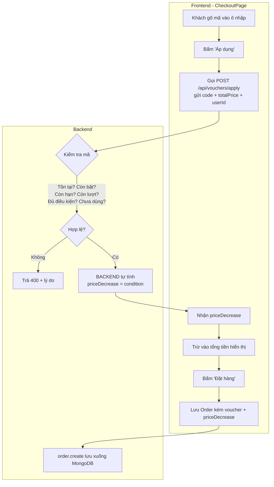

# Bài 35 — 🎓 Đồ án cuối khoá: làm chức năng Voucher end-to-end

> **Phần 6 · Nâng cao & hoàn thiện** — Thời lượng ước tính: **~180 phút (đồ án)**
> ⬅️ Bài trước: [34 — Refactor: `.env`, `configureStore`, xử lý lỗi tập trung](34-refactor-du-an.md) · Bài sau: [36 — Build và deploy lên môi trường thật](36-build-va-deploy.md) ➡️
> 🏠 [Mục lục](README.md)

---

## 🎯 Sau bài này bạn sẽ

- Tự tay dựng **trọn một chức năng full-stack từ số 0**: model → controller → route → mount → swagger → API frontend → giao diện → trang quản trị.
- Vận dụng lại **mọi thứ đã học** trong 34 bài: CRUD (Bài 07), bộ lọc query (Bài 09), phân quyền (Bài 12), swagger (Bài 13), tầng axios (Bài 18), giao diện admin (Bài 32), và nguyên tắc bảo mật (Bài 33).
- Hiểu và làm đúng nguyên tắc vàng: **tính giảm giá ở backend, không tin con số client gửi lên**.
- Tự đánh giá chất lượng công việc của mình bằng một **bảng tiêu chí chấm điểm** như trong công ty thật.

## 📋 Cần chuẩn bị

- Đã hoàn thành cả 34 bài trước, đặc biệt [07](07-crud-category.md), [09](09-bo-loc-query.md), [12](12-phan-quyen-middleware.md), [13](13-swagger-tai-lieu-api.md), [32](32-trang-quan-tri.md), [33](33-ra-soat-bao-mat.md).
- Backend + frontend + MongoDB đang chạy được. Có sẵn 1 tài khoản admin và 1 tài khoản khách.
- Postman để thử API.

> 💡 **Đây là ĐỒ ÁN, không phải bài đọc.** Bài này viết như một **bản đặc tả (spec) + hướng dẫn từng chặng**. Nó KHÔNG đưa hết lời giải: những phần dễ (giống category đã làm) bạn tự viết, những phần khó (logic áp mã) có gợi ý code. Cuối bài có phần **"Nộp bài & tự chấm"** thay cho mục "Tự tay làm" — vì cả bài này chính là tự tay làm.

---

## 1. Bối cảnh đồ án: một chức năng bị bỏ dở

Trong `yotea-be/src/models/` có sẵn một file mà **suốt 34 bài chưa ai đụng tới**: `voucher.js`. Ai đó (tác giả gốc) đã định làm chức năng mã giảm giá nhưng dừng lại ở bước khai báo model.

Ta hãy soi toàn bộ file này — đây là **điểm khởi đầu duy nhất** của đồ án.

`yotea-be/src/models/voucher.js:1-41`

```js
import { Schema, model } from "mongoose";

const voucherSchema = new Schema({
    code: {
        type: String,
        required: true,
        unique: true,
        uppercase: true,
    },
    quantity: {
        type: Number,
        required: true,
    },
    condition: {
        type: Number,
        required: true,
    },
    conditionNumber: {
        type: Number,
        required: true,
    },
    status: {
        type: Number,
        required: true,
    },
    timeStart: {
        type: Date,
        required: true,
    },
    timeEnd: {
        type: Date,
        required: true,
    },
    user_ids: {
        type: Array
    }
}, { timestamps: true });

voucherSchema.index({'$**': 'text'});

export default model("Voucher", voucherSchema);
```

**Mổ từng trường:**

| Trường | Kiểu | Ý nghĩa (theo thiết kế của bạn) |
|---|---|---|
| `code` | String, `unique`, `uppercase` | Mã người dùng gõ vào, ví dụ `SALE50K`. `uppercase:true` khiến Mongoose **tự viết hoa** trước khi lưu — nên khi tra cứu cũng phải viết hoa. |
| `quantity` | Number | Số lượt dùng còn lại. Mỗi lần có người áp mã thành công thì giảm 1. |
| `condition` | Number | **Số tiền được giảm** (VND). *(xem cảnh báo bên dưới)* |
| `conditionNumber` | Number | **Giá trị đơn tối thiểu** để đủ điều kiện dùng mã (VND). *(xem cảnh báo bên dưới)* |
| `status` | Number | `1` = mã đang bật, `0` = tắt. |
| `timeStart` / `timeEnd` | Date | Khoảng thời gian mã có hiệu lực. |
| `user_ids` | Array | Danh sách `_id` những người **đã dùng** mã này — để chặn một người dùng lại lần hai. |

> ⚠️ **Chỗ này thiết kế gốc làm chưa chuẩn — và bạn phải tự vá:** hai trường `condition` và `conditionNumber` **không hề có chú thích** ý nghĩa. Đây là "nợ kỹ thuật" điển hình: người sau nhìn vào không biết cái nào là *số tiền giảm*, cái nào là *ngưỡng đơn tối thiểu*.
>
> Trong đồ án này ta **quyết định** (và bạn phải ghi rõ quyết định đó vào README của mình):
> - `conditionNumber` = **ngưỡng tổng tiền đơn tối thiểu** để được áp mã.
> - `condition` = **số tiền giảm** cố định.
>
> Ví dụ: mã `SALE50K` có `conditionNumber = 200000`, `condition = 50000` nghĩa là *"đơn từ 200.000₫ được giảm 50.000₫"*. Nếu bạn muốn thiết kế theo % thì cứ đổi, miễn là **nhất quán và có tài liệu**.

**Và đây là phần hấp dẫn nhất.** Model `Order` cũng đã có sẵn hai trường chờ voucher, nhưng **chưa bao giờ được ghi giá trị** (xem [Bài 33](33-ra-soat-bao-mat.md)):

`yotea-be/src/models/order.js:27-42`

```js
    priceDecrease: {
        type: Number,
        default: 0
    },
    message: {
        type: String,
        default: ""
    },
    status: {
        type: Number,
        default: 0
    },
    voucher: {
        type: Array,
        default: []
    },
```

Nghĩa là: cả `Order.priceDecrease` (số tiền được giảm) lẫn `Order.voucher` (mã đã dùng) đã có chỗ trong database, chỉ chờ ta điền vào. Trang chi tiết đơn admin (`CartDetailPage.js`) thậm chí đã **hiển thị** `priceDecrease` và tính tổng cuối `totalPrice - priceDecrease` rồi — nhưng vì không ai ghi nên nó luôn bằng 0.

**Tóm lại, hiện trạng:**

| Thành phần | Có sẵn? |
|---|---|
| `models/voucher.js` | ✅ Có |
| `controllers/voucher.js` | ❌ **Chưa có — bạn viết** |
| `routes/voucher.js` | ❌ **Chưa có — bạn viết** |
| Mount trong `app.js` | ❌ **Chưa có — bạn thêm** |
| Swagger cho voucher | ❌ **Chưa có — bạn viết** |
| `yotea-fe/src/api/voucher.js` | ❌ **Chưa có — bạn viết** |
| Ô nhập mã ở `CheckoutPage` | ❌ **Chưa có — bạn thêm** |
| Ghi `voucher` + `priceDecrease` vào Order | ❌ **Chưa có — bạn thêm** |
| 3 màn admin quản lý voucher | ❌ **Chưa có — bạn viết** |

**Nhiệm vụ của bạn:** biến tất cả các dấu ❌ thành ✅.

---

## 2. Sơ đồ luồng chức năng cần dựng



Điểm mấu chốt — và cũng là bài học lớn nhất của [Bài 33](33-ra-soat-bao-mat.md): **mọi kiểm tra và phép tính giảm giá đều nằm ở backend**. Frontend chỉ gửi `code` + tổng tiền lên rồi *nhận về* số tiền giảm, tuyệt đối không tự tính rồi ép backend tin.

---

## CHẶNG 1 — Backend CRUD voucher

> **Mục tiêu chặng này:** admin thêm/sửa/xoá/xem được voucher qua API, giống hệt cách bạn đã làm với Category ở [Bài 07](07-crud-category.md).

### Bước 1.1 — Viết `controllers/voucher.js`

Tạo file **MỚI** `yotea-be/src/controllers/voucher.js`. Khuôn mẫu chuẩn của dự án là controller export đúng 5 hàm `create / read / list / update / remove` (xem quy ước ở [Bài 06](06-vong-doi-mot-request.md)).

Bạn hãy **tự viết** dựa theo `controllers/category.js` — nhưng voucher **không có slug**, nên bỏ mọi dòng `slugify`. Khối `list` với bộ lọc query thì copy y nguyên từ category/order (Bài 09).

> 💡 **Gợi ý khung `create` và `read`** (bạn tự gõ, đây là code MỚI của đồ án):

```js
// yotea-be/src/controllers/voucher.js  ← file MỚI, bạn tự tạo
import Voucher from "../models/voucher";

export const create = async (req, res) => {
    try {
        const voucher = await new Voucher(req.body).save();
        res.json(voucher);
    } catch (error) {
        res.status(400).json({
            message: "Thêm voucher thất bại",
            error
        });
    }
};

export const read = async (req, res) => {
    const filter = { _id: req.params.id };

    try {
        const voucher = await Voucher.findOne(filter).select("-__v").exec();
        if (!voucher) {
            return res.status(404).json({ message: "Không tìm thấy voucher" });
        }
        res.json(voucher);
    } catch (error) {
        res.status(400).json({ message: "Không tìm thấy voucher", error });
    }
};
```

> ⚠️ **Nâng cấp so với dự án gốc:** để ý dòng `if (!voucher) return res.status(404)`. Category gốc trả **200 kèm `null`** khi không thấy (lỗi #19 trong danh sách [Bài 33](33-ra-soat-bao-mat.md)). Đồ án là dịp để bạn làm cho **đúng** ngay từ đầu — trả 404 thật.

Còn `list`, `update`, `remove` bạn tự viết theo khuôn category (bỏ slug). Nhớ giữ `.select("-__v")`.

### Bước 1.2 — Viết `routes/voucher.js`

Tạo file **MỚI** `yotea-be/src/routes/voucher.js`. Quy ước đặt route của dự án: đường dẫn **số nhiều** (giống `/products`, `/orders`), và các thao tác ghi phải **khoá bằng admin** đúng ba tầng middleware `requireSignin, isAuth, isAdmin` như category.

Nhắc lại route category để bạn đối chiếu — `yotea-be/src/routes/category.js:8-14`:

```js
router.post("/category/:userId", requireSignin, isAuth, isAdmin, create);
router.get("/category/:slug", read);
router.get("/category", list);
router.put("/category/:id/:userId", requireSignin, isAuth, isAdmin, update);
router.delete("/category/:id/:userId", requireSignin, isAuth, isAdmin, remove);

router.param("userId", userById)
```

> 💡 **Gợi ý `routes/voucher.js`** (bạn tự gõ, code MỚI):

```js
// yotea-be/src/routes/voucher.js  ← file MỚI, bạn tự tạo
import { Router } from "express";
import { create, read, list, update, remove } from "../controllers/voucher";
import { apply } from "../controllers/voucher"; // sẽ viết ở CHẶNG 2
import { userById } from "../controllers/user";
import { isAdmin, isAuth, requireSignin } from "../middlewares/checkAuth";

const router = Router();

router.post("/vouchers/apply", apply);                                    // công khai — khách áp mã
router.post("/vouchers/:userId", requireSignin, isAuth, isAdmin, create); // 👑
router.get("/vouchers/:id", read);
router.get("/vouchers", list);
router.put("/vouchers/:id/:userId", requireSignin, isAuth, isAdmin, update);   // 👑
router.delete("/vouchers/:id/:userId", requireSignin, isAuth, isAdmin, remove); // 👑

router.param("userId", userById);

export default router;
```

> ⚠️ **Thứ tự route rất quan trọng.** Dòng `/vouchers/apply` phải đứng **trên** `/vouchers/:id`. Nếu đảo ngược, Express sẽ khớp `apply` như một `:id` và gọi nhầm `read`. Đây là bẫy kinh điển của Express — route cụ thể luôn đặt trước route có tham số động.
>
> 🔒 **Ghi chú bảo mật:** `apply` để công khai (khách vãng lai cũng áp mã được, giống `/checkout` không bọc `PrivateRouter`). Nhưng vì thế, logic bên trong `apply` **phải tự bảo vệ mình** — xem CHẶNG 2.

### Bước 1.3 — Mount router vào `app.js`

Mở `yotea-be/src/app.js`. Hiện tại phần mount như sau — `yotea-be/src/app.js:29-42`:

```js
app.use("/api", categoryRouter);
app.use("/api", productRouter);
app.use("/api", sliderRouter);
app.use("/api", storeRouter);
app.use("/api", cateNewsRouter);
app.use("/api", newsRouter);
app.use("/api", contactRouter);
app.use("/api", userRouter);
app.use("/api", authRouter);
app.use("/api", orderRouter);
app.use("/api", orderDetailRouter);
app.use("/api", cmtRouter);
app.use("/api", ratingRouter);
app.use("/api", favoritesRouter);
```

Bạn thêm **hai dòng**: một dòng `import` ở khối import routes (khoảng dòng 16-20), và một dòng `app.use` vào khối trên:

```js
// thêm vào khối import routes (đầu file)
import voucherRouter from "./routes/voucher";

// thêm vào khối app.use("/api", ...)
app.use("/api", voucherRouter);
```

Không có bước này thì mọi thứ bạn viết ở Bước 1.1–1.2 sẽ **trả 404** vì Express chưa biết tới router mới.

### Bước 1.4 — Viết swagger cho voucher

Nhắc lại từ [Bài 13](13-swagger-tai-lieu-api.md): swagger được viết bằng khối comment `@swagger` đặt **ngay trên mỗi hàm controller**. Đây là mẫu thật của dự án — `yotea-be/src/controllers/product.js:4-34`:

```js
/**
 * @swagger
 * /api/products/{userId}:
 *  post:
 *   tags: [Products]
 *   summary: Tạo sản phẩm mới
 *   description: Bắt buộc đăng nhập
 *   parameters:
 *     - in: path
 *       name: userId
 *       description: Id user đã đăng nhập
 *       required: true
 *       schema:
 *         type: string
 *         example: 623fec6776be914e8a89297d
 *   requestBody:
 *    required: true
 *    content:
 *     application/json:
 *      schema:
 *       $ref: '#/components/schemas/Products'
 *   responses:
 *    200:
 *     description: Tạo sản phẩm thành công
 *     content:
 *       application/json:
 *        schema:
 *          $ref: '#/components/schemas/Products'
 *    400:
 *     description: Tạo sản phẩm không thành công
 */
```

Bạn viết tương tự cho từng hàm của voucher (`tags: [Vouchers]`). Riêng endpoint `apply` là điểm nhấn — mô tả rõ body nhận `code`, `totalPrice`, `userId` và trả về `priceDecrease`.

> ⚠️ **Chỗ này dự án gốc làm chưa xong:** `app.js` **không hề mount `/api-docs`** dù đã cài `swagger-jsdoc` + `swagger-ui-express` (lỗi #1 danh sách [Bài 33](33-ra-soat-bao-mat.md)). Nếu ở [Bài 34](34-refactor-du-an.md) bạn đã bật swagger lên rồi thì các comment này sẽ hiện ra tại `http://localhost:8080/api-docs`. Nếu chưa, coi như phần swagger là điểm cộng — viết comment cho chuẩn, còn việc mount để dành.

---

## CHẶNG 2 — API kiểm tra & áp mã (trái tim của đồ án)

> **Mục tiêu chặng này:** viết endpoint `POST /api/vouchers/apply` nhận `code` + tổng tiền đơn, chạy đủ **6 lớp kiểm tra**, rồi **backend tự tính** số tiền giảm và trả về.

Đây là phần khó nhất và cũng quan trọng nhất. Nó là nơi bạn chứng minh mình đã thấm nguyên tắc **"không bao giờ tin dữ liệu từ client"** của [Bài 33](33-ra-soat-bao-mat.md).

### 6 lớp kiểm tra bắt buộc

| # | Kiểm tra gì | Dựa vào trường | Sai thì trả |
|---|---|---|---|
| 1 | Mã có **tồn tại** không? | `code` (nhớ `.toUpperCase()`) | 404 "Mã không tồn tại" |
| 2 | Mã có **đang bật** không? | `status === 1` | 400 "Mã đã bị khoá" |
| 3 | Mã còn **trong hạn** không? | `timeStart <= now <= timeEnd` | 400 "Mã hết hạn / chưa bắt đầu" |
| 4 | Mã còn **lượt** không? | `quantity > 0` | 400 "Mã đã hết lượt" |
| 5 | Đơn có **đủ điều kiện** không? | `totalPrice >= conditionNumber` | 400 "Đơn tối thiểu ... để dùng mã" |
| 6 | User đã **dùng mã này** chưa? | `!user_ids.includes(userId)` | 400 "Bạn đã dùng mã này rồi" |

Qua hết 6 cửa thì: `priceDecrease = voucher.condition` (số tiền giảm). **Không lấy con số nào từ client cho phép tính này.**

> 💡 **Gợi ý code `apply`** (bạn tự gõ, code MỚI của đồ án — thêm vào cuối `controllers/voucher.js`):

```js
export const apply = async (req, res) => {
    const { code, totalPrice, userId } = req.body;

    try {
        // 1. Tồn tại? (code lưu dạng UPPERCASE nên phải viết hoa khi tra)
        const voucher = await Voucher.findOne({ code: (code || "").toUpperCase() }).exec();
        if (!voucher) {
            return res.status(404).json({ message: "Mã giảm giá không tồn tại" });
        }

        // 2. Đang bật?
        if (voucher.status !== 1) {
            return res.status(400).json({ message: "Mã giảm giá đã bị khoá" });
        }

        // 3. Còn hạn? (so sánh với thời điểm hiện tại của SERVER)
        const now = new Date();
        if (now < voucher.timeStart || now > voucher.timeEnd) {
            return res.status(400).json({ message: "Mã giảm giá không trong thời gian sử dụng" });
        }

        // 4. Còn lượt?
        if (voucher.quantity <= 0) {
            return res.status(400).json({ message: "Mã giảm giá đã hết lượt sử dụng" });
        }

        // 5. Đủ điều kiện đơn tối thiểu?
        if (Number(totalPrice) < voucher.conditionNumber) {
            return res.status(400).json({
                message: `Đơn tối thiểu ${voucher.conditionNumber}đ mới dùng được mã này`,
            });
        }

        // 6. User này đã dùng chưa?
        if (userId && voucher.user_ids?.includes(userId)) {
            return res.status(400).json({ message: "Bạn đã sử dụng mã này rồi" });
        }

        // Qua hết 6 cửa → BACKEND tự tính số tiền giảm
        const priceDecrease = voucher.condition;

        return res.json({
            code: voucher.code,
            priceDecrease,
            message: "Áp dụng mã thành công",
        });
    } catch (error) {
        res.status(400).json({ message: "Áp mã thất bại", error });
    }
};
```

> ⚠️ **Vì sao dùng `new Date()` của server chứ không nhận ngày từ client?** Vì đồng hồ máy khách sửa được. Nếu để client gửi "hôm nay là ngày nào" lên, kẻ xấu chỉnh đồng hồ là qua được cửa hết hạn. Mọi mốc thời gian nhạy cảm phải lấy từ server.
>
> ⚠️ **Vì sao KHÔNG nhận `priceDecrease` từ client?** Vì đây chính là lỗ hổng #5 của [Bài 33](33-ra-soat-bao-mat.md) — "giá tiền do client quyết định". Nếu backend tin `priceDecrease` client gửi, khách gửi `priceDecrease: 9999999` là mua hàng âm tiền. Backend **luôn tự lấy `voucher.condition`** làm nguồn tin.

> 💡 **Mẹo:** ở cửa #5 bạn có thể chặn thêm trường hợp `condition > totalPrice` (giảm nhiều hơn giá đơn) bằng cách `Math.min(voucher.condition, totalPrice)`. Đây là chi tiết nhỏ nhưng thể hiện tư duy phòng thủ.

### "Tiêu thụ" mã khi đặt hàng (quan trọng)

Endpoint `apply` **chỉ kiểm tra và báo giá** — nó **không** trừ `quantity` hay ghi `user_ids`. Nếu trừ ngay lúc áp mã, khách bấm "Áp dụng" rồi bỏ giỏ hàng là mã bị hao oan.

Việc **thực sự tiêu thụ mã** nên làm ở lúc **đặt hàng thành công**. Có hai cách:

1. **Đơn giản (đủ cho đồ án):** ở `CheckoutPage` sau khi tạo Order xong, gọi thêm một API `PUT /api/vouchers/:id/:userId` để `quantity -= 1` và `user_ids.push(userId)`.
2. **Chuẩn hơn (điểm cộng):** để `order.create` ở backend tự nhận `code`, tự kiểm tra lại lần nữa (lại nguyên tắc "kiểm ở backend"), tự trừ lượt và tự tính `priceDecrease` — client không gửi số tiền giảm lên nữa. Đây là hướng nâng cao ở cuối bài.

---

## CHẶNG 3 — Frontend: ô nhập mã ở CheckoutPage

> **Mục tiêu chặng này:** thêm `api/voucher.js`, thêm ô nhập mã vào trang thanh toán, gọi `apply`, trừ vào tổng tiền, và lưu `voucher` + `priceDecrease` vào Order khi đặt hàng.

### Bước 3.1 — Viết `api/voucher.js`

Tạo file **MỚI** `yotea-fe/src/api/voucher.js` theo đúng quy ước tầng API của dự án ([Bài 18](18-tang-api-axios.md)): có `DB_NAME`, dùng `instance` (axios) đã cấu hình `baseURL`, các mutation kèm token qua tham số mặc định `isAuthenticate()`.

Đối chiếu khuôn — `yotea-fe/src/api/category.js:1-43`:

```js
import { createApi, fetchBaseQuery } from "@reduxjs/toolkit/query/react";
import { isAuthenticate } from "../utils/localStorage";
import instance from "./instance";

const DB_NAME = "category";

export const getAll = (start = 0, limit = 0) => {
  let url = `/${DB_NAME}/?_sort=createdAt&_order=desc`;
  if (limit) url += `&_start=${start}&_limit=${limit}`;
  return instance.get(url);
};

export const add = (category, { token, user } = isAuthenticate()) => {
  const url = `/${DB_NAME}/${user._id}`;
  return instance.post(url, category, {
    headers: {
      Authorization: `Bearer ${token}`,
    },
  });
};
```

> 💡 **Gợi ý `api/voucher.js`** (bạn tự gõ, code MỚI):

```js
// yotea-fe/src/api/voucher.js  ← file MỚI, bạn tự tạo
import { isAuthenticate } from "../utils/localStorage";
import instance from "./instance";

const DB_NAME = "vouchers";

export const getAll = (start = 0, limit = 0) => {
  let url = `/${DB_NAME}/?_sort=createdAt&_order=desc`;
  if (limit) url += `&_start=${start}&_limit=${limit}`;
  return instance.get(url);
};

export const get = (id) => instance.get(`/${DB_NAME}/${id}`);

// endpoint áp mã — CÔNG KHAI, không cần token
export const apply = (payload) => instance.post(`/${DB_NAME}/apply`, payload);

export const add = (voucher, { token, user } = isAuthenticate()) => {
  return instance.post(`/${DB_NAME}/${user._id}`, voucher, {
    headers: { Authorization: `Bearer ${token}` },
  });
};

export const update = (voucher, { token, user } = isAuthenticate()) => {
  return instance.put(`/${DB_NAME}/${voucher._id}/${user._id}`, voucher, {
    headers: { Authorization: `Bearer ${token}` },
  });
};

export const remove = (id, { token, user } = isAuthenticate()) => {
  return instance.delete(`/${DB_NAME}/${id}/${user._id}`, {
    headers: { Authorization: `Bearer ${token}` },
  });
};
```

> ⚠️ **Đừng lặp lại lỗi cũ:** tham số mặc định `{ token, user } = isAuthenticate()` là **đúng quy ước dự án**, nhưng nhớ lỗi #3 của [Bài 33](33-ra-soat-bao-mat.md): `isAuthenticate()` **nổ TypeError** nếu người dùng chưa từng đăng nhập. Các hàm admin (`add/update/remove`) chỉ chạy trong trang admin (đã đăng nhập) nên an toàn; riêng `apply` thì **không** dùng `isAuthenticate()` — nó là hàm công khai cho cả khách vãng lai.

### Bước 3.2 — Thêm ô nhập mã vào CheckoutPage

Nhớ lại `CheckoutPage.js` hiện tính tổng tiền bằng `reduce` rồi lưu vào state `totalPrice` — `yotea-fe/src/pages/user/cart/CheckoutPage.js:97-111`:

```js
  useEffect(() => {
    setLoading(true);

    const getTotalPrice = () => {
      setTotalPrice(() => {
        return cart.reduce((total, cart) => {
          return total + cart.productPrice * cart.quantity;
        }, 0);
      });
    };
    getTotalPrice();

    updateTitle("Thanh toán");
    setLoading(false);
  }, []);
```

Bạn cần thêm **state mới** cho mã giảm giá, và một hàm áp mã. Đây là code **MỚI bạn tự viết thêm** vào component:

```jsx
// thêm vào đầu component (code MỚI của bạn)
import { apply } from "../../../api/voucher";

const [voucherCode, setVoucherCode] = useState("");
const [priceDecrease, setPriceDecrease] = useState(0);
const [appliedCode, setAppliedCode] = useState("");

const handleApplyVoucher = async () => {
  try {
    const { data } = await apply({
      code: voucherCode,
      totalPrice,                         // gửi để backend kiểm điều kiện
      userId: (user && user._id) || "",
    });
    setPriceDecrease(data.priceDecrease); // TIN con số backend trả về
    setAppliedCode(data.code);
    toast.success(data.message);
  } catch (error) {
    setPriceDecrease(0);
    setAppliedCode("");
    toast.error(error.response?.data?.message || "Áp mã thất bại");
  }
};
```

Và một ô nhập trong JSX, đặt cạnh bảng tổng tiền (khối `tfoot` ở `CheckoutPage.js:276-284`). Phần class Tailwind lược bớt cho gọn:

```jsx
{/* code MỚI của bạn — đặt trong cột "Đơn hàng của bạn" */}
<div className="flex gap-2 my-3">
  <input
    type="text"
    value={voucherCode}
    onChange={(e) => setVoucherCode(e.target.value)}
    placeholder="Nhập mã giảm giá"
    className="border px-2 h-10 flex-1 outline-none"  /* ...lược class... */
  />
  <button type="button" onClick={handleApplyVoucher} className="px-3 bg-orange-400 text-white">
    Áp dụng
  </button>
</div>

{priceDecrease > 0 && (
  <div className="flex justify-between text-sm">
    <span>Giảm giá ({appliedCode})</span>
    <span>- {formatCurrency(priceDecrease)}</span>
  </div>
)}
<div className="flex justify-between font-semibold">
  <span>Thành tiền</span>
  <span>
    {formatCurrency(totalPrice - priceDecrease > 0 ? totalPrice - priceDecrease : 0)}
  </span>
</div>
```

> ⚠️ **Nút áp mã PHẢI có `type="button"`.** Nếu quên, mặc định nó là `type="submit"` và nằm trong `<form>` → bấm "Áp dụng" sẽ **submit luôn cả đơn hàng**. Đây là bẫy hay gặp khi thêm nút phụ vào form.

### Bước 3.3 — Lưu voucher + priceDecrease vào Order

Hiện `onSubmit` dựng `orderData` **chưa có** voucher — `yotea-fe/src/pages/user/cart/CheckoutPage.js:51-60`:

```js
    const orderData = {
      userId: (user && user._id) || "",
      customerName: dataInput.fullName,
      address: dataInput.address,
      phone: dataInput.phone,
      email: dataInput.email,
      totalPrice,
      message: dataInput.message,
    };
    const { data } = await addOrder(orderData);
    const orderId = data._id;
```

Bạn bổ sung hai trường (code MỚI của bạn):

```js
    const orderData = {
      userId: (user && user._id) || "",
      customerName: dataInput.fullName,
      address: dataInput.address,
      phone: dataInput.phone,
      email: dataInput.email,
      totalPrice,
      priceDecrease,                                  // ← MỚI
      voucher: appliedCode ? [appliedCode] : [],      // ← MỚI (Order.voucher là Array)
      message: dataInput.message,
    };
```

Giờ thì trang chi tiết đơn admin (`CartDetailPage`) sẽ hiển thị đúng dòng giảm giá và tổng cuối — hai trường "chết" bấy lâu nay cuối cùng đã sống.

> ⚠️ **Đừng quên bug `forEach` + `await`!** Chính `CheckoutPage.js:64-89` đang mắc lỗi #11 của [Bài 33](33-ra-soat-bao-mat.md): `cart.forEach(async ...)` **không chờ** các dòng chi tiết lưu xong. Đồ án của bạn **không được lặp lại lỗi này**. Nếu ở [Bài 34](34-refactor-du-an.md) bạn đã sửa thành `for...of` hoặc `Promise.all` thì giữ nguyên; nếu chưa, đây là lúc sửa (xem lại [Bài 03 §5](03-kien-thuc-nen.md) và [Bài 28](28-thanh-toan.md)).

---

## CHẶNG 4 — Admin: 3 màn quản trị voucher

> **Mục tiêu chặng này:** admin có trang **danh sách / thêm / sửa** voucher, theo đúng khuôn ba màn của [Bài 32](32-trang-quan-tri.md).

Bạn đã dựng 3 màn này cho Category rồi, nên chặng này chủ yếu là **nhân bản có sửa đổi**. Ba file mới trong `yotea-fe/src/pages/admin/voucher/`:

| File mới | Nhân bản từ | Sửa gì |
|---|---|---|
| `VoucherListPage.js` | `category/CategoryListPage.js` | Cột hiển thị: `code`, `condition`, `conditionNumber`, `quantity`, `status`, `timeStart`, `timeEnd`. Nút xoá dùng mẫu SweetAlert2. |
| `AddVoucherPage.js` | `category/AddCategoryPage.js` | Form các trường voucher. **Bỏ phần upload ảnh** (voucher không có ảnh). Dùng `<input type="datetime-local">` cho `timeStart`/`timeEnd`. |
| `EditVoucherPage.js` | `category/EditCategoryPage.js` | `reset(data)` để đổ dữ liệu; submit gọi `update`. |

Đăng ký route trong `yotea-fe/src/App.js` (khối `/admin`, đặt cạnh các route category — tham khảo `App.js:196-347`). Nhớ dùng đường dẫn nhất quán, ví dụ:

```jsx
{/* code MỚI của bạn — thêm vào nhánh /admin */}
{ path: "voucher", element: <VoucherListPage /> },
{ path: "voucher/add", element: <AddVoucherPage /> },
{ path: "voucher/:id/edit", element: <EditVoucherPage /> },
```

> ⚠️ **Tránh đúng cái bẫy route param của dự án gốc!** Nhiều trang edit của Yotea khai báo route `:id` nhưng lại đọc `useParams().slug` → `slug === undefined` → trang không load được (lỗi ở `EditCategoryPage`, `EditNewsPage`, `EditProductPage` — xem bản đồ admin). Voucher **không có slug**, nên route dùng `:id` và trong `EditVoucherPage` bạn đọc `const { id } = useParams();`. Hãy làm giống `EditSlidePage.js` (trang edit **làm đúng** duy nhất trong dự án):

```js
// EditSlidePage làm đúng — yotea-fe/src/pages/admin/slider/EditSlidePage.js:52-59 (tham khảo)
useEffect(() => {
  (async () => {
    const { data } = await get(id);
    setPreview(data.image);
    reset(data);
  })();
}, []);
```

Form thêm voucher — mẫu validate bằng yup (code MỚI của bạn, lược bớt class):

```jsx
const schema = yup.object().shape({
  code: yup.string().required("Vui lòng nhập mã"),
  condition: yup.number().typeError("Phải là số").required("Nhập số tiền giảm"),
  conditionNumber: yup.number().typeError("Phải là số").required("Nhập đơn tối thiểu"),
  quantity: yup.number().typeError("Phải là số").min(1, "Ít nhất 1 lượt").required(),
  status: yup.number().required("Chọn trạng thái"),
  timeStart: yup.string().required("Chọn ngày bắt đầu"),
  timeEnd: yup.string().required("Chọn ngày kết thúc"),
});
```

> 💡 **Mẹo:** với hai trường số `condition`/`conditionNumber`, khi submit nhớ ép kiểu (`+data.condition`) trước khi gửi — giống `AddProductPage` ép `+data.price`. Model khai `required: true` kiểu Number, nếu gửi chuỗi rỗng Mongoose sẽ báo lỗi validate.

---

## 3. 📊 Bảng tiêu chí chấm điểm đồ án

Chấm chính đồ án của bạn theo bảng này (giống cách reviewer trong công ty đánh giá một pull request):

| Nhóm | Tiêu chí | Điểm | Đạt khi |
|---|---|:---:|---|
| **Chức năng chạy** | CRUD voucher hoạt động qua Postman | 2 | Thêm/sửa/xoá/xem đều đúng, trả 404 khi không thấy |
| | `apply` chạy đủ 6 lớp kiểm tra | 2 | Mỗi lớp sai đều trả đúng thông báo |
| | Ô nhập mã ở checkout trừ đúng tổng tiền | 1 | Áp mã hợp lệ → tổng giảm; mã sai → báo lỗi |
| | Order lưu được `voucher` + `priceDecrease` | 1 | Trang chi tiết đơn admin hiện đúng dòng giảm giá |
| | 3 màn admin đủ và chạy | 1 | List/Add/Edit đều mở và thao tác được |
| **Bảo mật** | Giảm giá tính ở **backend** | 1.5 | Sửa `priceDecrease` trong request client **không** ăn thua |
| | Route ghi khoá `isAdmin`; kiểm thời gian bằng giờ server | 0.5 | Khách thường không tạo/sửa/xoá voucher được |
| **Theo quy ước** | Đặt tên đúng chuẩn dự án | 0.5 | Bộ ba `routes/controllers/models`, api FE có `DB_NAME` + `getAll/get/add/update/remove` |
| **Xử lý lỗi** | Mọi controller bọc `try/catch`, có `return` sau `res` lỗi | 0.5 | Không có unhandled rejection, không `ERR_HTTP_HEADERS_SENT` |
| | Tổng | **10** | |

---

## 4. 🪤 Các bẫy đã học — tuyệt đối phải tránh

Đồ án là bài kiểm tra xem bạn đã thật sự học được từ những lỗi của dự án chưa. Bốn cái bẫy dưới đây đều **có thật** trong Yotea; đồ án của bạn mà mắc lại là **mất điểm nặng**:

| Bẫy | Lỗi gốc trong dự án | Trong đồ án phải làm |
|---|---|---|
| 🪤 **`forEach` + `await`** | `CheckoutPage.js:64-89` — dòng chi tiết đơn lưu không chờ ([Bài 03](03-kien-thuc-nen.md), [28](28-thanh-toan.md)) | Nếu vòng lặp có `await`, dùng `for...of` hoặc `Promise.all` |
| 🪤 **Tin giá client** | Order/OrderDetail lưu y nguyên giá client gửi (lỗ hổng #5, [Bài 33](33-ra-soat-bao-mat.md)) | `priceDecrease` **luôn** lấy từ `voucher.condition` ở backend |
| 🪤 **Thiếu middleware** | `routes/order.js` `POST/GET/DELETE` không bảo vệ (lỗ hổng #3) | Route ghi voucher đủ `requireSignin, isAuth, isAdmin` |
| 🪤 **Mass assignment** | `const update = req.body` nhét thẳng vào DB (lỗ hổng #1, #2) | Ở endpoint nhạy cảm chỉ đọc đúng trường cần; không cho client set `quantity`/`user_ids` tuỳ ý |

Thêm hai bẫy nhỏ đặc thù của bài này:

- 🪤 **Thứ tự route** — `/vouchers/apply` phải đứng trên `/vouchers/:id` (Bước 1.2).
- 🪤 **Route param `:id` vs `useParams().slug`** — đừng lặp lại lỗi của `EditCategoryPage` (CHẶNG 4).

---

## 5. 🚀 Gợi ý mở rộng nâng cao (điểm cộng)

Làm xong phần lõi rồi, muốn thử thách hơn:

1. **Voucher theo phần trăm.** Thêm trường `type` (`fixed` / `percent`). Nếu `percent`, `priceDecrease = totalPrice * condition / 100`, và thêm trần giảm tối đa (`maxDecrease`).
2. **Tiêu thụ mã ở backend, chống chạy đua (race condition).** Chuyển việc trừ `quantity` + push `user_ids` vào `order.create`, dùng `findOneAndUpdate` với điều kiện `quantity > 0` để hai request đồng thời không cùng dùng lượt cuối.
3. **Kiểm lại giá ở backend hoàn toàn.** `order.create` nhận `code` + danh sách `productId/quantity`, **tự** tra giá sản phẩm từ DB rồi tự tính `totalPrice` và `priceDecrease` — client không gửi số tiền nào cả. Đây là bản vá triệt để cho lỗ hổng #5.
4. **Chống spam áp mã.** Giới hạn số lần gọi `apply` mỗi IP trong 1 phút (rate limit).
5. **Hiển thị danh sách mã khả dụng** cho khách trên trang giỏ hàng thay vì bắt gõ tay.

---

## 6. ✅ Kiểm chứng kết quả

Chạy backend (`npm start` tại `yotea-be`) và frontend (`npm start` tại `yotea-fe`).

**Bước 1 — tạo một voucher bằng Postman** (đăng nhập admin lấy token trước):

```
POST http://localhost:8080/api/vouchers/<adminId>
Headers: Authorization: Bearer <token-admin>
Body (JSON):
{
  "code": "sale50k",
  "quantity": 100,
  "condition": 50000,
  "conditionNumber": 200000,
  "status": 1,
  "timeStart": "2026-08-01T00:00:00.000Z",
  "timeEnd": "2026-12-31T23:59:59.000Z"
}
```

Kết quả mong đợi — `code` bị **tự viết hoa** thành `SALE50K`:

```json
{
  "_id": "...",
  "code": "SALE50K",
  "quantity": 100,
  "condition": 50000,
  "conditionNumber": 200000,
  "status": 1,
  "timeStart": "2026-08-01T00:00:00.000Z",
  "timeEnd": "2026-12-31T23:59:59.000Z",
  "createdAt": "..."
}
```

**Bước 2 — áp mã:**

```
POST http://localhost:8080/api/vouchers/apply
Body (JSON): { "code": "sale50k", "totalPrice": 250000, "userId": "" }
```

→ phải trả:

```json
{ "code": "SALE50K", "priceDecrease": 50000, "message": "Áp dụng mã thành công" }
```

**Bước 3 — thử phá (bảo mật):** gửi `totalPrice: 100000` (dưới ngưỡng 200.000) → phải bị chặn với thông báo "Đơn tối thiểu ...". Gửi `code: "SALE50K"` khi đơn đủ điều kiện nhưng backend **không** trả bất kỳ con số nào do client bịa ra — chứng minh giảm giá do server quyết.

**Bước 4 — trên web:** vào `/checkout`, gõ `sale50k`, bấm "Áp dụng" → tổng tiền giảm 50.000₫. Đặt hàng → vào trang admin chi tiết đơn, thấy dòng "Giảm giá" hiện đúng.

---

## 7. 🐞 Lỗi thường gặp

| Thông báo / hiện tượng | Nguyên nhân | Cách sửa |
|---|---|---|
| `Cannot POST /api/vouchers` | Quên mount router trong `app.js` | Thêm `import` + `app.use("/api", voucherRouter)` (Bước 1.3) |
| Gọi `/vouchers/apply` lại chạy vào `read` | Route `apply` đặt **sau** `/vouchers/:id` | Đưa dòng `apply` lên trên (Bước 1.2) |
| Áp mã luôn báo "không tồn tại" dù mã đúng | Quên `.toUpperCase()` khi tra, mà DB lưu chữ hoa | `findOne({ code: code.toUpperCase() })` |
| `ValidationError: condition is required` | Form gửi chuỗi rỗng / không ép kiểu số | Ép `+data.condition` trước khi gửi; yup `.number()` |
| Trang edit voucher trống trơn | Route `:id` nhưng đọc `useParams().slug` | Đọc `const { id } = useParams()` |
| Bấm "Áp dụng" bị submit cả đơn | Nút thiếu `type="button"` | Thêm `type="button"` |
| `TypeError: Cannot read ... of undefined` khi khách chưa đăng nhập | `apply` FE lỡ dùng `isAuthenticate()` | `apply` là hàm công khai, **không** dùng `isAuthenticate()` |
| `ERR_HTTP_HEADERS_SENT` | Quên `return` sau `res.status(400)` trong `apply` | Thêm `return` trước mỗi `res` lỗi |

---

## 8. 📝 Bài tập

**Bài 1.** Endpoint `apply` của bạn hiện chỉ **kiểm tra**, chưa **trừ lượt** (`quantity`) và chưa ghi `user_ids`. Viết thêm logic tiêu thụ mã **ở lúc đặt hàng** sao cho: (a) mỗi user chỉ dùng mã một lần; (b) mã hết `quantity` thì không ai áp được nữa.

<details>
<summary>💡 Xem gợi ý & lời giải</summary>

Cách đơn giản (đủ cho đồ án): sau khi `addOrder` thành công ở `CheckoutPage`, nếu có `appliedCode` thì gọi thêm một API tiêu thụ mã. Ở backend viết một hàm (hoặc mở rộng `update`) trừ lượt an toàn:

```js
// code MỚI của bạn — controllers/voucher.js
export const consume = async (req, res) => {
  const { code, userId } = req.body;
  try {
    // trừ lượt CHỈ KHI còn lượt và user chưa dùng — chống chạy đua
    const voucher = await Voucher.findOneAndUpdate(
      {
        code: code.toUpperCase(),
        quantity: { $gt: 0 },
        user_ids: { $ne: userId },
      },
      { $inc: { quantity: -1 }, $push: { user_ids: userId } },
      { new: true }
    ).exec();

    if (!voucher) {
      return res.status(400).json({ message: "Mã không còn khả dụng" });
    }
    res.json({ message: "Đã dùng mã" });
  } catch (error) {
    res.status(400).json({ message: "Lỗi khi dùng mã", error });
  }
};
```

Điểm hay: `$gt: 0` và `$ne: userId` nằm **trong điều kiện tìm** nên MongoDB xử lý nguyên tử (atomic) — hai request đồng thời không thể cùng dùng lượt cuối. `$inc`/`$push` khiến client không quyết định được con số, đúng tinh thần lỗ hổng #3 [Bài 33](33-ra-soat-bao-mat.md).

</details>

**Bài 2.** Ở endpoint `apply`, nếu `voucher.condition` (số tiền giảm) **lớn hơn** `totalPrice` (ví dụ mã giảm 50k nhưng đơn chỉ 30k), điều gì xảy ra với tổng tiền? Hãy vá.

<details>
<summary>💡 Xem gợi ý & lời giải</summary>

Nếu không chặn, `priceDecrease = 50000` trong khi đơn 30.000 → tổng tiền âm. Frontend đã có lá chắn hiển thị (`totalPrice - priceDecrease > 0 ? ... : 0`) nhưng **backend vẫn nên tự bảo vệ** — không dựa vào FE. Sửa:

```js
const priceDecrease = Math.min(voucher.condition, Number(totalPrice));
```

Đây lại là nguyên tắc "backend không tin FE": ngay cả phép chặn âm cũng phải làm ở server.

</details>

**Bài 3.** (suy ngẫm) Giả sử bạn để `order.create` nhận thẳng `priceDecrease` từ client (như thiết kế hiện tại của CHẶNG 3). Một kẻ xấu bỏ qua giao diện, gọi trực tiếp `POST /api/orders` với `{"totalPrice": 250000, "priceDecrease": 250000}`. Hắn mua được đơn 0đ. Đây là biến thể của lỗ hổng nào, và cách vá triệt để là gì?

<details>
<summary>💡 Xem gợi ý & lời giải</summary>

Đây chính là **lỗ hổng #5 — giá tiền do client quyết định** (và gốc bệnh là **mass assignment**, `new Order(req.body)` ở `controllers/order.js:5`). Cách vá triệt để (gợi ý mở rộng #3): `order.create` **không** nhận `priceDecrease` từ body. Nó nhận `code`, tự chạy lại toàn bộ 6 lớp kiểm tra của `apply`, tự tính `priceDecrease = voucher.condition`, và tự tra giá sản phẩm để tính `totalPrice`. Con số client gửi lên chỉ để hiển thị, **không bao giờ** được ghi vào tiền.

Bài học: một endpoint "tin client" ở tầng dưới sẽ **vô hiệu hoá** mọi kiểm tra đẹp đẽ bạn làm ở tầng trên. Bảo mật phải khoá ở nơi *ghi dữ liệu*, không phải nơi *hiển thị*.

</details>

---

## 9. 📮 Nộp bài & tự chấm

Cả bài này **là** phần "Tự tay làm" — nên thay vì một mục riêng, đây là checklist nộp bài:

- [ ] `controllers/voucher.js` — đủ `create/read/list/update/remove/apply`, mọi hàm có `try/catch` và `return` sau `res` lỗi.
- [ ] `routes/voucher.js` — route ghi khoá `isAdmin`, `apply` đặt đúng thứ tự.
- [ ] `app.js` — đã mount `voucherRouter`.
- [ ] Swagger — có khối `@swagger` cho các hàm voucher.
- [ ] `api/voucher.js` — đúng quy ước `DB_NAME` + `getAll/get/apply/add/update/remove`.
- [ ] `CheckoutPage` — ô nhập mã, gọi `apply`, trừ tổng tiền, lưu `voucher` + `priceDecrease`.
- [ ] 3 màn admin voucher + route trong `App.js`.
- [ ] Một file `VOUCHER.md` ngắn ghi **quyết định thiết kế** của bạn (ý nghĩa `condition`/`conditionNumber`, kiểu giảm cố định hay %).
- [ ] Tự chấm theo **bảng tiêu chí §3** và ghi lại điểm.

Chấm xong, đối chiếu lại **§4 — Các bẫy đã học**: đọc từng dòng code mới của mình một lần nữa, tự hỏi "mình có mắc lại bẫy nào không?".

---

## 📌 Tóm tắt

- Yotea có sẵn `models/voucher.js` và hai trường `Order.voucher` / `Order.priceDecrease` **nhưng chưa có controller, route, API hay giao diện nào** — đồ án là hoàn thiện trọn vẹn chức năng đó.
- Dựng một chức năng full-stack đi theo đúng chuỗi: **model → controller → route → mount → swagger → api FE → giao diện → admin**, mỗi mắt xích tái dùng một bài đã học.
- **Trái tim của bài** là endpoint `apply` với 6 lớp kiểm tra và nguyên tắc bất di bất dịch: **backend tự tính giảm giá, không tin con số client gửi lên** ([Bài 33](33-ra-soat-bao-mat.md)).
- Bốn cái bẫy phải tránh: `forEach`+`await`, tin giá client, thiếu middleware, mass assignment.
- Tự chấm bằng bảng tiêu chí như reviewer thật; ghi lại quyết định thiết kế để không để lại "nợ kỹ thuật" cho người sau.

**Từ khoá tra cứu thêm:** `Express route order`, `Mongoose findOneAndUpdate atomic`, `coupon code system design`, `server-side price validation`, `race condition inventory`, `datetime-local input`

➡️ **Bài tiếp theo:** [36 — Build và deploy lên môi trường thật](36-build-va-deploy.md) — đưa dự án hoàn chỉnh (kèm chức năng voucher của bạn) lên internet cho cả thế giới dùng.
